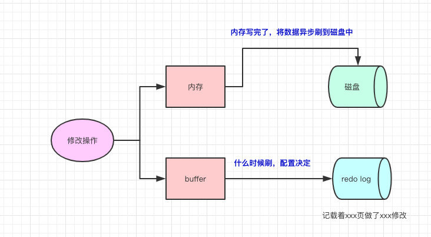

# 关于MYSQL的面试题

> mysql乐观锁和悲观锁的概念? 原理机制

乐观锁认为读多写少, 读不上锁, 写采用cas  
悲观锁总是认为写多读少, 任意操作都要进行上锁

> MySQL的原子性是怎么保证的

- undo log
- binlog (数据库的变更, 搜索引擎的数据也需要变更)
- redo log (innoDB)

> binlog

binlog记录了数据库表结构和表数据变更，比如update/delete/insert/truncate/create。它不会记录select（因为这没有对表没有进行变更）  
binlog我们可以简单理解为：存储着每条变更的SQL语句（当然从下面的图看来看，不止SQL，还有trcID「事务Id」等等）  
主要作用: 复制和恢复数据  
> redo log

redo log的存在为了：当我们修改的时候，写完内存了，但数据还没真正写到磁盘的时候。此时我们的数据库挂了，我们可以根据redo log来对数据进行恢复。因为redo log是顺序IO，所以写入的速度很快，并且redo log记载的是物理变化（xxxx页做了xxx修改），文件的体积很小，恢复速度很快。

> mysql的数据如何恢复到任意时间点?

恢复到任意时间点以定时的做全量备份，以及备份增量的 binlog 日志为前提。恢复到任意时间点首先将全量备份恢复之后，再此基础上回放增加的 binlog 直至指定的时间点。
> 主键 超键 候选键 外键是什么?

- 超键(super key): 在关系中能唯一标识元组的属性集称为关系模式的超键
- 候选键(candidate key): 不含有多余属性的超键称为候选键。也就是在候选键中，若再删除属性，就不是键了！
- 主键(primary key): 用户选作元组标识的一个候选键程序主键
- 外键(foreign key)：如果关系模式R中属性K是其它模式的主键，那么k在模式R中称为外键。

主键为候选键的子集，候选键为超键的子集，而外键的确定是相对于主键的。

> 视图的作用，视图可以更改么？

- 视图是虚拟的表，与包含数据的表不一样，视图只包含使用时动态检索数据的查询；不包含任何列或数据。使用视图可以简化复杂的sql操作，隐藏具体的细节，保护数据；视图创建后，可以使用与表相同的方式利用它们。
- 视图不能被索引，也不能有关联的触发器或默认值，如果视图本身内有order by 则对视图再次order by将被覆盖。
- 创建视图：`create view XXX as XXXXXXXXXXXXXX;`
- 对于某些视图比如未使用联结子查询分组聚集函数Distinct Union等，是可以对其更新的，对视图的更新将对基表进行更新；但是视图主要用于简化检索，保护数据，并不用于更新，而且大部分视图都不可以更新。

> drop,delete与truncate的区别?

drop直接删掉表 truncate删除表中数据，再插入时自增长id又从1开始 delete删除表中数据，可以加where字句。

（1） DELETE语句执行删除的过程是每次从表中删除一行，并且同时将该行的删除操作作为事务记录在日志中保存以便进行进行回滚操作。TRUNCATE TABLE 则一次性地从表中删除所有的数据并不把单独的删除操作记录记入日志保存，删除行是不能恢复的。并且在删除的过程中不会激活与表有关的删除触发器。执行速度快。

（2） 表和索引所占空间。当表被TRUNCATE 后，这个表和索引所占用的空间会恢复到初始大小，而DELETE操作不会减少表或索引所占用的空间。drop语句将表所占用的空间全释放掉。

（3） 一般而言，drop > truncate > delete

（4） 应用范围。TRUNCATE 只能对TABLE；DELETE可以是table和view

（5） TRUNCATE 和DELETE只删除数据，而DROP则删除整个表（结构和数据）。

（6） truncate与不带where的delete ：只删除数据，而不删除表的结构（定义）drop语句将删除表的结构被依赖的约束（constrain),触发器（trigger)索引（index);依赖于该表的存储过程/函数将被保留，但其状态会变为：invalid。

（7） delete语句为DML（Data Manipulation Language),这个操作会被放到 rollback segment中,事务提交后才生效。如果有相应的 tigger,执行的时候将被触发。

（8） truncate、drop是DDL（Data Define Language),操作立即生效，原数据不放到 rollback segment中，不能回滚

（9） 在没有备份情况下，谨慎使用 drop 与 truncate。要删除部分数据行采用delete且注意结合where来约束影响范围。回滚段要足够大。要删除表用drop;若想保留表而将表中数据删除，如果于事务无关，用truncate即可实现。如果和事务有关，或是想触发trigger,还是用delete。

（10） Truncate table 表名 速度快,而且效率高,因为: truncate table 在功能上与不带 WHERE 子句的 DELETE 语句相同：二者均删除表中的全部行。但 TRUNCATE TABLE 比 DELETE 速度快，且使用的系统和事务日志资源少。DELETE 语句每次删除一行，并在事务日志中为所删除的每行记录一项。TRUNCATE TABLE 通过释放存储表数据所用的数据页来删除数据，并且只在事务日志中记录页的释放。

（11） TRUNCATE TABLE 删除表中的所有行，但表结构及其列、约束、索引等保持不变。新行标识所用的计数值重置为该列的种子。如果想保留标识计数值，请改用 DELETE。如果要删除表定义及其数据，请使用 DROP TABLE 语句。

（12） 对于由 FOREIGN KEY 约束引用的表，不能使用 TRUNCATE TABLE，而应使用不带 WHERE 子句的 DELETE 语句。由于 TRUNCATE TABLE 不记录在日志中，所以它不能激活触发器。

> 索引的工作原理及其种类

数据库索引，是数据库管理系统中一个排序的数据结构，以协助快速查询、更新数据库表中数据。索引的实现通常使用B树及其变种B+树。

> 连接的种类

- 外连接
  1. 概念：包括左向外联接、右向外联接或完整外部联接
  2. 左连接：left join 或 left outer join (1)左向外联接的结果集包括 LEFT OUTER 子句中指定的左表的所有行，而不仅仅是联接列所匹配的行。如果左表的某行在右表中没有匹配行，则在相关联的结果集行中右表的所有选择列表列均为空值(null)。 (2)sql 语句`select * from table1 left join table2 on table1.id = table2.id`
  3. right join 或 right outer join (1)右向外联接是左向外联接的反向联接。将返回右表的所有行。如果右表的某行在左表中没有匹配行，则将为左表返回空值。 (2)sql 语句`select * from table1 right join table2 on table1.id = table2.id`
  4. 完整外部联接:full join 或 full outer join (1)完整外部联接返回左表和右表中的所有行。当某行在另一个表中没有匹配行时，则另一个表的选择列表列包含空值。如果表之间有匹配行，则整个结果集行包含基表的数据值。 (2)sql 语句`select * from table1 a full join table2 b on a.id = b.id`
- 内连接
  1. 概念：内联接是用比较运算符比较要联接列的值的联接
  2. join | inner join
  3. `select * from table1 join table2 on table1.id=table2.id`
  4. 只返回符合条件的table1和table2的列
- 交叉连接(完全)
  1. 概念：没有 WHERE 子句的交叉联接将产生联接所涉及的表的笛卡尔积。第一个表的行数乘以第二个表的行数等于笛卡尔积结果集的大小。（table1和table2交叉连接产生3*3=9条记录）
  2. 交叉连接：cross join (不带条件where...)
  3. sql语句`select * from table1 cross join table2` == `select * from table1, table2`
  4. 返回3*3=9条记录，即笛卡尔积

> 数据库范式

- 第一范式（1NF）
  - 在任何一个关系数据库中，第一范式（1NF）是对关系模式的基本要求，不满足第一范式（1NF）的数据库就不是关系数据库。 所谓第一范式（1NF）是指数据库表的每一列都是不可分割的基本数据项，同一列中不能有多个值，即实体中的某个属性不能有多个值或者不能有重复的属性。如果出现重复的属性，就可能需要定义一个新的实体，新的实体由重复的属性构成，新实体与原实体之间为一对多关系。在第一范式（1NF）中表的每一行只包含一个实例的信息。简而言之，第一范式就是无重复的列。
- 第二范式（2NF）
  - 第二范式（2NF）是在第一范式（1NF）的基础上建立起来的，即满足第二范式（2NF）必须先满足第一范式（1NF）。第二范式（2NF）要求数据库表中的每个实例或行必须可以被惟一地区分。为实现区分通常需要为表加上一个列，以存储各个实例的惟一标识。这个惟一属性列被称为主关键字或主键、主码。 第二范式（2NF）要求实体的属性完全依赖于主关键字。所谓完全依赖是指不能存在仅依赖主关键字一部分的属性，如果存在，那么这个属性和主关键字的这一部分应该分离出来形成一个新的实体，新实体与原实体之间是一对多的关系。为实现区分通常需要为表加上一个列，以存储各个实例的惟一标识。简而言之，第二范式就是非主属性非部分依赖于主关键字。
- 第三范式（3NF）
  - 满足第三范式（3NF）必须先满足第二范式（2NF）。简而言之，第三范式（3NF）要求一个数据库表中不包含已在其它表中已包含的非主关键字信息。例如，存在一个部门信息表，其中每个部门有部门编号（dept_id）、部门名称、部门简介等信息。那么在员工信息表中列出部门编号后就不能再将部门名称、部门简介等与部门有关的信息再加入员工信息表中。如果不存在部门信息表，则根据第三范式（3NF）也应该构建它，否则就会有大量的数据冗余。简而言之，第三范式就是属性不依赖于其它非主属性。（我的理解是消除冗余）

> 数据库优化的思路?

- SQL语句优化
  - 应尽量避免在 where 子句中使用!=或<>操作符，否则将引擎放弃使用索引而进行全表扫描
  - 应尽量避免在 where 子句中对字段进行 null 值判断，否则将导致引擎放弃使用索引而进行全表扫描
  - 很多时候用 exists 代替 in 是一个好的选择。
  - 用Where子句替换HAVING 子句 因为HAVING 只会在检索出所有记录之后才对结果集进行过滤。
- 索引优化
- 数据库结构优化
- 服务器硬件优化

> 存储过程与触发器的区别

触发器与存储过程非常相似，触发器也是SQL语句集，两者唯一的区别是触发器不能用EXECUTE语句调用，而是在用户执行Transact-SQL语句时自动触发（激活）执行。

触发器是在一个修改了指定表中的数据时执行的存储过程。

通常通过创建触发器来强制实现不同表中的逻辑相关数据的引用完整性和一致性。由于用户不能绕过触发器，所以可以用它来强制实施复杂的业务规则，以确保数据的完整性。

触发器不同于存储过程，触发器主要是通过事件执行触发而被执行的，而存储过程可以通过存储过程名称名字而直接调用。当对某一表进行诸如UPDATE、INSERT、DELETE这些操作时，SQLSERVER就会自动执行触发器所定义的SQL语句，从而确保对数据的处理必须符合这些SQL语句所定义的规则。

> MySQL 性能优化的21个最佳实践

1. 为查询缓存优化你的查询
2. EXPLAIN 你的 SELECT 查询
3. 当只要一行数据时使用 LIMIT 1
4. 为搜索字段建索引
5. 在 Join 表的时候使用相当类型的例，并将其索引
6. 千万不要 ORDER BY RAND()
7. 避免 SELECT *
8. 永远为每张表设置一个 ID
9. 使用 ENUM 而不是 VARCHAR
10. 从 PROCEDURE ANALYSE() 取得建议
11. 尽可能的使用 NOT NULL
12. Prepared Statements
13. 无缓冲的查询
14. 把 IP 地址存成 UNSIGNED INT
15. 固定长度的表会更快
16. 垂直分割
17. 拆分大的 DELETE 或 INSERT 语句
18. 越小的列会越快
19. 选择正确的存储引擎
20. 使用一个对象关系映射器(Object Relational Mapper)
21. 小心“永久链接”

> 常见的数据库优化手段

TODO
> 索引的优缺点, 什么字段上建立索引

TODO
> 数据库连接池

TODO
> durid的常用配置

TODO
> SQL高级方面, 比如group by, having, 左连接, 子查询（带in）, 行转列等高级用法

TODO
> 建表方面, 你项目是用三范式还是反范式, 理由是什么

TODO
> 性能优化,如何通过执行计划查看SQL语句改进点的方式, 或者其它能改善SQL性能的方式

建索引等

> MySQL集群, MyCAT分库分表的技能

通过LVS+Keepalived实现MySQL负载均衡, MyCAT的配置方式

> Mysql有哪些存储引擎, 各自优缺点

MyISAM、InnoDB、MERGE、MEMORY(HEAP)、BDB(BerkeleyDB)、EXAMPLE、FEDERATED、ARCHIVE、CSV、BLACKHOLE。

- InnoDB
  - 灾难恢复性好
  - 支持事务
  - 使用行级锁
  - 支持外键关联
  - 支持热备份
- MyISAM
  - 不支持事务
  - 使用表级锁，并发性差
  - 主机宕机后，MyISAM表易损坏，灾难恢复性不佳
  - 可以配合锁，实现操作系统下的复制备份、迁移
  - 只缓存索引，数据的缓存是利用操作系统缓冲区来实现的。可能引发过多的系统调用且效率不佳
  - 数据紧凑存储，因此可获得更小的索引和更快的全表扫描性能
- MEMORY: 提供内存表，也不支持事务和外键。显著提高访问数据的速度，可用于缓存会频繁访问的、可以重构的数据、计算结果、统计值、中间结果。
  - 使用表级锁，虽然内存访问快，但如果频繁的读写，表级锁会成为瓶颈
  - 只支持固定大小的行。Varchar类型的字段会存储为固定长度的Char类型，浪费空间
  - 不支持TEXT、BLOB字段。当有些查询需要使用到临时表（使用的也是MEMORY存储引擎）时，如果表中有TEXT、BLOB字段，那么会转换为基于磁盘的MyISAM表，严重降低性能
  - 由于内存资源成本昂贵，一般不建议设置过大的内存表，如果内存表满了，可通过清除数据或调整内存表参数来避免报错
  - 服务器重启后数据会丢失，复制维护时需要小心

> 高并发下, 如何做到安全地修改同一行数据

悲观锁(索引)

> 为什么要使用索引?

索引可以避免全表扫描

> 什么样的信息能成为索引?

主键, 唯一键

> 索引的数据结构

- 二叉树: 可能会退化成链表
- B-树
- B+树
- Hash
- BitMap

---

1. B+树的磁盘读写代价更低
2. B+树的查询效率更加稳定
3. B+树更有利于对数据库的扫描

> MyISAM适合的场景

- 频繁执行全表count语句
- 读多写少
- 不需要事务
