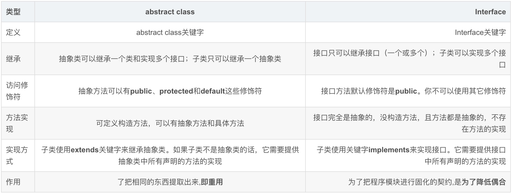

# BASIC QUESTIONS

> HashMap 的源码，实现原理，JDK8 中对 HashMap 做了怎样的优化

JDK8 引入了红黑树

> HaspMap 扩容是怎样扩容的，为什么都是 2 的 N 次幂的大小

为了保证 hash 散列平稳 hash & (tab.length-1)

> HashMap，Hashtable，ConcurrentHashMap 的区别

Hashtable

- 底层数组+链表实现，无论 key 还是 value 都不能为 null，线程安全，实现线程安全的方式是在修改数据时锁住整个 Hashtable，效率低
- 初始 size 为 11，扩容：newSize = oldSize\*2+1
- 计算 index 的方法：index = (hash & 0x7FFFFFFF) % tab.length

HashMap(JDK7)

- 底层数组+链表实现，可以存储 null 键和 null 值，线程不安全
- 初始 size 为 16，扩容：newSize = oldSize\*2，size 一定为 2 的 n 次幂
- 扩容针对整个 Map，每次扩容时，原来数组中的元素依次重新计算存放位置，并重新插入
- 插入元素后才判断该不该扩容，有可能无效扩容（插入后如果扩容，如果没有再次插入，就会产生无效扩容）
- 当 Map 中元素总数超过 Entry 数组的 0.75F，触发扩容操作，为了减少链表长度，元素分配更均匀
- 计算 index 方法：index = hash & (tab.length – 1)

ConcurrentHashMap(JDK7)

- 底层采用分段的数组+链表实现，线程安全
- 通过把整个 Map 分为 N 个 Segment，可以提供相同的线程安全，但是效率提升 N 倍，默认提升 16 倍。(读操作不加锁，由于 HashEntry 的 value 变量是 volatile 的，也能保证读取到最新的值。)
- Hashtable 的 synchronized 是针对整张 Hash 表的，即每次锁住整张表让线程独占，ConcurrentHashMap 允许多个修改操作并发进行，其关键在于使用了锁分离技术
- 有些方法需要跨段，比如 size()和 containsValue()，它们可能需要锁定整个表而而不仅仅是某个段，这需要按顺序锁定所有段，操作完毕后，又按顺序释放所有段的锁
- 扩容：段内扩容（段内元素超过该段对应 Entry 数组长度的 75%触发扩容，不会对整个 Map 进行扩容），插入前检测需不需要扩容，有效避免无效扩容

ConcurrentHashMap(JDK8)

- Node 数组+链表+红黑树的数据结构

> 极高并发下 HashTable 和 ConcurrentHashMap 哪个性能更好，为什么，如何实现的

HashTable 使用一把锁处理并发问题，当有多个线程访问时，需要多个线程竞争一把锁，导致阻塞 ConcurrentHashMap 则使用分段，减少了锁的粒度

> HashMap 在高并发下如果没有处理线程安全会有怎样的安全隐患，具体表现是什么

多线程 put 时可能会导致 get 无限循环，具体表现为 CPU 使用率 100%；

原因：在向 HashMap put 元素时，会检查 HashMap 的容量是否足够，如果不足，则会新建一个比原来容量大两倍的 Hash 表，然后把数组从老的 Hash 表中迁移到新的 Hash 表中，迁移的过程就是一个 rehash()的过程，多个线程同时操作就有可能会形成循环链表，所以在使用 get()时，就会出现 Infinite Loop 的情况

> java 中四种修饰符的限制范围

- private 私有
- 无修饰符 本类 + 本包
- protected 本类 + 子类
- public 都可以访问

> Object 类中的方法

```java
private static native void registerNatives();
public final native Class<?> getClass();
public native int hashCode();
public boolean equals(Object obj) {
    return (this == obj);
}
protected native Object clone() throws CloneNotSupportedException;
public String toString() {
    return getClass().getName() + "@" + Integer.toHexString(hashCode());
}
public final native void notify();
public final native void notifyAll();
public final native void wait(long timeout) throws InterruptedException;
public final void wait(long timeout, int nanos) throws InterruptedException {
     if (timeout < 0) {
        throw new IllegalArgumentException("timeout value is negative");
    }

    if (nanos < 0 || nanos > 999999) {
          throw new IllegalArgumentException(
                              "nanosecond timeout value out of range");
    }

    if (nanos > 0) {
        timeout++;
    }

    wait(timeout);
}
public final void wait() throws InterruptedException {
    wait(0);
}
protected void finalize() throws Throwable { }
```

> Java 序列化的方式

实现 Serialize 接口

> 传值和传引用的区别，Java 是怎么样的，有没有传值引用

final 传值

> 一个 ArrayList 在循环过程中删除，会不会出问题，为什么

会出现 ConcureentModificationException, 需要用 iterator 来实现遍历删除

> @Transactional 注解在什么情况下会失效，为什么

1. @Transactional 应用在非 public 修饰的方法上
2. @Transactional 注解属性 propagation 设置错误
3. @Transactional 注解属性 rollbackFor 设置错误
4. 同一个类中方法调用，导致@Transactional 失效
5. 异常被 `catch` “吃了”导致@Transactional 失效
6. 数据库引擎不支持事务

> java 反射中，Class.forName 和 classloader 的区别?

- class.forName()和 classLoader 都可用来对类进行加载。
- class.forName()除了将类的.class 文件加载到 jvm 中之外，还会对类进行解释，执行类中的 static 块。
- 而 classLoader 只干一件事情，就是将.class 文件加载到 jvm 中，不会执行 static 中的内容,只有在 newInstance 才会去执行 static 块。
- Class.forName(name, initialize, loader)带参函数也可控制是否加载 static 块。并且只有调用了 newInstance()方法采用调用构造函数，创建类的对象

```java
 public static Class<?> forName(String className) throws ClassNotFoundException {
    Class<?> caller = Reflection.getCallerClass();
    return forName0(className, true, ClassLoader.getClassLoader(caller), caller);
}
```

> Spring 事务

- PROPAGATION_REQUIRED: 表示当前方法必须运行在事务中。如果当前事务存在，方法将会在该事务中运行。否则，会启动一个新的事务
- PROPAGATION_SUPPORTS: 表示当前方法不需要事务上下文，但是如果存在当前事务的话，那么该方法会在这个事务中运行
- PROPAGATION_MANDATORY: 表示该方法必须在事务中运行，如果当前事务不存在，则会抛出一个异常
- PROPAGATION_REQUIRES_NEW: 表示当前方法必须运行在它自己的事务中。一个新的事务将被启动。如果存在当前事务，在该方法执行期间，当前事务会被挂起。如果使用 JTATransactionManager 的话，则需要访问 TransactionManager
- PROPAGATION_NOT_SUPPORTED: 表示该方法不应该运行在事务中。如果存在当前事务，在该方法运行期间，当前事务将被挂起。如果使用 JTATransactionManager 的话，则需要访问 TransactionManager
- PROPAGATION_NEVER: 表示当前方法不应该运行在事务上下文中。如果当前正有一个事务在运行，则会抛出异常
- PROPAGATION_NESTED: 表示如果当前已经存在一个事务，那么该方法将会在嵌套事务中运行。嵌套的事务可以独立于当前事务进行单独地提交或回滚。如果当前事务不存在，那么其行为与 PROPAGATION_REQUIRED 一样。

> OOM 问题和 StackOverflow 有什么区别

- 如果线程请求的栈深度大于虚拟机所允许的最大深度，会抛出 StackOverFlow 内存溢出异常。
- 如果虚拟机在拓展栈时无法申请到足够的内存空间，则会抛出 OOM 泄露异常。

> Java 中的几种基本数据类型是什么? 各占用多少字节?


> String 类可以被继承吗? 为什么

不可以, String 类是被 final 关键字修饰的类, 无法被继承

1. 修饰类: 当用 final 修饰一个类时，表明这个类不能被继承。final 类中的成员变量可以根据需要设为 final，但是要注意 final 类中的所有成员方法都会被隐式地指定为 final 方法。
2. 修饰方法: 使用 final 修饰方法的原因有两个。第一个原因是把方法锁定，以防任何继承类修改它的含义；第二个原因是效率。在早期的 Java 实现版本中，会将 final 方法转为内嵌调用。但是如果方法过于庞大，可能看不到内嵌调用带来的任何性能提升。在最近的 Java 版本中，不需要使用 final 方法进行这些优化了。
3. 修饰变量: 对于被 final 修饰的变量，如果是基本数据类型的变量，则其数值一旦在初始化之后便不能更改；如果是引用类型的变量，则在对其初始化之后便不能再让其指向另一个对象。虽然不能再指向其他对象，但是它指向的对象的内容是可变的。

> String, StringBuffer 和 StringBuilder 的区别

运算速度比较（通常情况下）：StringBuilder > StringBuffer > String

String：适用于少量的字符串操作。

StringBuilder：适用于单线程下在字符串缓冲区进行大量操作。

StringBuffer：适用于多线程下在字符串缓冲区进行大量操作。

> ArrayList 和 LinkedList 有什么区别?

1. ArrayList 是实现了基于动态数组的数据结构，LinkedList 基于链表的数据结构。
2. 对于随机访问 get 和 set，ArrayList 绝对优于 LinkedList，因为 LinkedList 要移动指针。
3. 对于新增和删除操作 add 和 remove，LinedList 比较占优势，因为 ArrayList 要移动数据。

> 类的实例化顺序: 父类静态数据, 构造函数, 字段, 子类静态数据, 构造函数, 字段, 当 new 的时候, 他们的执行顺序?

1. 首先会执行类中 static 代码块(不管代码块是否在类的开头还是末尾处)，如果这个类有父类，同样会优先查找父类中的 static 代码块，然后是当前类的 static。
2. 然后会从父类的第一行开始执行，直至代码末尾处，中间不管是有赋值还是 method 调用，都会按顺序一一执行（method），普通代码块{ }...
3. 其次才是父类的构造函数，执行带参数或不带参数的构造函数，依赖于实例化的类的构造函数有没有 super 父类的带参或不带参的构造函数，上边试验二三已经证明。
4. 然后会从子类（当前类）的第一行开始执行，直至代码末尾处，中间不管是有赋值还是 method 调用，都会按顺序一一执行（method），普通代码块{ }...
5. 其次会是子类（当前类）的构造函数，按顺序执行。
6. 最后是类方法的调用执行，如果子类覆盖了父类的 method，执行时会先执行子类覆盖的 method，method 内如果有 super.method()，才会调用父类的同名 method，否则不会。

总结：父类静态成员和静态代码块->子类静态成员和静态代码块->父类非静态成员和非静态代码块->父类构造方法->子类非静态成员和非静态代码块->子类构造方法

> 用过哪些 Map 类, 都有什么区别? HashMap 是线程安全的吗?并发下使用的 map 是什么? 内部原理分别是什么? (存储方式, hashcode, 扩容, 默认容量等)

HashMap, LinkedHashMap, ConcurrentHashMap, TreeMap  
HashMap 是非线程安全的, 并发场景下用 ConcurrentHashMap

> JDK1.8 的 ConcurrentHashMap 放弃了分段锁, 为什么? 如果你来设计, 你如何设计?

在 JAVA 的 jdk1.8 中则对 ConcurrentHashMap 又再次进行了大的修改，取消了 segment 段锁字段，采用了 CAS+Synchronized 技术来保障线程安全。

> 有没有有顺序的 Map 实现类, 如果有, 是怎么保证顺序的?

1. LinkedHashMap 继承自 HashMap，所以它的底层仍然是基于拉链式散列结构。该结构由数组和链表+红黑树 在此基础上 LinkedHashMap 增加了一条双向链表，保持遍历顺序和插入顺序一致的问题。
2. 在实现上，LinkedHashMap 很多方法直接继承自 HashMap（比如 put remove 方法就是直接用的父类的），仅为维护双向链表覆写了部分方法（get（）方法是重写的）。
3. LinkedHashMap 使用的键值对节点是 Entity 他继承了 hashMap 的 Node,并新增了两个引用，分别是 before 和 after。这两个引用的用途不难理解，也就是用于维护双向链表.
4. 链表的建立过程是在插入键值对节点时开始的，初始情况下，让 LinkedHashMap 的 head 和 tail 引用同时指向新节点，链表就算建立起来了。随后不断有新节点插入，通过将新节点接在 tail 引用指向节点的后面，即可实现链表的更新
5. LinkedHashMap 允许使用 null 值和 null 键， 线程是不安全的，虽然底层使用了双线链表，但是增删相快了。因为他底层的 Entity 保留了 hashMap node 的 next 属性。
6. 如何实现迭代有序: 重新定义了数组中保存的元素 Entry（继承于 HashMap.node)，该 Entry 除了保存当前对象的引用外，还保存了其上一个元素 before 和下一个元素 after 的引用，从而在哈希表的基础上又构成了双向链接列表。仍然保留 next 属性，所以既可像 HashMap 一样快速查找，用 next 获取该链表下一个 Entry，也可以通过双向链接，通过 after 完成所有数据的有序迭代.
7. 竟然 inkHashMap 的 put 方法是直接调用父类 hashMap 的，但在 HashMap 中，put 方法插入的是 HashMap 内部类 Node 类型的节点，该类型的节点并不具备与 LinkedHashMap 内部类 Entry 及其子类型节点组成链表的能力。那么，LinkedHashMap 是怎样建立链表的: 虽然 linkHashMap 调用的是 hashMap 中的 put 方法，但是 linkHashMap 重写了，了一部分方法，其中就有 `newNode(int hash, K key, V value, Node<K,V> e)`, `linkNodeLast(LinkedHashMap.Entry<K,V> p)`; 这两个方法就是: 第一个方法就是新建一个 linkHasnMap 的 Entity 方法，而 linkNodeLast 方法就是为了把 Entity 接在链表的尾部。
8. 链表节点的删除过程: 与插入操作一样，LinkedHashMap 删除操作相关的代码也是直接用父类的实现，但是 LinkHashMap 重写了 removeNode()方法 afterNodeRemoval（）方法，该 removeNode 方法在 hashMap 删除的基础上有调用了 afterNodeRemoval 回调方法。完成删除。

删除的过程并不复杂，上面这么多代码其实就做了三件事：

- 根据 hash 定位到桶位置
- 遍历链表或调用红黑树相关的删除方法
- 从 LinkedHashMap 维护的双链表中移除要删除的节点

> 抽象类和接口的区别, 类可以继承多个类吗, 接口可以继承多个接口吗, 类可以实现多个接口吗?

- 相同点:
  1. 都不能被实例化。
  2. 接口的实现类和抽象类的子类只有全部实现了接口或者抽象类中的方法后才可以被实例化。
- 不同点：
  1. 接口只能定义抽象方法不能实现方法，抽象类既可以定义抽象方法，也可以实现方法。
  2. 单继承，多实现。接口可以实现多个，只能继承一个抽象类。
  3. 接口强调的是功能，抽象类强调的是所属关系。
  4. 接口中的所有成员变量 为 public static final， 静态不可修改，当然必须初始化。接口中的所有方法都是 public abstract 公开抽象的。而且不能有构造方法。抽象类就比较自由了，和普通的类差不多，可以有抽象方法也可以没有，可以有正常的方法，也可以没有。



> 继承和聚合的区别在哪?

继承：他是 is-a 的关系，指一个类继承另外一个类的功能  
聚合：他是 has-a 　
组合：他是 contans-a（强聚合）

> IO 模型有哪些? 讲讲你理解的 NIO, 与 BIO 和 AIO 之间的区别是什么? 谈谈 Reactor 模型

- 什么是 BIO,NIO,AIO
  1. JAVA BIO：同步并阻塞，服务器实现模式为一个连接一个线程，即客户端有连接请求时服务器端就需要启动一个线程并处理，如果这个连接不做任何事情会造成不必要的开销，可以通过线程池机制改善
  2. JAVA NIO：同步非阻塞，服务器实现模式为一个请求一个线程，即客户端发送的连接请求都会注册到多路复用器上，多路复用器轮询到连接有 IO 请求时才启动一个线程进行处理
  3. JAVA AIO(NIO2)：异步非阻塞，服务器实现模式为一个有效请求一个线程，客户端的 I/O 请求都是由 OS 先完成了再通知服务器应用去启动线程进行处理
- 使用场景
  1. BIO 方式适用于连接数目比较小且固定的架构，这种方式对服务器资源要求比较高，并发局限于应用中，JDK1.4 以前的唯一选择，但程序直观简单易理解。
  2. NIO 方式适用于连接数目多且连接比较短（轻操作）的架构，比如聊天服务器，并发局限于应用中，编程比较复杂，JDK1.4 开始支持。
  3. AIO 方式使用于连接数目多且连接比较长（重操作）的架构，比如相册服务器，充分调用 OS 参与并发操作，编程比较复杂，JDK1.7 开始支持。
- BIO 同步并阻塞
  - tomcat 采用的传统的 BIO（同步阻塞 IO 模型）+ 线程池模式，对于十万甚至百万连接的时候，传统 BIO 模型是无能为力的：
    1. 线程的创建和销毁成本很高，在 linux 中，线程本质就是一个进程，创建销毁都是重量级的系统函数
    2. 线程本身占用较大的内存，像 java 的线程栈一般至少分配 512K-1M 的空间，如果系统线程过高，内存占用是个问题
    3. 线程的切换成本高，操作系统发生线程切换的时候，需要保留线程的上下文，然后执行系统调用，如果线程数过高可能执行线程切换的时间甚至大于线程执行的时间，这时候带来的表现是系统 load 偏高，CPU 使用率很高
    4. 容易造成锯齿状的系统负载。系统负载是用活动线程数或 CPU 核心数，一旦线程数量高但外部网络环境不是很稳定，就很容易造成大量请求的结果同时返回，激活大量阻塞线程从而使系统负载压力过大。
- NIO 同步非阻塞
  - NIO 基于 Reactor，当 socket 有流可读或可写入 socket，操作系统会相应的通知引用程序进行处理，应用再将流读取到缓冲区或写入操作系统。也就是，不是一个链接就要对应一个处理线程，而是一个有效请求对应一个线程，当连接没有数据时，是没有工作线程来处理的
- Reactor 模型
  - nio 只有 acceptor 的服务线程是堵塞进行的，其他读写线程是通过注册事件的方式，有读写事件激活时才调用线程资源区执行，不会一直堵塞等着读写操作，Reactor 的瓶颈主要在于 acceptor 的执行，读写事件也是在这一块分发
- AIO 异步非堵塞 IO
  - AIO 需要一个链接注册读写事件和回调方法，当进行读写操作时，只须直接调用 API 的 read 或 write 方法即可，这两种方法均为异步，对于读操作而言，当有流可读取时，操作系统会将可读的流传入 read 方法的缓冲区，并通知应用程序；对于写操作而言，当操作系统将 write 方法传递的流写入完毕时，操作系统主动通知应用程序
  - read/write 方法都是异步的，完成后会主动调用回调函数

> 反射的原理? 反射创建类实例的三种方式是什么?

原理：反射首先是能够获取到 Java 中的反射类的字节码，然后将字节码中的方法，变量，构造函数等映射成 相应的 Method、Filed、Constructor 等类

1. 第一种方式（利用 getClass()方法）
2. 第二种方式（直接对象的.class）
3. 第三种方式（Class.forName()）

```java
    Class<?> c1 = Dummy.class;
    Class<?> c2 = new Dummy().getClass();
    Class<?> c3 = Class.forName("cn.az.java.basic.reflect.ReflectDummy");
    Constructor<?> ctr = c1.getConstructor();
    System.out.println(c1.newInstance());
    System.out.println(ctr.newInstance());
```

> 反射中, Class.forName 和 ClassLoader 的区别?

Class.forName 除了将类的.class 文件加载到 jvm 中之外，还会对类进行解释，执行类中的 static 块。

而 classloader 只干一件事情，就是将.class 文件加载到 jvm 中，不会执行 static 中的内容，只有在 newInstance 才会去执行 static 块。

> 描述动态代理的几种实现方式, 分别说出相应的优缺点

Jdk 和 Cglib 的区别和实现

java 动态代理是利用反射机制生成一个实现代理接口的匿名类，在调用具体方法前调用 InvokeHandler 来处理。

而 cglib 动态代理是利用 asm 开源包，对代理对象类的 class 文件加载进来，通过修改其字节码生成子类来处理。

1. 如果目标对象实现了接口，默认情况下会采用 JDK 的动态代理实现 AOP
2. 如果目标对象实现了接口，可以强制使用 CGLIB 实现 AOP
3. 如果目标对象没有实现了接口，必须采用 CGLIB 库，spring 会自动在 JDK 动态代理和 CGLIB 之间转换

如何强制使用 CGLIB 实现 AOP？

1. 添加 CGLIB 库，`SPRING_HOME/cglib/*.jar`
2. 在 spring 配置文件中加入`<aop:aspectj-autoproxy proxy-target-class="true"/>`

JDK 动态代理和 CGLIB 字节码生成的区别？

1. JDK 动态代理只能对实现了接口的类生成代理，而不能针对类
2. CGLIB 是针对类实现代理，主要是对指定的类生成一个子类，覆盖其中的方法,因为是继承，所以该类或方法最好不要声明成 final

> 为什么 CGlib 方式可以对接口实现代理

JDK 实现动态代理需要实现类通过接口定义业务方法，对于没有接口的类，如何实现动态代理呢，这就需要 CGLib 了。CGLib 采用了非常底层的字节码技术，其原理是通过字节码技术为一个类创建子类，并在子类中采用方法拦截的技术拦截所有父类方法的调用，顺势织入横切逻辑。JDK 动态代理与 CGLib 动态代理均是实现 Spring AOP 的基础。

> final 的用途

1. 修饰类: 当用 final 修饰一个类时，表明这个类不能被继承。final 类中的成员变量可以根据需要设为 final，但是要注意 final 类中的所有成员方法都会被隐式地指定为 final 方法。
2. 修饰方法: 使用 final 修饰方法的原因有两个。第一个原因是把方法锁定，以防任何继承类修改它的含义；第二个原因是效率。在早期的 Java 实现版本中，会将 final 方法转为内嵌调用。但是如果方法过于庞大，可能看不到内嵌调用带来的任何性能提升。在最近的 Java 版本中，不需要使用 final 方法进行这些优化了。
3. 修饰变量: 对于被 final 修饰的变量，如果是基本数据类型的变量，则其数值一旦在初始化之后便不能更改；如果是引用类型的变量，则在对其初始化之后便不能再让其指向另一个对象。虽然不能再指向其他对象，但是它指向的对象的内容是可变的。

> 写出三种单例模式

```java
public class Singleton {
    private final static Singleton INSTANCE = new Singleton();

    // Private constructor suppresses
    private Singleton() {}

    // default public constructor
    public static Singleton getInstance() {
        return INSTANCE;
    }
  }
public class Singleton {
    private Singleton(){}
    private volatile static Singleton instance = null;

    public static Singleton getInstance() {
        if (instance == null) {
            synchronized(Singleton.class) {
                if (instance == null) {
                    instance = new Singleton();
                }
            }
        }
        return instance;
    }
}

```

> 如何在父类中为子类自动完成所有的 hashcode 和 equals 实现? 这么做有何优劣?

直接重写 equals 方法和 hashcode 方法

> 请结合 OOP 设计理念,谈谈访问修饰符 public、private、protected、default 在应用设计中的作用

面对对象设计理念

> 浅拷贝和深拷贝的区别

浅拷贝的两个对象并非独立的  
深拷贝是一个整个独立的对象拷贝

> 数组和链表数据结构描述,各自的时间复杂度

数组: 查询和更新 O(1), 增加和删除 O(n)  
链表: 查询和更新 O(n), 增加和删除 O(1)

> Error 和 Exception 的区别? CheckedException, RuntimeException 的区别?

Error（错误）是系统中的错误，程序员是不能改变的和处理的，是在程序编译时出现的错误，只能通过修改程序才能修正。一般是指与虚拟机相关的问题，如系统崩溃，虚拟机错误，内存空间不足，方法调用栈溢等。对于这类错误的导致的应用程序中断，仅靠程序本身无法恢复和和预防，遇到这样的错误，建议让程序终止。

Exception（异常）表示程序可以处理的异常，可以捕获且可能恢复。遇到这类异常，应该尽可能处理异常，使程序恢复运行，而不应该随意终止异常。

- Exception 又分为两类
  - CheckedException：（编译时异常） 需要用 try——catch 显示的捕获，对于可恢复的异常使用 CheckedException。
  - UnCheckedException（RuntimeException）：（运行时异常）不需要捕获，对于程序错误（不可恢复）的异常使用 RuntimeException。

> 请列出 5 个运行时异常

- NullPointerException
- ClassCastException
- IllegalArgumentException
- IllegalStateException
- IndexOutOfBoundsException
- UnsupportedOperationException

> 在自己的代码中, 如果创建一个 java.lang.String 类, 这个类是否可以被类加载器加载? 为什么

由于双亲委派原则, JVM 不会加载具有相同 URI 的类两次

> 说说你对 java.lang.Object 中 hashCode 和 equals 方法的理解. 在什么场景下需要重新实现这两个方法

TODO

> 在 jdk1.5 中引入了泛型, 是为了解决什么问题?

泛型的本质是参数化类型, 所操作的数据类型被指定为一个参数, 泛型的好处是在编译时候检查类型安全, 并且所有的强制转换都是自动和隐式的, 以提高代码的重用率

> a.hashCode()有什么用? 与 a.equals(b)有什么关系

hashcode()方法提供了对象的 HashCode 值, 是 native 方法, 返回的默认值和 System.identity Hash Code(obj)一致; 通常这个值是对象头部的一部分二进制组成的数字, 具有一定的标识对象的意义存在, 但绝不定于地址

作用: 用一个数字标识对象

两个对象 equals 相等, 则 hashcode 一定相等; hashcode 相等的两个对象不一定 equals 相等

> 有没有可能 2 个不相等的对象有相同的 hashcode

有可能, 也就是所谓的 hash 冲突

> Java 中的 HashSet 内部是如何工作的

内部维护了一个 HashMap, 且有一个公共 value `private static final Object PRESENT = new Object();`

> 什么是序列化, 怎么序列化, 为什么序列化, 反序列化会遇到什么问题, 如何解决

implements Serializable

序列化: 把对象转换为字节序列的过程称为对象的序列化  
反序列化: 把字节序列恢复成对象的过程称为对象的反序列化

目的: 把内存中的对象状态保存到一个文件中或者数据库中; 用套接字在网络上传输对象; 通过 RMI 传输对象的时候

> java8 的新特性

- Objects, Collections
- **lambda**
- `default`
- Stream
- `java.time`
- HashMap 引入了红黑树
- `Optional<T>`

> 注解的原理

注解底层是使用反射实现的`method.getAnnotation(xxAnonotation.class)`

---

1.1 服务调用超时问题怎么解决?
1.2 Dubbo 支持哪些序列化方式?
1.3 Dubbo 和 SpringCloud 的关系?
1.4 Dubbo 的架构设计?一共划分了哪些层?
1.5 Dubbo 的默认集群容错方案?
1.6 Dubbo 使用的是什么通信框架?
1.7 Dubbo 的主要应用场景?
1.8 Dubbo 服务注册与发现的流程?流程说明。
1.9 Dubbo 的集群容错方案有哪些?
1.10 Dubbo 的四大组件
1.11 Dubbo 在安全机制方面是如何解决的
1.12 Dubbo 和 SpringCloud 的区别?
1.13 Dubbo 支持哪些协议，每种协议的应用场景，优缺点?
1.14 Dubbo 的核心功能有哪些?
1.15 Dubbo 的注册中心集群挂掉，发布者和订阅者之间还能通信么?
1.16 Dubbo 集群的负载均衡有哪些策略
1.17 为什么需要服务治理?
1.18 Dubbo 超时时间怎样设置?

## 2 ElasticSearch

2.1 你们公司的 ES 集群，一个 node 一般会分配几个分片?
2.2 Elasticsearch 是如何实现 Master 选举的?
2.3 你是如何做写入调优的?
2.4 如何避免脑裂?
2.5 19-Elasticsearch 对于大数据量（上亿量级）的聚合如何实现?
2.6 ES 主分片数量可以在后期更改吗?为什么?
2.7 如何监控集群状态?
2.8 ElasticSearch 中的副本是什么?
2.9 ES 更新数据的执行流程?
2.10 shard 里面是什么组成的?
2.11 ElasticSearch 中的分析器是什么?
2.12 什么是脑裂?
2.13 客户端在和集群连接时，如何选择特定的节点执行请求的?
2.14 Elasticsearch 中的倒排索引是什么?
2.15 什么是索引?索引（名词） 一个索引(index)
2.16 详细描述一下 Elasticsearch 更新和删除文档的过程

## 3 JVM

3.1 JVM 参数主要有⼏种分类
3.2 Java 中会存在内存泄漏吗，简述一下。
3.3 Java 虚拟机是如何判定两个 Java 类是相同的?
3.4 Java 中都有哪些引用类型
3.5 在 Java 中，对象什么时候可以被垃圾回收?
3.6 StackOverflow 异常有没有遇到过?一般你猜测会在什么情况下被触发?
3.7 堆空间分哪些部分?以及如何设置各个部分?
3.8 什么是栈帧?栈帧存储了什么?
3.9 如何设置参数生成 GC 日志?
3.10 GC 是什么?为什么要有 GC?
3.12 使用过哪些 jdk 命令，并说明各个的作用是什么
3.13 JVM 运行时数据区区域分为哪⼏部分?
3.14 是否了解类加载器双亲委派模型机制和破坏双亲委派模型?
3.15 逃逸分析有几种类型?
3.16 -Xms 这些参数的含义是什么?
3.17 你知道哪几种垃圾收集器, 各自的优缺点，重点讲下 cms 和 G1，包括原理，流程，优缺点。
3.18 JVM 的内存结构，Eden 和 Survivor 比例是多少?

## 4 多线程/高并发

4.1 负载平衡的意义什么?
4.2 请说出同步线程及线程调度相关的方法?
4.3 关于 epoll 和 select 的区别，哪些说法 是正确的?（多选）
A. epoll 和 select 都是 I/O 多路复用的技术，都可以实现同时监听 多个 I/O 事件的状态。
B. epoll 相比 select 效率更高，主要是基于其操作系统支持的 I/O 事件通知机制，而 select 是基于轮询机制。
C. epoll 支持水平触发和边沿触发两种模式。
D. select 能并行支持 I/O 比较小，且无法修改。
4.4 启动一个线程是调用 run()方法还是 start()方法?
4.5 如何确保 N 个线程可以访问 N 个资源同时又不导致死锁?
4.6 编写多线程程序的几种实现方式（换个问法：创建多线程的方式）?
4.7 线程和进程的区别?
4.8 什么是线程池，有哪些常用线程池?
4.9 什么是死锁?
4.10 怎么保证缓存和数据库数据的一致性?

## 5 消息中间件

5.1 消费者获取消息有几种模式?
5.2 RocketMQ 的特点有哪些?
5.3 kafka 同时设置了 7 天和 10G 清除数据，到第五天的时候消息达到了 10G，这个时候 kafka 将如何处理?
5.4 为何需要 Kafka 集群
5.5 Kafka 数据存储设计
5.6 Kafka 如何判断一个节点是否存活?
5.7 kafka 消息发送的可靠性机制有几种
5.8 请详细说一下推送模式和拉取模式。
5.9 Kafka 与传统消息系统之间有三个关键区别
5.10 RocketMQ 由哪些角色组成?
5.12 Kafka 的消费者如何消费数据
5.13 Kafka 的优点
5.14 Kafka 的设计是什么样的呢?
5.15 说说你对 Consumer 的了解?
5.16 Kafka 新建的分区会在哪个目录下创建
5.17 说一下 Kafka 消费者消费过程
5.18 介绍下 Kafka
5.19 什么情况会导致 Kafka 运行变慢?
