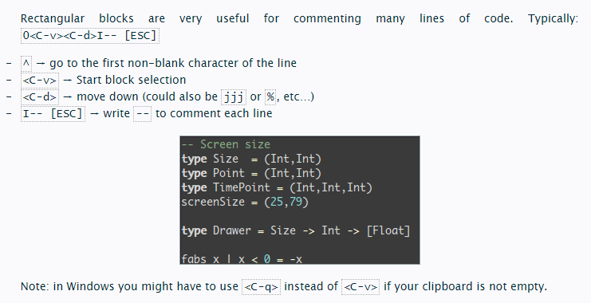
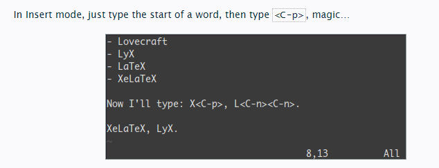
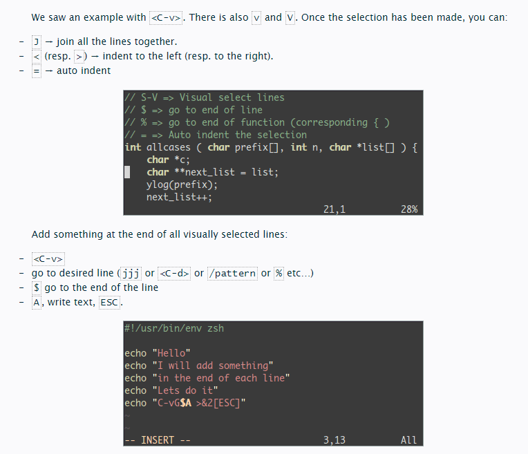

# Vim

## 4 steps

1. Survive
2. Feel comfortable
3. Feel Better, Stronger, Faster
4. Use Superpowers of vim

## 1st level - Survive

- `i` insert mode. Type `esc` to return to normal mode
- `x` delete the char under the cursor
- `:wq` save and quit(`:w` save `:q` quit)
- `dd` delete (and copy) the current line
- `p` paste
- `hjkl` basic cursor move
- `:help <command>` show help about `<command>`

## 2nd level - Feel comfortable

### insert mode variations

- `a` insert after the cursor
- `o` insert a new line after the current one
- `O` insert a new line before the current one
- `cw` replace from the cursor to the end of the word
  
### basic moves

- `0` go to the first column
- `^` go to the first non-blank character of the line
- `$` go to the end of line
- `g_` go to the last non-blank character of line
- `/pattern` search for pattern
  
### copy/paste

- `P` paste before, remember `p` is paste after current position
- `yy` copy the current line, easier but equivalent to ddP

### undo/redo

- `u` undo
- `ctrl r` redo

### load/save/quit/change file (buffer)

- `:e <path/to/file>` open
- `:w` save
- `:saves <path/to/file>` save to <path/to/file>
- `:x`, `ZZ` or `:wq` save and quit
- `:q!` quit without saving, also `:qa!` to quit even if there are modified
- `:bn` (resp `:bp`) show next (resp. previous) file (buffer)

## 3rd level - Better Stronger Faster

### Better

1. `.` (dot) will repeat the last command
2. `N<command>` will repeat the command N times

```vim
2dd → will delete 2 lines
3p → will paste the text 3 times
100idesu [ESC] → will write “desu desu desu desu desu desu desu desu desu desu desu desu desu desu desu desu desu desu desu desu desu desu desu desu desu desu desu desu desu desu desu desu desu desu desu desu desu desu desu desu desu desu desu desu desu desu desu desu desu desu desu desu desu desu desu desu desu desu desu desu desu desu desu desu desu desu desu desu desu desu desu desu desu desu desu desu desu desu desu desu desu desu desu desu desu desu desu desu desu desu desu desu desu desu desu desu desu desu desu desu”
. → Just after the last command will write again the 100 “desu”.
3. → Will write 3 “desu” (and not 300, how clever).
```

### Stronger

By default, words are composed of letters and the underscore character. Let’s call a WORD a group of letter separated by blank characters. If you want to consider WORDS, then just use uppercase characters.

1. N`G` go to line N
2. `gg` shortcut for `1G` -> go to the start of the file
3. `G` go to last line
4. `w` go to the start the following word
5. `e` go to the end of this word
6. `W` go to the start of the following WORD
7. `E` go to the end of this WORD
8. `%` go to the corresponding `(`,`{`,`[`
9. `*`(resp. `#`) go to next (resp. previous) occurrence of the word under the cursor

### Faster

Most commands can be used using the following general format: `<start pos><cmd><end pos>`  
`0y$` means: go to the beginning of this line, yank from here, up to the end of this line

## 4th level - Vim Superpowers

### Move on current line: 0 ^ $ g_ f F t T


### Zone selection `<action>a<object>` or `<action>i<object>`


### Select rectangular blocks: `<Ctrl v>`



### Completion: `<Ctrl n>` and `<Ctrl p>`



### Macros: qa do something `q`, `@a`, `@@`


### Visual selection: `v`, `V`, `<Ctrl v>`



### Splits: `:split` and `vsplit`


