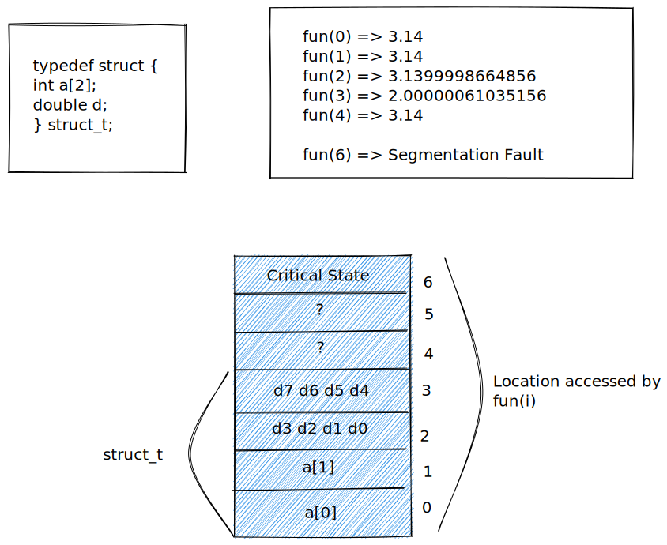

# Course overview

**Abstraction is Good but Don't forget Reality**

## Realities

1. Ints are not Integers, Floats are not Reals
2. Know Assembly
   - Behavior of programs in presence of bugs
   - Tuning program performance
   - Implementing system software
   - Creating/fighting malware
3. Memory Matters
4. There's more to performance than asymptotic complexity
5. Computer do more than execute programs

### Memory Referencing Bug Example

```c
typedef struct {
    int a[2];
    double d;
} struct_t;

double fun(int i) {
    volatile struct_t s;
    s.d = 3.14;
    s.a[i] = 1073741824;
    return s.d;
}
```



### Memory System Performance Example

2.0 GHz Intel Core i7 Haswell

```c
// 4.3 ms
void copyij(int src[2048][2048], int dst[2048][2048]) {
    int i, j;
    for (i = 0; i < 2048; i++) {
        for (j = 0; j < 2048; j++) {
            dst[i][j] = src[i][j];
        }
    }
}
// 81.8 ms
void copyij(int src[2048][2048], int dst[2048][2048]) {
    int i, j;
    for (j = 0; j < 2048; j++) {
        for (i = 0; i < 2048; i++) {
            dst[i][j] = src[i][j];
        }
    }
}
```

- Hierarchical memory organization
- Performance depends on access patterns
