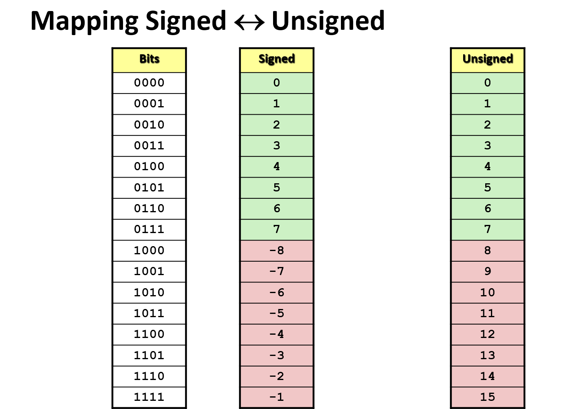

# Bits Manipulation

## Everything is bits

Each bit is 0 or 1.

### Base 2 Number Representation

- `15213` -> `11101101101101`
- `1.20` -> `1.001100110011[0011]`
- `1.5213 * 10^4` -> `1.1101101101101 * 2^13`

## Encoding Byte Values

- Byte = 8 bits.
  - Binary Range: 00000000 to 11111111
  - Decimal Range: 0 to 255
  - Hexadecimal Range: 00 to FF

| Hex | Decimal | Binary |
| --- | ------- | ------ |
| 0   | 0       | 0000   |
| 1   | 1       | 0001   |
| 2   | 2       | 0010   |
| 3   | 3       | 0011   |
| 4   | 4       | 0100   |
| 5   | 5       | 0101   |
| 6   | 6       | 0110   |
| 7   | 7       | 0111   |
| 8   | 8       | 1000   |
| 9   | 9       | 1001   |
| A   | 10      | 1010   |
| B   | 11      | 1011   |
| C   | 12      | 1100   |
| D   | 13      | 1101   |
| E   | 14      | 1110   |
| F   | 15      | 1111   |

## C Data Types

| C data type | Typical 32-bit | Typical 64-bit | x86-64 |
| ----------- | -------------- | -------------- | ------ |
| char        | 1              | 1              | 1      |
| short       | 2              | 2              | 2      |
| int         | 4              | 4              | 4      |
| long        | 4              | 8              | 8      |
| float       | 4              | 4              | 4      |
| double      | 8              | 8              | 8      |
| long double | -              | -              | 10/16  |
| pointer     | 4              | 8              | 8      |

## Boolean Algebra

Encode True as 1 and False as 0.

- And: A&B=1 when both A=1 and B=1
- Or: A|B=1 when either A=1 or B=1
- Not: ~A=1 when A=0
- Exclusive-Or(Xor): A^B=1 when either A=1 or B=1, but not both

### Bit-Level Operations in C

- Apply to any "integral" data type
  - long, int, short, char, unsigned
- View arguments as bit vectors
- Arguments applied bit-wise

### Logic Operations in C

&&, ||, !

- view 0 as Falsy
- Anything nonzero as Truthy
- Always return 0 or 1
- Early termination

## Shift Operations

### Left Shift `x << y`

- shift bit-vector x left y positions (throw away extra bits on left)
- fill with 0 on right

### Right Shift `x >> y`

- shift bit-vector x right y positions (throw away extra bits on right)
- Logical shift: Fill with 0 on left
- Arithmetic shift: Replicate most significant bit on left

### Undefined behavior

Shift amount < 0 or >= word size

## Encoding Integers

- $B2U(X) = \sum_{i=0}^{w-1}x_i*2^i$
- $B2T(X) = -x_{w-1} * 2^{w-1} + \sum_{i=0}^{w-2}x_i*2^i$

### Sign Bit

For 2's complement, most significant bit indicates sign

- 0 for non-negative
- 1 for negative

### Numeric Ranges

**Unsigned Values**

- UMin = 0
- UMax = $2^w -1$

**Two's Complement Values**

- TMin = $-2^{w-1}$
- TMax = $2^{w-1}-1$

---

Values for w = 16:

| .    | Decimal | Hex   | Binary            |
| ---- | ------- | ----- | ----------------- |
| UMax | 65535   | FF FF | 11111111 11111111 |
| TMax | 32767   | 7F FF | 01111111 11111111 |
| TMin | -32768  | 80 00 | 10000000 00000000 |
| -1   | -1      | FF FF | 11111111 11111111 |
| 0    | 0       | 00 00 | 00000000 00000000 |

### Unsigned & Signed Numeric Values

| X    | B2U(X) | B2T(X) |
| ---- | ------ | ------ |
| 0000 | 0      | 0      |
| 0001 | 1      | 1      |
| 0010 | 2      | 2      |
| 0011 | 3      | 3      |
| 0100 | 4      | 4      |
| 0101 | 5      | 5      |
| 0110 | 0      | 6      |
| 0111 | 7      | 7      |
| 1000 | 8      | -8     |
| 1001 | 9      | -7     |
| 1010 | 10     | -6     |
| 1011 | 11     | -5     |
| 1100 | 12     | -4     |
| 1101 | 13     | -3     |
| 1110 | 14     | -2     |
| 1111 | 15     | -1     |

### Mapping Signed <-> Unsigned

- Bit pattern is maintained
- But reinterpreted
- Can have unexpected effects: adding or substracting $2^w$
- Express containing signed and unsigned int => `int is cast to unsigned`

### Expanding, Truncating

- Expanding
  - Unsigned: zeros added
  - Signed: sign extension
  - Both yield expected result
- Truncating
  - Unsigned/signed: bits are truncated
  - Result reinterpreted
  - Unsigned: mod operation
  - Signed: similiar to mod
  - For small numbers yields expected behavior

## Addition, Negation, Multiplication, Shifting

### Unsigned Addition

Ignores carry output

$s = UAdd_w(u, v) = (u + v) mod 2^w$

### Two's Complement Addition

TAdd and UAdd have identical Bit-Level behavior

### Unsigned/Signed Mul

Ignores high order _w_ bits

$UMult_w(u,v) = (u*v)mod2^w$
