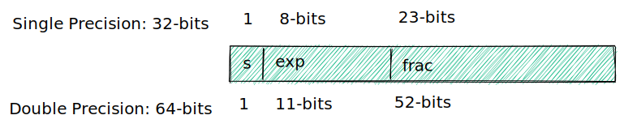

# Floating Point

## Fractional binary numbers

- Bits to right of "binary point" represent fractional powers of 2
- Represents rational number: $\sum_{k=-j}^i b_k \times 2^k$

### Examples

- 5 3/4 -> 101.11
- 2 7/8 -> 10.111
- 1 7/16 -> 1.0111

**Observations**

1. Divide by 2 by shifting right (unsigned)
2. multiply by 2 by shifting left
3. Numbers of form 0.11111111... are just below 1.0

**Limitations**

Can only exactly represent numbers of the form $x/2^k$

- 1/3 -> 0.01010101[01]
- 1/5 -> 0.00110011[0011]
- 1/10 -> 0.000110011[0011]

## IEEE floating point standard

### Numeric Form $(-1)^s M 2^E$

- Sign Bit `s` determines whether number is negative or positive
- Significand M normally a fractional value in range [1.0, 2.0)
- Exponent E weights value by power of two

### Encoding

- Most Significant Bit `s` is sign bit `s`
- `exp` field encodes E (but not equal to E)
- `frac` field encodes M (but not equal to M)

### Normalized Values

When `exp != 000..0 and exp != 111...1`

Exponent coded as a biased value: $E = Exp - Bias$

- Exp: unsigned value of exp field
- $Bias = 2^{k-1} - 1$ where k is number of exponent bits
  - Single Precision: 127 (Exp: 1...254, E: -126...127)
  - Double Precision: 1023 (Exp: 1...2046, E: -1022...1023)

Significand coded with implied leading 1: $M = 1.xxxxx_2$

- `xxx..x`: bits of frac field
- Minimum when `frac=000...0` (M = 1.0)
- Maximum when `frac=111...1` (M = 2.0 -$\Sigma$)
- Get extra leading bit for "free"

### De-normalized Values

When `exp = 000...0`

Exponent value: `E = 1 - Bias` (instead of `E = 0 - Bias`)

Significand coded with implied leading 0: `M = 0.xxx...x`

- `exp = 000...0, frac = 000...0`
  - Represents zero value
  - Distinct values: +0, -0
- `exp = 000...0, frac != 000...0`
  - Numbers closest to 0.0
  - Equispaced

### Special Values

When `exp = 111...1`

- `exp = 111...1, frac = 000...0`
  - Represents value $\infty$
  - Operations that overflows
  - Both positive and negative
  - $1.0/0.0=-1.0/-0.0=+\infty$, $1.0/-0.0=-\infty$
- `exp = 111...1, frac != 000...0`
  - Not-a-Number (NaN)
  - Represents case when no numeric value can be determined
  - $sqrt(-1)$, $\infty - \infty$, $\infty \times 0$

### Tiny Floating Point Example

8-bit floating point representation

- s: 1 bit
- exp: 4 bits
- frac: 3 bits

## Rounding, addition, multiplication

### Basic Idea

- First compute exact result
- Make it fit into desired precision
  - Possibly overflow if exponent too large
  - Possibly round to fit into frac

### Multiplication

$(-1)^{s1}{M1}2^{E1} \times (-1)^{s2}{M2}2^{E2} = (-1)^sM2^E$

- Sign s: `s1 ^ s2`
- Significand M: `M1 x M2`
- Exponent E: `E1 + E2`

**Fixing**

- If `M >= 2`, shift M right, increment E
- If E out of range, overflow
- Round M to fit frac precision

### Addition

Assume `E1 > E2` $(-1)^{s1}{M1}2^{E1} + (-1)^{s2}{M2}2^{E2} = (-1)^sM2^E$

- Sign s, significand M: Result of signed align & add
- Exponent E: E1

**Fixing**

- If `M >= 2`, shift M right, increment E
- If `M < 1`, shift M left k positions, decrement E by k
- Overflow if E out of range
- Round M to fit frac precision

## Floating point in C

Casting between int, float and double changes bit representation

- double/float -> int
  - Truncates fractional part
  - Like rounding toward zero
  - Not defined when out of range or NAN (General sets to TMin)
- int -> double
  - Exact conversion, as long as int has <= 53 bits word size
- int -> float
  - Will round according to rounding mode
