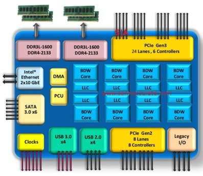
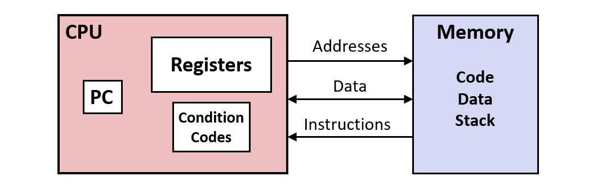
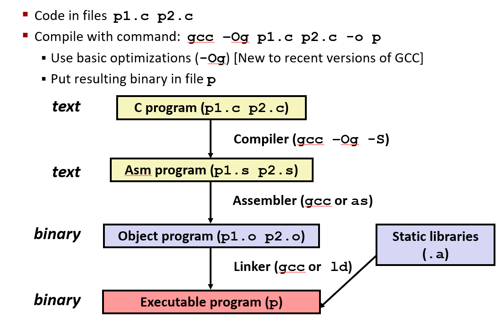

# Machine Level Programming - Basics

Intel x86 Processors

- CISC: Complex instruction set computer
- RISC: Reduced Instruction Set Computers



## C, Assembly, Machine Code

- Architecture(ISA: Instruction set architecture): The parts of a processor design that one needs to understand or write assembly/machine code
- Mirco-Architecture: Implementation of the architecture
- Code Forms
  - Machine Code: The byte Level programs that a processor executes
  - Assembly Code: A text representation of machine code

### Assembly/Machine Code View



### Turning C into Object Code



### Compile Into Assembly

`gcc -Og -S sum.c`

```c
long plus(long x, long y);

void sumstore(long x, long y, long *dest)
{
    long t = plus(x, y);
    *dest = t;
}
```

```as
sumstore:
   pushq   %rbx
   movq    %rdx, %rbx
   call    plus
   movq    %rax, (%rbx)
   popq    %rbx
   ret
```

### Assembly Characterisics: Operations

- Perform arithmetic function on register or on memory data
- Transfer data between memory and register
  - Load data from memory into register
  - Store register data into memory
- Transfer Control
  - Unconditional jumps to/from procedures
  - Conditional branches

### Disassembling Object Code

`objdump -d sum`

```as
0000000000400595 <sumstore>:
  400595:  53               push   %rbx
  400596:  48 89 d3         mov    %rdx,%rbx
  400599:  e8 f2 ff ff ff   callq  400590 <plus>
  40059e:  48 89 03         mov    %rax,(%rbx)
  4005a1:  5b               pop    %rbx
  4005a2:  c3               retq
```

- Useful tool for examining object code
- Analyzes bit pattern of series of instructions
- Produces approximate rendition of assembly code
- Can be run on either `a.out` or `.o` file

## Assembly Bacis

### x86-64 Integer Registers

- %rax (%eax)
- %rbx (%ebx)
- %rcx (%ecx)
- %rdx (%edx)
- %rsi (%esi)
- %rdi (%edi)
- %rsp (%esp)
- %rbp (%ebp)
- %r8 (%r8d) .... %r15 (%r15d)

### Moving Data

`movq Source, Dest`

- Immediate: Constant Integer Data
  - Example: `$0x400`, `$-533`
  - Prefix with `$`
  - Encoded with 1, 2, 4 bytes
- Register: One of 16 integer registers
  - Example: `%rax`, `%rdx`
  - Except `%rsp` reserved for special use
- Memory: 8 consecutive bytes of memory at address given by register
  - Example: `(%rax)`

**movq**

> Cannot do memory-memory transfer with a single instruction

| Source | Dest | Code                | C Analog        |
| ------ | ---- | ------------------- | --------------- |
| Imm    | Reg  | `movq $0x4, %rax`   | `temp = 0x4`    |
| Imm    | Mem  | `movq $-14, (%rax)` | `*p = -14`      |
| Reg    | Reg  | `movq %rax, %rdx`   | `temp2 = temp1` |
| Reg    | Mem  | `movq %rax, (%rdx)` | `*p = temp`     |
| Mem    | Reg  | `movq (%rax), %rdx` | `temp = *p`     |

### Simple Memory Addressing Modes

- Normal: `(R)` -> `Mem[Reg[R]]`
  - Register R specifies memory address
  - `movq (%rcx), %rax
- Displacement: `D(R)` -> `Mem[Reg[R] + D]`
  - Register R specifies start of memory region
  - Constant displacement D specifies offset
  - `moq 8(%rbp), %rdx`
- Most General Form: `D(Rb, Ri, S)` -> `Mem[Reg[Rb] + S * Reg[Ri] + D]`
  - D: Constant "displacement" (1, 2, 4 bytes)
  - Rb: Base Register: any of 16 integer registers
  - Ri: Index register: any, except for `%rsp`
  - S: Scale (1, 2, 4, 8)
- Special Cases
  - `(Rb, Ri)` -> `Mem[Reg[Rb] + Reg[Ri]]`
  - `D(Rb, Ri)` -> `Mem[Reg[Rb] + Reg[Ri] + D]`
  - `(Rb, Ri, S)` -> `Mem[Reg[Rb] + S * Reg[Ri]]`

### Address Computation instruction

- leaq Src, Dst
  - Src is address mode expression
  - Set Dst to address denoted by expression
  - Computing addresses without memory reference
  - Computing arithmetic expressions of the form of `x+k*y`

Two Operand Instructions:

- addq Src,Dest Dest = Dest + Src
- subq Src,Dest Dest = Dest - Src
- imulq Src,Dest Dest = Dest \* Src
- salq Src,Dest Dest = Dest << Src
- sarq Src,Dest Dest = Dest >> Src
- shrq Src,Dest Dest = Dest >> Src
- xorq Src,Dest Dest = Dest ^ Src
- andq Src,Dest Dest = Dest & Src
- orq Src,Dest Dest = Dest | Src

One Operand Instructions:

- incq Dest Dest = Dest + 1
- decq Dest Dest = Dest - 1
- negq Dest Dest = -Dest
- notq Dest Dest = ~Dest
