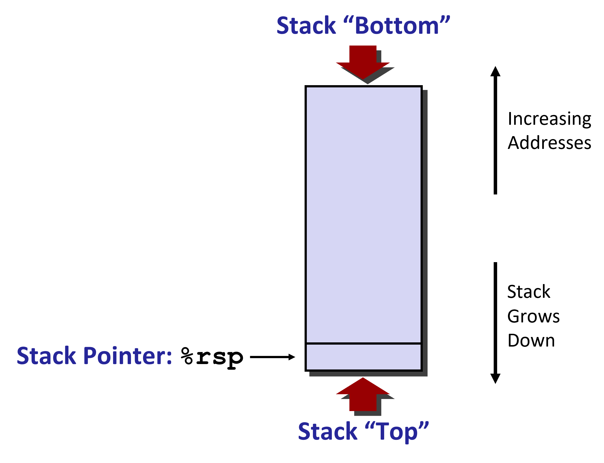
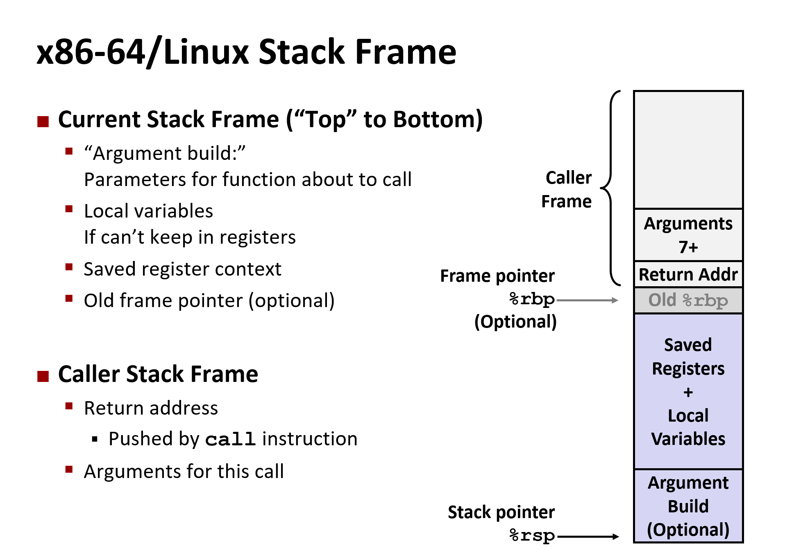

# Machine Level Programming - Procedures

## Stack Structure



- pushq Src
  - Fetch operand at Src
  - Decrement %rsp by 8
  - Write operand at address given by %rsp
- popq Dest
  - Read value at address given by %rsp
  - Increment %rsp by 8
  - Store value at Dest (must be register)

## Calling Conventions

```c
void multstore(long x, long y, long *dest)
{
    long t = mult2(x, y);
    *dest = t;
}
long mult2(long a, long b)
{
  long s = a * b;
  return s;
}
```

```asm
0000000000400540 <multstore>:
  400540: push   %rbx           # Save %rbx
  400541: mov    %rdx,%rbx      # Save dest
  400544: callq  400550 <mult2> # mult2(x,y)
  400549: mov    %rax,(%rbx)    # Save at dest
  40054c: pop    %rbx           # Restore %rbx
  40054d: retq                  # Return
0000000000400550 <mult2>:
  400550:  mov    %rdi,%rax     # a
  400553:  imul   %rsi,%rax     # a * b
  400557:  retq                 # Return
```

### Passing Control

- Use stack to support procedure call and return
- Procedure call: `call label`
  - Push return address on stack
  - jump to label
- Return address
  - Address of the next instruction right after call
- Procedure return: `ret`
  - Pop address from stack
  - Jump to address

### Passing Data

- First 6 arguments: %rdi, %rsi, %rdx, %rcx, %r8, %r9
- Return value: %rax
- Stack: ArgN .... Arg8, Arg7

> Only allocate stack space when needed

### Managing local data

- Languages that support recursion
  - Code must be `Reentrant`: Multiple simultaneous instantiations of single procedure
  - Need some place to store state of each instantiation: Arguments, Local variables, Return pointer
- Stack Discipline
  - State for given procedure needed for limited time
  - Callee returns before caller does
- Stack allocated in frames
  - State for single procedure instantiation

**State Frames**

- Return information
- Local storage
- Temporary space



- Caller Saved
  - Caller Saves temporary values in its frame before the call
- Callee Saved
  - Callee saves temporary values in its frame before using
  - Callee resotres them before returning to the caller
