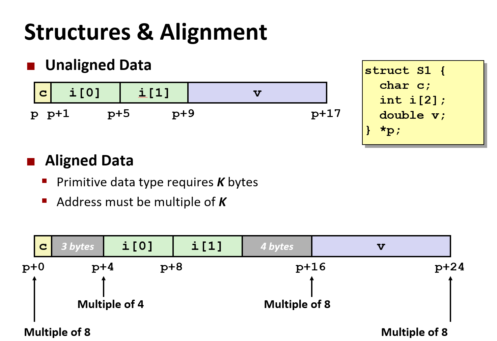

# Machine Level Programming - Data

## Arrays

`T A[L]`

- Array of data type T and length L
- Contiguously allocated region of `L* sizeof(T)` bytes in memory

### Access Array

```c
int get_digit(int* z, int digit) {
    return z[digit];
}
```

```asm
# %rdi = z
# %rsi = digit
    movl    (%rdi, %rsi, 4), %eax
```

### Array Loop

```c
void zincr(int* z) {
    size_t i;
    for (i = 0; i < ZLEN; i++) {
        z[i]++;
    }
}
```

```asm
# %rdi = z
  movl    $0, %eax          #   i = 0
  jmp     .L3               #   goto middle
.L4:                        # loop:
  addl    $1, (%rdi,%rax,4) #   z[i]++
  addq    $1, %rax          #   i++
.L3:                        # middle
  cmpq    $4, %rax          #   i:4
  jbe     .L4               #   if <=, goto loop
  rep; ret
```

## Structures

```c
struct rec {
    int a[4];
    size_t i;
    struct rec *next;
}
```

- Structure represented as block of memory: Big enough to hold all of the fields
- Fields ordered according to declaration: Even if another ordering could yield a more compact representation
- Compiler determines overall size+positions of fields: Machine-Level program has no understanding of the structures in the source code

### Follow linked list

```c
void set_val(struct rec *r, int val) {
    while(r) {
        int i = r->i;
        r->a[i] = val;
        r = r->next;
    }
}
```

```asm
.L11:                         # loop:
  movslq  16(%rdi), %rax      #   i = M[r+16]
  movl    %esi, (%rdi,%rax,4) #   M[r+4*i] = val
  movq    24(%rdi), %rdi      #   r = M[r+24]
  testq   %rdi, %rdi          #   Test r
  jne     .L11                #   if !=0 goto loop
```

### Structure & Alignment



- Aligned data
  - Primitive data type requires K bytes
  - Address must be multiple of K
- Motivation for aligning data
  - Memory accessed by (aligned) chunks of 4 or 8 bytes (system dependent)
    - Inefficient to load or store datau that spans quad word boundaries
    - Virtual Memory tricker when datum spans 2 pages
- Compiler
  - Inserts gaps in structure to ensure correct alignment of fields

## Floating Point

- Arguments passed in %xmm0, %xmm1 ...
- Result returned int %xmm0
- All XMM registers caller-saved

```c
double dadd(double x, double y)
{
    return x + y;
}
```

```asm
# x in %xmm0, y in %xmm1
    addsd   %xmm1, %xmm0
    ret
```
