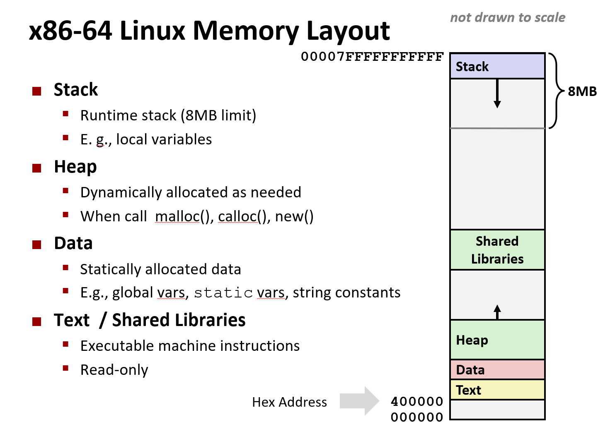

# Machine Level Programming - Advanced

## Memory Layout



## Buffer Overflow

When exceeding the memory size allocated for an array

```c
typedef struct {
  int a[2];
  double d;
} struct_t;

double fun(int i) {
  volatile struct_t s;
  s.d = 3.14;
  s.a[i] = 1073741824; /* Possibly out of bounds */
  return s.d;
}
```

```s
fun(0)  ➙    3.14
fun(1)  ➙    3.14
fun(2)  ➙    3.1399998664856
fun(3)  ➙    2.00000061035156
fun(4)  ➙    3.14
fun(6)  ➙    Segmentation fault
```

**String Library Code**

> No way to specify limit on number of characters to read

```c
/* Get string from stdin */
char *gets(char *dest)
{
    int c = getchar();
    char *p = dest;
    while (c != EOF && c != '\n') {
        *p++ = c;
        c = getchar();
    }
    *p = '\0';
    return dest;
}
```

- Avoid overflow vulnerabilities
- Employ system-level protections
- Have compiler use "stack canaries"
