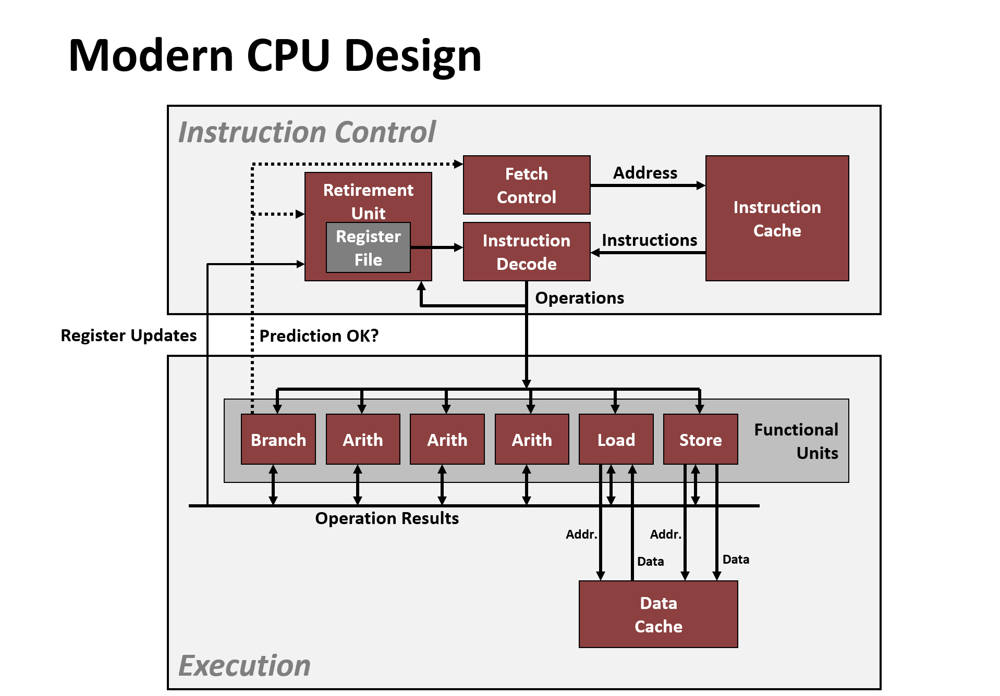

# Program Optimization

## Perforamnce Realities

### Constant factors matter

- Easily see 10:1 performance range depending on how code is written
- Must optimize at multiple levels: algorithm, data representations, procedures and loops

### Understand system to optimize

- How program are compiled and executed
- How modern processors+memory systems operate
- How to measure program performance and identify bottlenecks
- How to improve performance without destroying code modularity and generality

## Optimizing Compilers

### Provide efficient mapping of program to machine

- register allocation
- code selection and ordering (scheduling)
- dead code elimination
- eliminating minor inefficiencies

### Don't (usually) improve asymptotic efficiency

- up to programmer to select best overall algorithm
- big-O savings are (often) more important than constant factors

### Have difficulty overcoming "optimization blockers"

- potential memory aliasing
- potential procedure side-effects

## Limitations of Optimizing Compilers

### Operate under fundamental constraint

- Must not cause any change in program behavior
- Often prevents it from making optimizations that would only affect behavior under pathological conditions

## Generally Useful Optimizations

### Code motion/pre-computation

Reduce frequency with which computation performed.

```c
void set_row(double *a, double *b, long i, long n) {
    long j;
    for (j = 0; j < n; j++) {
        a[n*i+j] = b[j];
    }
}
```

```c
void set_row(double *a, double *b, long i, long n) {
    long j;
    int ni = n * i;
    for (j = 0; j < n; j++) {
        a[ni+j] = b[j];
    }
}
```

### Strength reduction

- Replace costly operation with simpler one
- Shift, add instead of multiply or divide
- Recognize sequence of products

```c
for (i = 0; i < n; i++) {
  int ni = n*i;
  for (j = 0; j < n; j++)
    a[ni + j] = b[j];
}
```

```c
int ni = 0;
for (i = 0; i < n; i++) {
  for (j = 0; j < n; j++)
    a[ni + j] = b[j];
  ni += n;
}
```

### Sharing of common sub-expression

- Reuse portions of expressions
- GCC will do this with `-O1`

```c
/* Sum neighbors of i,j */
up =    val[(i-1)*n + j  ];
down =  val[(i+1)*n + j  ];
left =  val[i*n     + j-1];
right = val[i*n     + j+1];
sum = up + down + left + right;
```

```c
long inj = i*n + j;
up =    val[inj - n];
down =  val[inj + n];
left =  val[inj - 1];
right = val[inj + 1];
sum = up + down + left + right;
```

### Removing unnecessary procedure calls

```c
void lower(char *s)
{
  size_t i;
  // multiple call strlen
  for (i = 0; i < strlen(s); i++)
    if (s[i] >= 'A' && s[i] <= 'Z')
      s[i] -= ('A' - 'a');
}
```

## Optimization Blockers

### Procedure calls

- Procedure may have side effects (Alter global state each time called)
- Function may not return same value for given arguments

### Memory aliasing

- Two different memory references specify single location
- Easy to have happen in C
- Get in habit of introducion local variables

## Exploiting Instruction-Level Parallelism

- Need general understanding of modern processor design
- Performance limited by data dependencies
- Simple transformations can yield dramatic performance improvement

## Modern CPU Design


