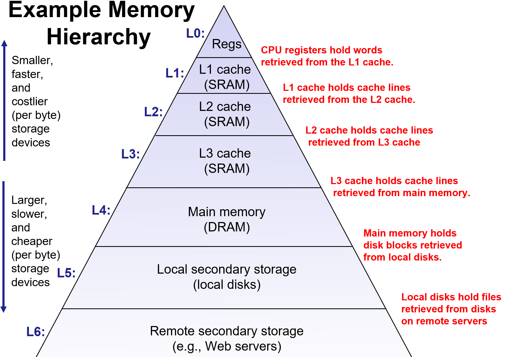
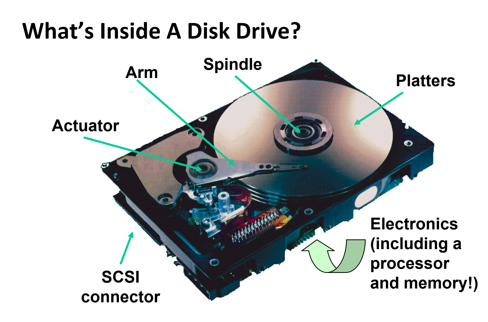
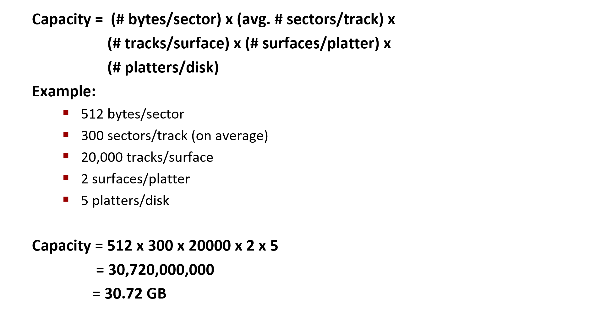
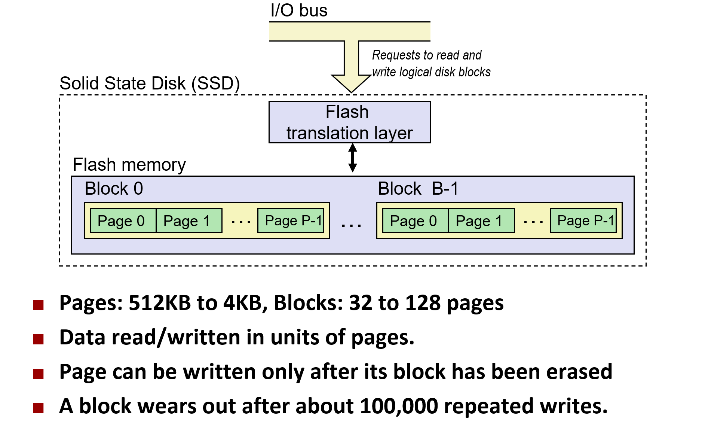
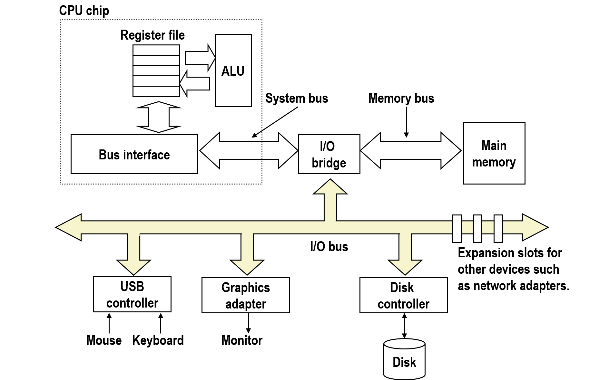

# The Memory Hierarchy

- RAM (Lose information if powered off)
  - SRAM (More Expensive)
  - DRAM (Refresh, EDC)
- ROM
  - DISK
  - SSD

## The disk drive

磁头首先要移动到相应磁道(寻道时间)；然后，在相应扇区旋转到磁头下之前，驱动器必须一直等待(旋转延迟)；最后，还要从所请求的块上传输数据(传输时间)。

### To compute the disk capacity

## The SSD (Solid State Disk)

## The I/O Bus

## Locality

**Principle of Locality**: Programs tend to use data and instructions with addresses near or equal to those they have used recently.

### Temporal Locality

Recently referenced items are likely to be referenced again in the near future [e.g. same reference used in multiple functions]

### Spatial Locality

Items with nearby addresses tend to be referenced close together in time [e.g. i+1 in a for loop]
