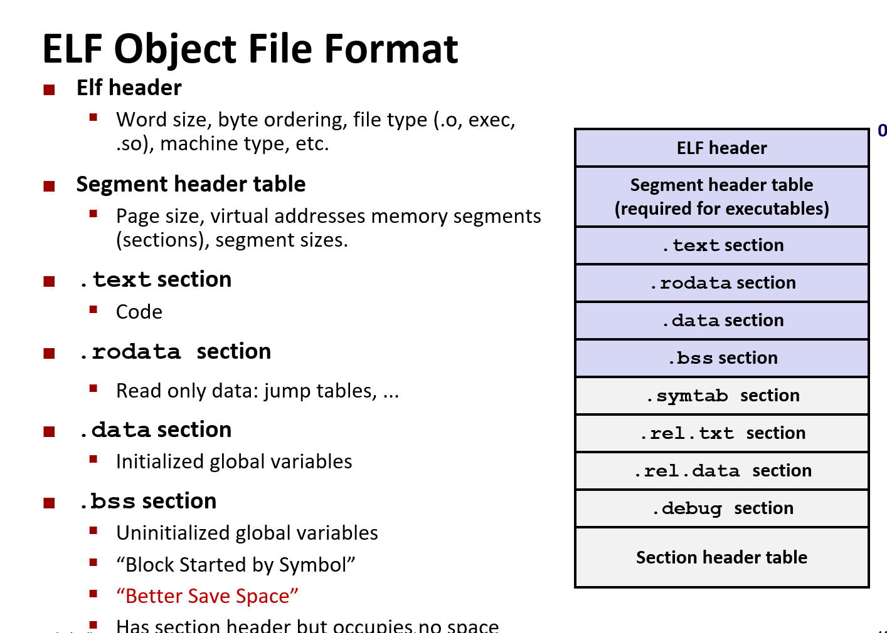
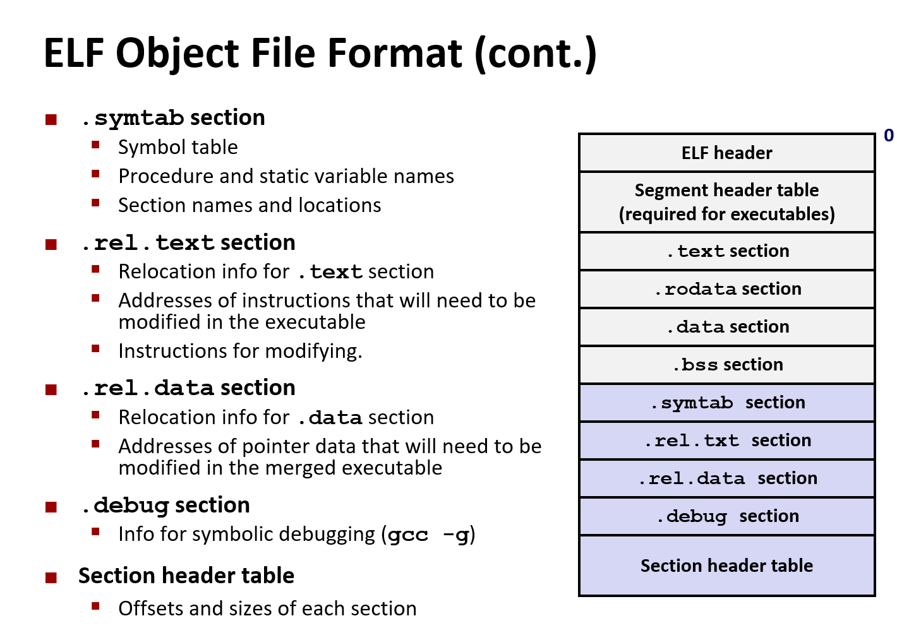

# Linking

`gcc -Og -o prog main.c sum.c`

```c
// main.c
int sum(int *a, int n);

int array[2] = {1, 2};

int main() {
    int val = sum(array, 2);
    return val;
}
```

```c
// sum.c
int sum(int *a, int n) {
    int i, s = 0;
    for (i = 0; i < n; i++) {
        s += a[i];
    }
    return s;
}
```

## Why Linkers

- 模块化 - 将功能分散到多个文件(模块)中，避免单个文件的巨型程序
- 效率 - Change one source file, compile and then relink

## How Linkers work

- Symbol resolution - 符号解析
- Relocation - 重定位
  - Merge separate code and data sections into single sections
  - Relocates symbols from their relative locations in the `.o` files to their final absolute memory locations in the executable
  - Updates all references to these symbols to reflect their new positions

```c
void swap() {} // define symbol `swap`
swap(); // reference symbol `swap`
int *xp = &x; // define symbol `xp`, reference `x`
```

### Three kinds of Object Files (Modules)

- Relocatable object file `.o` -> 可以在编译时与其他可重定位目标文件合并起来，创建一个可执行目标文件
- Executable object file `a.out` -> 二进制代码和数据，其形式可以被直接复制到内存并执行
- Shared object file `.so` -> 特殊的可重定位目标文件，可以在加载或者运行时被动态地加载进内存并链接

### Executable and Linkable Format (ELF)




### Linker Symbols

- Global (int a = 2)
- External (reference other symbol in current module)
- Local (`static int a`)

**Rules**

1. Multiple strong symbols are not allowed
2. Given a strong symbol and multiple weak symbols, choose the strong one
3. If there are multiple weak symbols, pick an arbitrary one

## How do we package?

### Old fashioned: static libraries (`.a.` arhive files)

- Concatenate related relocatable object files into a single file with an index
- Enhance linker so that it tries to resolve unresolved external references by looking for the symbols in one or more archives
- If an archive member file resolves reference, link it into the executable

**linker's algorithm for resolving external references**

1. Scan `.o` files and `.a` files in the command line order
2. During the scan, keep a list of the current unresolved references
3. As each new `.o` or `.a` file, obj, is encountered, try to resolve each unresolved reference in the list against the symbols defined in obj
4. If any entries in the unresolved list at end of scan, then error

**Problems**

- Command line order matters

### Shared libraries

Object files that contain code and data that are loaded and linked into an application dynamically, at either load-time or run-time (`.dll`, `.so`)

- Dynamic Linking can occur when executable is first loaded and run (load time)
- Dynamic linking can also occur after program has begun (run-time)
- Shared library routines can be shared by multiple process

## Summary

- Linking is a technique that allows programs to be constructed from multiple object files
- Linking can happen at different times in a program’s lifetime
  - Compile time
  - Load time
  - Run time
- Understanding linking can help you avoid nasty errors and make you a better programmer. (multiple symbol/reference in different module)
