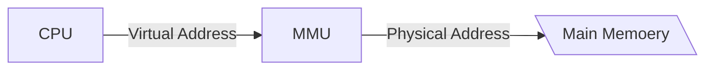

# Virtual Memory Concepts

"Simple" systems like embedded microcontrollers still uses physical addressing.

## The main idea

- Uses main memory efficiently
- Simplifies memory management
- Isolates address spaces

---

VM is just an array of N contiguous bytes stored on disk.

- Caching
- Memory Management
- Memory Protection
- Address Translation

---

Each process has its own virtual address space.
