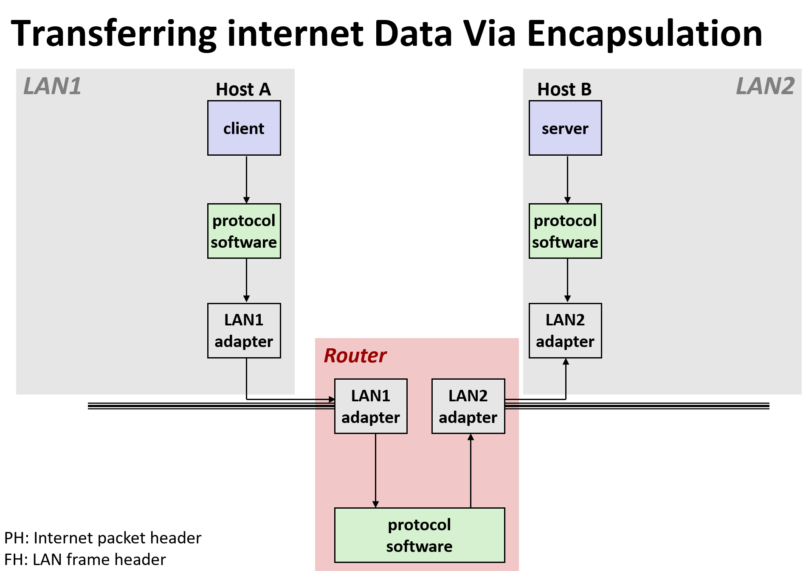
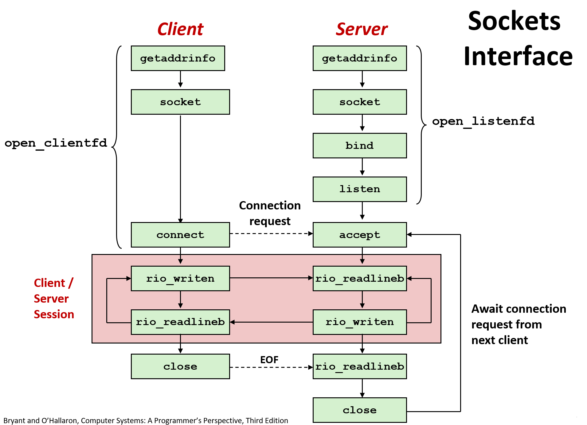

# Network Programming

The Grand Client-Server Architecture

## Computer Networks

A network is a hierarchical system of boxes and wires organized by geographical proximity

- SAN
- LAN
- WAN

## Internet Protocol

- Provides a naming scheme
- Provides a delivery mechanism

- UDP (User Datagram Protocol)
- TCP (Transmission Control Protocol)

## More

- 《网络是如何连接的》
- TLPI 中的网络相关 API
