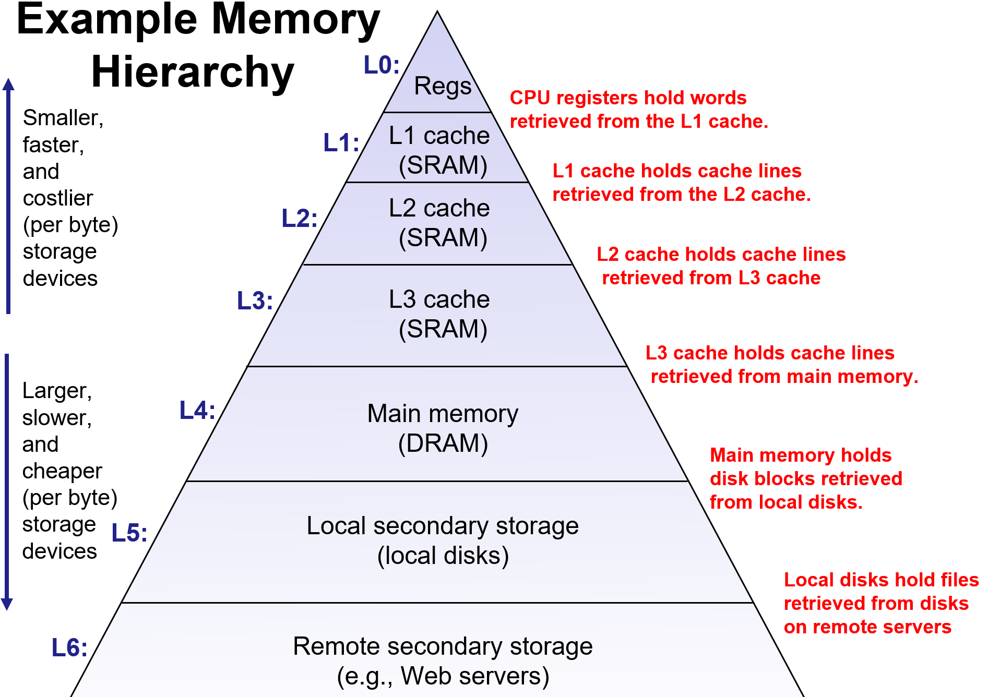

# Database Storage Part One

The DBMS assumes that the primary storage location of the database is on non-volatile disk.

The DBMS's components manage the movement of data between non-volatile and volatile storage.

## Storage Hierarchy

Random access on non-volatile storage is usually much slower than sequential access.

### How does DBMS to maximum sequential access

- Algorithms try to reduce number of writes to random pages so that data is stored in contiguous blocks.
- Allocating multiple pages at the same time is called an extent

## System Design Goals

1. Allow the DBMS to manage databases that exceed the amount of memory available
2. Reading/writing to disk is expensive, so it must be managed carefully to avoid large stalls and performance degradation
3. Random access on disk is usually much slower than sequential access, so the DBMS will want to maximize sequential access.

**MMAP** works good enough for read-only access. It's complicated when there are multipble writers.

### DMSB doesn't use the OS

- Flushing dirty pages to disk in the correct order.
- Specialized prefetching
- Buffer replacement policy
- Thread/process scheduling

## Basic Structure

- File Storage
- Page Layout
- Tuple Layout

The DBMS stores a database as one or more files
on disk typically in a proprietary format.

The store manager is responsible for maintaining a database's files, and it organizes the files as a collection of pages. A Page is fixed-size block of data.

- Hardware Page (usually 4KB)
- OS Page (usually 4KB)
- Database Paeg (512B ~ 16KB)

A hardware page is the largest block of data that the storage device can guarantee failsafe writes.

A heap file is an unordered collection of pages with tuples that are stored in random order.

### Page

**Page Header**

Every page contains a header of meta-data about the pages' contents:

- Page Size
- Checksum
- DBMS Version
- Transaction Visibility
- Compression Information

**Page Layout**

- Tuple-oriented
- Log-structured

### Tuple

Each tuple is assigned a unique record identifier, and is prefixed with a header that contains meta-data about it.

- Visibility info (concurrency control)
- BitMap for NULL values
