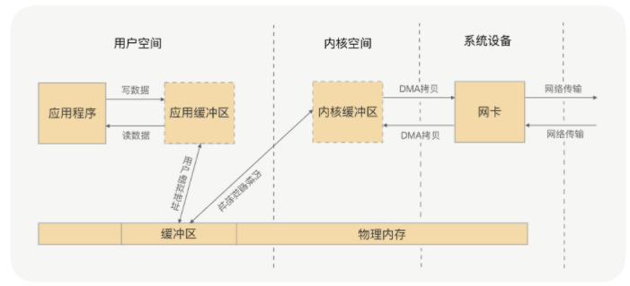

# gRPC

RPC 是解决分布式系统通信的一大利器

- 序列化
- 编解码
- 网络传输

---

- 连接管理
- 健康检测
- 负载均衡
- 优雅启停
- 异常重启
- 业务分组
- 熔断限流

## 定义

RPC 的全称是 Remote Procedure Call, 即远程过程调用

- 屏蔽远程调用和本地调用的区别
- 隐藏底层网络通信的复杂性

## 序列化

- 头部数据用来声明序列化协议, 序列化版本, 用于高低版本向后兼容
- 对象数据主要包括类名, 签名, 属性名, 属性类型及属性值
- 存在对象引用, 继承的情况下, 递归遍历"写对象"逻辑

**常用序列化方式**

- JDK (Serializable)
- JSON
- Hessian

### Protobuf

```java
/**
  * // Idl 文件格式
  * syntax = "proto3";
  * option java_package = "com.test";
  * option java_outer_classname = "StudentProtobuf";
  *
  * message StudentMsg {
     int32 no = 1;
     string name = 2;
  }
  */

StudentProtobuf.StudentMsg.Builder builder = StudentProtobuf.StudentMsg.newBuilder().setNo(103);
builder.setName("protobuf");
// to byte
StudentProtobuf.StudentMsg msg = builder.build();
byte[] data = msg.toByteAdday();

// parse from byte
StudentProtobuf.StudentMsg deStudent = StudentProtobuf.StudentMsg.parseFrom(data);

System.out.println(deStudent);
```

## 网络通信

IO 多路复用更适合高并发的场景，可以用较少的进程（线程）处理较多的 socket 的 IO 请求，但使用难度比较高。当然高级的编程语言支持得还是比较好的，比如 Java 语言有很多的开源框架对 Java 原生 API 做了封装，如 Netty 框架，使用非常简便；而 GO 语言，语言本身对 IO 多路复用的封装就已经很简洁了。

而阻塞 IO 与 IO 多路复用相比，阻塞 IO 每处理一个 socket 的 IO 请求都会阻塞进程（线程），但使用难度较低。在并发量较低、业务逻辑只需要同步进行 IO 操作的场景下，阻塞 IO 已经满足了需求，并且不需要发起 select 调用，开销上还要比 IO 多路复用低。

### 零拷贝

应用进程的每一次写操作，都会把数据写到用户空间的缓冲区中，再由 CPU 将数据拷贝到系统内核的缓冲区中，之后再由 DMA 将这份数据拷贝到网卡中，最后由网卡发送出去。这里我们可以看到，一次写操作数据要拷贝两次才能通过网卡发送出去，而用户进程的读操作则是将整个流程反过来，数据同样会拷贝两次才能让应用程序读取到数据。

应用进程的一次完整的读写操作，都需要在用户空间与内核空间中来回拷贝，并且每一次拷贝，都需要 CPU 进行一次上下文切换（由用户进程切换到系统内核，或由系统内核切换到用户进程），这样是不是很浪费 CPU 和性能呢？那有没有什么方式，可以减少进程间的数据拷贝，提高数据传输的效率呢？

所谓的零拷贝，就是取消用户空间与内核空间之间的数据拷贝操作，应用进程每一次的读写操作，可以通过一种方式，直接将数据写入内核或从内核中读取数据，再通过 DMA 将内核中的数据拷贝到网卡，或将网卡中的数据 copy 到内核。



解决方案: mmap+write, sendfile

### Netty

- Netty 提供了 CompositeByteBuf 类，它可以将多个 ByteBuf 合并为一个逻辑上的 ByteBuf，避免了各个 ByteBuf 之间的拷贝。
- ByteBuf 支持 slice 操作，因此可以将 ByteBuf 分解为多个共享同一个存储区域的 ByteBuf，避免了内存的拷贝。
- 通过 wrap 操作，我们可以将 byte[] 数组、ByteBuf、ByteBuffer 等包装成一个 Netty ByteBuf 对象, 进而避免拷贝操作。
