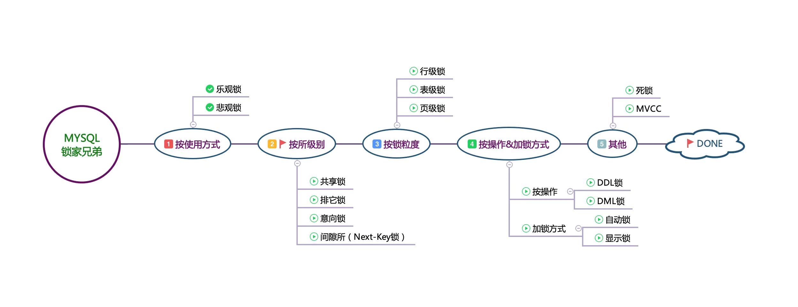

# MySQL Learning

## 当前读与快照读

- **快照读**：读取的是记录数据的可见版本（可能是过期的数据），不用加锁
- **当前读**：读取的是记录数据的最新版本，并且当前读返回的记录都会加上锁，保证其他事务不会再并发的修改这条记录

## select (snapshot read)

当执行 select 的时候，innodb 默认会执行快照读，相当于就是给你目前的状态找了一张照片，以后执行 select 的时候就会返回当前照片里面的数据，当其他事务提交了也对你不造成影响，和你没关系，这就实现了可重复读了

## update, insert, delete (current read)

当你执行这几个操作的时候默认会执行当前读，也就是会读取最新的记录，也就是别的事务提交的数据你也可以看到，这样很好理解啊，假设你要 update 一个记录，另一个事务已经 delete 这条数据并且 commit 了，这样不是会产生冲突吗，所以你 update 的时候肯定要知道最新的信息啊。  
我在这里介绍一下 update 的过程吧，首先会执行当前读，然后把返回的数据加锁，之后执行 update。加锁是防止别的事务在这个时候对这条记录做什么，默认加的是排他锁，也就是你读都不可以，这样就可以保证数据不会出错了。但注意一点，就算你这里加了写锁，别的事务也还是能访问的，是不是很奇怪？数据库采取了一致性非锁定读，别的事务会去读取一个快照数据。  
innodb 默认隔离级别是 RR， 是通过 MVVC 来实现了，读方式有两种，执行 select 的时候是快照读，其余是当前读，所以，mvvc 不能根本上解决幻读的情况

## mysql 查询优化原理分析

操作：查询条件放到子查询中，子查询只查主键 ID，然后使用子查询中确定的主键关联查询其他的属性字段；  
原理：减少回表操作；

```sql
select * from test a inner join (select id from test where val=4 limit 300000,5) b on a.id=b.id;
```

## 乐观锁&悲观锁


select...for update 是 MySQL 提供的实现悲观锁的方式.在 MySQL 中用悲观锁必须确定走了索引，而不是全表扫描，否则将会将整个数据表锁住.  
利用数据版本号(version)机制(或者是时间戳)是乐观锁最常用的一种实现方式

## 数据库中间层

## MyCat

## 关系型数据库

### 如何设计一个关系型数据库

- 存储 (文件系统)
- 程序实例
  1. 存储管理
  2. 缓存机制
  3. SQL 解析
  4. 日志管理
  5. 权限划分
  6. 异常机制(容灾)
  7. 索引管理 -- 快速访问 (二叉查找树)
  8. 锁管理 - 高可用, 高并发

### BTree 索引

1. 根节点至少包括两个孩子
2. 树中每个节点最多含有 m 个孩子(m>=2)
3. 除根节点和叶节点外, 其他每个至少有 ceil(m/2)个孩子
4. 所有叶子节点都位于同一层

### B+Tree 索引

1. 非叶子节点的子树指针与关键字个数相同
2. 非叶子节点的子树指针 p[i],指向关键字值(k[i],k[i+1])的子数
3. 非叶子节点仅用来索引, 数据都保存在叶子节点中
4. 所有叶子节点均有一个链指针指向下一个叶子节点

- Hash 索引
- BitMap 索引

### 密集索引和稀疏索引的区别

- 密集索引文件中的每个搜索码值都对应一个索引值
- 稀疏索引文件只为索引码的某些值建立索引项

#### InnoDB 索引

1. 若一个主键被定义, 则该主键作为密集索引
2. 若没有主键被定义, 该表的第一个唯一非空索引则作为密集索引
3. 若不满足以上条件, innodb 内部会生成一个隐藏主键(密集索引)
4. 非主键索引存储相关键位和其对应的主键值, 包含两次查找

> 如何定位并优化慢查询 sql?

- 根据慢日志定位慢查询 sql (`show variables like '%query%'`)
  1. `long_query_time = 1.000s`
  2. `show_query_log = ON`
- 使用 explain 等工具分析 sql (`explain xxx`)
  1. type (index, all)
  2. extra (using filesort, using temporary)
- 修改 sql 或者尽量让 sql 走索引

> explain 关键字段

- type (最优到最差)
  - system>const>eq_ref>ref>fulltext>ref_or_null>index_merge>unique_subquery>index_subquery>range>index>all
- extra
  - using filesort: 表示 MySQL 会对结果使用一个外部索引排序,而不是从表内按索引次序读到相关内容
  - using temporary: 表示 MySQL 再对查询结果进行排序时会使用临时表,常见于排序 Order By 和分组查询 Group By

> 联合索引的最左匹配原则的成因?

1. 最左前缀匹配原则(非常重要的原则), mysql 会一直向右匹配直到遇到范围查询(>, <, between, like)就停止匹配, 如 a=3 and b=4 and c>5 and d = 6,如果建立(a,b,c,d)顺序的索引, d 是用不到索引的, 如果建立(a,b,d,c)的索引则可以用到, abd 的顺序可以任意调整.
2. =和 in 可以乱序, 比如 a=1 and b=2 and c=3 建立(a,b,c)索引可以任意顺序, mysql 的查询优化器会帮你优化成索引可以识别的形式.

> 索引是建立得越多越好吗?

- 数据量小的表不需要建立索引, 建立索引会增加额外的开销
- 数据变更需要维护索引, 因此更多的索引意味着更多的维护成本
- 更多的索引意味着消耗更多的空间

### 锁模块(表级, 行级, 页级)

> MyISAM 和 InnoDB 关于锁方面的区别是什么

写锁(Exclusive 排他锁), 读锁(Share 共享锁)

- MyISAM 默认表级锁, 不支持行级锁
- InnoDB 默认行级锁, 也支持表级锁

InnoDB 检索时没有用上索引的话, 是表级锁

```sql
show variables like '%autocommit%';
set autocommit = 0; # 关闭自动提交
select * from xxx where xx in (1,3,8) lock in share mode; # innoDB
select * from xxx where xx in (1,3,8) for update; # myisam

```

> 数据库事务的四大特性

- Atomic (原子性)
- Consistency (一致性)
- Isolation (事务之间隔离)
- Durability (持久性)

> 事务隔离级别以及各级别下的并发访问问题

```sql
select @@tx_isolation;
set session transaction isolation level read uncommitted; # for current session

start transaction;
select * from xx where xx = '1' lock in share mode;

# rollback;
commit;
```

- 更新丢失: mysql 所有级别在数据库层面上均可避免
- 脏读: READ-COMMITTED 级别以上可避免
- 不可重复读: REPEATABLE-READ 级别以上可避免 (强调数据发生改变)
- 幻影读: SERIALIZABLE 级别可避免 (强调数据增加或减少)

> InnoDB 可重复度隔离级别下如何避免幻读

- 表象: 快照读(非阻塞读) -- 伪 MVCC
- 内在: next-key 锁(行锁+gap 锁)

---

- 当前读: select ... lock in share mode, select ... for update, update, delete, insert
- 快照读: 不加锁的非阻塞读, select(SERIALIZABLE 级别以外)

---

- 如果 where 条件全部命中, 则不会用 Gap 锁, 只会加记录锁(Record Lock)
- 如果 where 条件部分命中或全不命中, 则会加 Gap 锁

Gap 锁会用在非唯一索引或不走索引的当前读中(解决幻读)

```sql
select * from xxx where xx in (1,3,8) lock in share mode;
```

Suppose that an index contains the values 10, 11, 13, and 20. The possible next-key locks for this
index cover the following intervals, where a round bracket denotes exclusion of the interval endpoint
and a square bracket denotes inclusion of the endpoint:

`(negative infinity, 10] (10, 11] 2655 InnoDB Locking (11, 13] (13, 20] (20, positive infinity)`

> RC, RR 级别下的 InnoDB 的非阻塞读如何实现

- 数据行里的 DB_TRX_ID, DB_ROLL_PTR, DB_ROW_ID 字段(上一次事务 ID, 回滚指针, 隐藏主键)
- undo 日志
- read view

#### MyISAM 适合的场景

1. 频繁执行全表 count 的语句
2. 查多写少
3. 没有事务

#### InnoDB 适合的场景

1. 数据增删改查都相当频繁
2. 可靠性要求较高, 要求支持事务

### 语法部分

- GROUP BY (using temporary)
  1. 满足“SELECT 子句中的列名必须是分组列或列函数
  2. 列函数对于 Group By 子句定义的每个组各返回一个结果
- HAVING
  1. 通常和 GROUP BY 子句一起使用
  2. WHERE 过滤行, HAVING 过滤组
  3. SQL 顺序: WHERE>GROUP BY > HAVING
- 统计相关: COUNT, SUM, MAX, MIN, AVG
