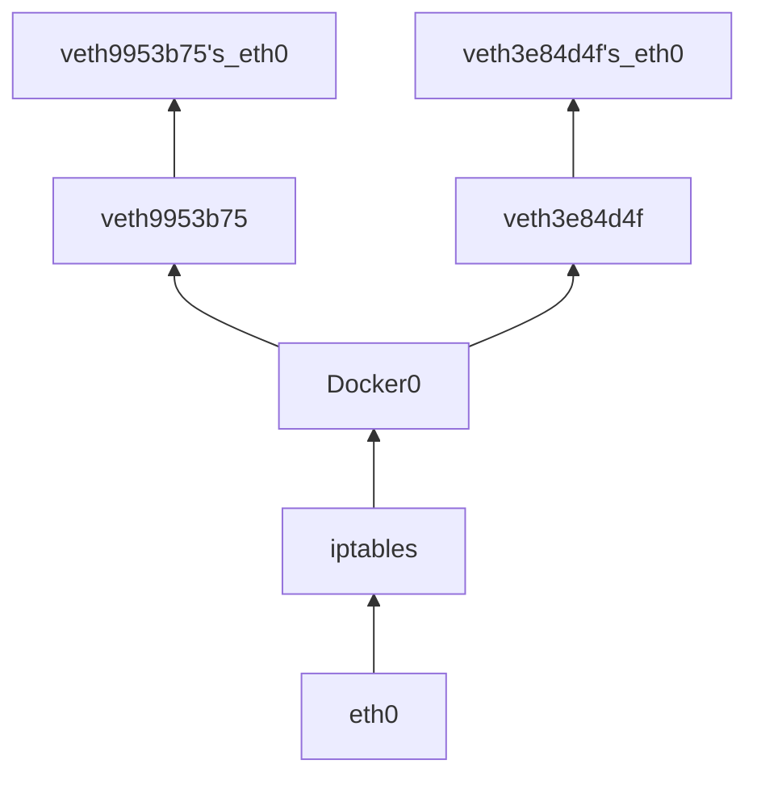

# Docker

- 进程 - namespace
- 网络 - libnetwork
- 挂载点(文件系统) Chroot
- 资源 - Control Group v1 v2
- 镜像 - OCI Image Spec (Advanced) union fs

## Three Main Part

1. Namespace
2. Control Group
3. UnionFS (AUFS)

### Namespace

- UTS `CLONE_NEWUTS` 主机名和域名
- IPC `CLONE_NEWIPC` 信号量、消息队列和共享内存
- PID `CLONE_NEWPID` 进程编号
- Network `CLONE_NEWNET` 网络设备、网络栈、端口等
- Mount `CLONE_NEWNS` 挂载点(文件系统)
- User `CLONE_NEWUSER` 用户和用户组
- Cgroup `CLONE_NEWCGROUP` CGROUP 的根目录

### Control Group

1. Resource Limit
2. Prioritization
3. Accounting
4. Control

---

## 容器 - 根文件系统(rootfs)

- /proc
- /dev
- /dev/shm
- /dev/mqueue
- /dev/pts
- /sys
