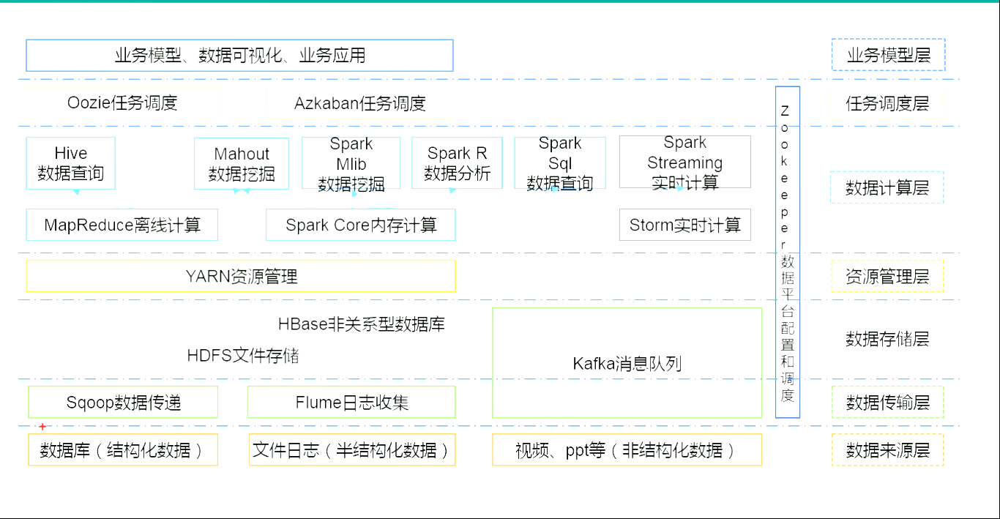

# 大数据学习(JAVA) - 2020.07.25

## 大数据

### 概念

指无法在一定时间范围内用常规软件工具进行捕捉, 管理和处理的数据集合, 是需要新处理模式才能具有更强的决策力, 洞察发现力和流程优化能力的海量, 高增长率和多样化的信息资产

### 特点(4V)

1. Volume(容量)
2. Velocity(速率)
3. Variety(多样性)
4. Value(低价值密度)

### 应用场景

1. 物流仓储: 大数据分析系统助力商家精细化运营, 提升销量, 节约成本
2. 零售: 分析用户消费习惯
3. 旅游: 数据分析
4. 商业广告推荐

### 大数据业务流程分析

1. 产品人员提需求(统计总用户数, 日活, 回流用户数)
2. 数据部门搭建数据平台, 分析数据指标
3. 数据可视化(报表展示, 邮件发送, 大屏幕展示等)

### 大数据部门组织架构

1. 平台组 => Hadoop, Flume, Kafka, Hbase, Spark等框架平台搭建; 集群性能监控, 调优
2. 数据仓库组 => ETL工程师-数据清洗; Hive工程师-数据分析,建模
3. 数据挖掘组 => 算法工程师, 推荐系统工程师, 用户画像工程师
4. 报表开发组 => Java EE

## Hadoop

### 介绍

1. Hadoop是一个由Apache基金会所开发的分布式系统基础架构
2. 主要解决海量数据的存储和分析计算问题
3. Hadoop通常指Hadoop的生态圈

### 发展历史

1. Lucence框架实现与Google类似的全文搜索功能, 提供了全文检索引擎的架构, 包括完整的查询引擎和索引引擎

### 三大发行版本

1. Apache版本最原始
2. Cloudera在大型互联网企业中用的较多
3. Hortonworks文档最好

### 优势

1. 高可靠性: Hadoop底层维护多个数据副本, 即使某个计算元素或存储发生故障, 也不会导致数据丢失
2. 高扩展性: 在集群间分配任务数据, 可方便扩展数以千计的节点
3. 高效: 在Map-Reduce的思想下, Hadoop并行工作以加快任务处理速度
4. 高容错性: 能够自动将失败的任务重新分配

### 组成

#### 1.x

- common(辅助)
- HDFS(数据存储)
- MapReduce(计算&资源调度)

#### 2.x

- common(辅助工具)
- HDFS(数据存储)
- Yarn(资源调度)
- MapReduce(计算)

#### HDFS

- NameNode: 存储文件的元数据, 如文件名, 文件目录结构, 文件属性(生成时间, 副本数, 文件权限), 以及每个文件的块列表和块所在的DataNode等
- DataNode: 在本地文件系统存储文件块数据, 以及块数据的校验和
- SecondaryNameNode: 用来监控HDFS状态的辅助后台程序, 每隔一段时间获取HDFS元数据的快照

#### Yarn

- ResourceManager
  - 处理客户端请求
  - 监控NodeManager
  - 启动或监控ApplicationMaster
  - 资源的分配和调度
- NodeManager
  - 管理单个节点上的资源
  - 处理来自ResouceManager的命令
  - 处理来着ApplicationMaster的命令
- ApplicationMaster
  - 负责数据切分
  - 为应用程序申请资源并分配给内部的任务
  - 任务的监控与容错
- Container
  - Container是YARN中资源抽象, 封装了某个节点上的多维度资源: CPU, 内存, 磁盘, 网络等

#### MapReduce

1. Map阶段并行处理输入数据
2. Reduce阶段对Map结果进行汇总

### 技术生态体系

## Hadoop运行环境搭建

- todo

### Hadoop目录结构

- bin
- etc
- include
- lib
- libexec
- sbin
- share
