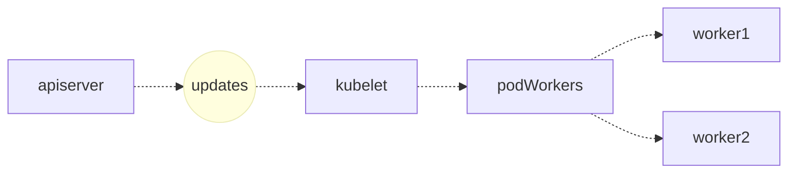
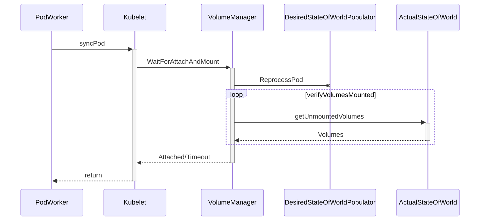
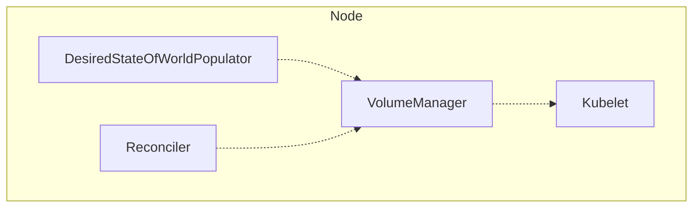
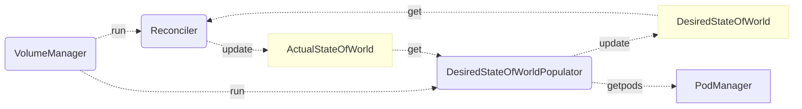
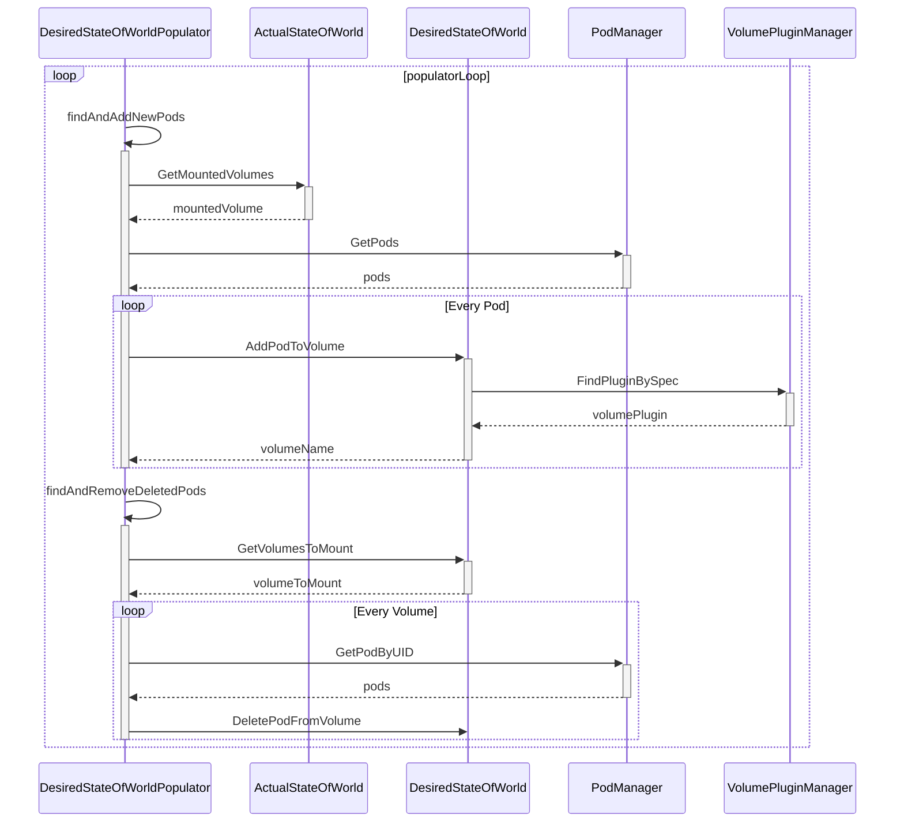
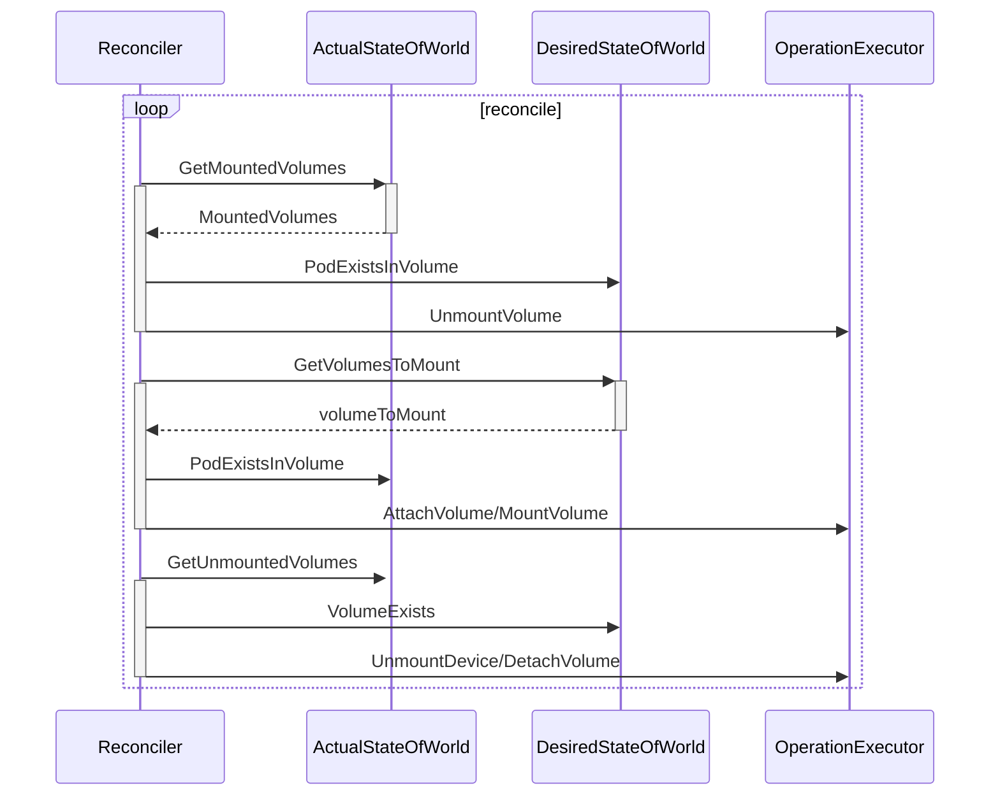

# 持久卷 PV、PVC

Kubernetes 引入了一组叫作 Persistent Volume Claim（PVC）和 Persistent Volume（PV）的 API 对象用于管理存储卷。

## Sample Graph

### apiserver with kubelet



### podWorker timeline



### Volume Manager









## Sample

PVC:

```yml
apiVersion: v1
kind: PersistentVolumeClaim
metadata:
  name: mongodb-pvc
spec:
  resources:
    requests:
      storage: 1Gi # 定义了PVC的容量
  accessModes:
    - ReadWriteOnce # 只能在一个node节点上进行读写操作
  storageClassName: "" # storageClass
```

PV:

```yml
apiVersion: v1
kind: PersistentVolume
metadata:
  name: mongodb-pv
spec:
  capacity:
    storage: 1Gi
  accessModes:
    - ReadWriteOnce
    - ReadOnlyMany
  persistentVolumeReclaimPolicy: Retain
  gcePersistentDisk: # 定义存储的类型是GCE
    pdName: mongodb
    fsType: ext4
```

PVC 和 PV 相当于“接口”和“实现”（Static Provisioning），所以我们需要将 PVC 和 PV 绑定起来才可以使用，而 PVC 和 PV 绑定的时候需要满足：

- PV 和 PVC 的 spec 字段要匹配，比如 PV 的存储（storage）大小，就必须满足 PVC 的要求。
- PV 和 PVC 的 storageClassName 字段必须一样才能进行绑定。storageClassName 表示的是 StorageClass 的 name 属性。

在 Pod 中使用 PVC：

```yml
apiVersion: v1
kind: Pod
metadata:
  name: mongodb
spec:
  containers:
    - image: mongo
      name: mongodb
      volumeMounts:
        - name: mongodb-data
          mountPath: /data/db
      ports:
        - containerPort: 27017
          protocol: TCP
      resources:
        limits:
          cpu: "250m"
          memory: "512Mi"
  volumes:
    - name: mongodb-data
      persistentVolumeClaim:
        claimName: mongodb-pvc # 指定PVC名称
```

在 Pod 中只需要声明 PVC 的名字，等 Pod 创建后 kubelet 就会把这个 PVC 所对应的 PV，也就是一个 GCE 类型的 Volume，挂载在这个 Pod 容器内的目录上。

PVC 和 PV 是为了区分团队协作中管理员和研发人员的职责：研发人员定义 PVC，PV 交给管理员实现。

PersistentVolumeController 会不断地查看当前每一个 PVC，是不是已经处于 Bound（已绑定）状态。如果不是，那它就会遍历所有的、可用的 PV，并尝试将其与这个“单身”的 PVC 进行绑定。

### StorageClass 的 Dynamic Provisioning

如果找不到可用的 PV，StorageClass 提供了 Dynamic Provisioning 机制，可以根据模板自动创建 PV。

k8s 能够根据用户提交的 PVC，找到一个对应的 StorageClass ，然后调用该 StorageClass 声明的存储插件，创建出需要的 PV。

1. PV 的属性。比如，存储类型、Volume 的大小等等。
2. 创建这种 PV 需要用到的存储插件。比如，Ceph 等等。

```yml
apiVersion: storage.k8s.io/v1
kind: StorageClass
metadata:
  name: block-service
provisioner: kubernetes.io/gce-pd
parameters:
  type: pd-ssd
```

provisioner 字段的值是：kubernetes.io/gce-pd，这是 k8s 内置的存储插件，type 字段也是跟着 provisioner 定义的，官方默认支持 Dynamic Provisioning 的内置存储插件：`https://kubernetes.io/docs/concepts/storage/storage-classes/`。

### PV 和 PVC 的生命周期

Provisioning —> Binding —> Using —> Reclaiming

#### **Provisioning**

k8s 提供了两种 PV 生成方式： statically or dynamically

statically：由管理员创建 PV，它们携带可供集群用户使用的真实存储的详细信息。 它们存在于 Kubernetes API 中，可用于消费。

dynamically：当管理员创建的静态 PV 都不匹配用户的 PersistentVolumeClaim 时，集群可能会尝试为 PVC 动态配置卷。 此配置基于 StorageClasses，PVC 必须请求一个 StorageClasses，并且管理员必须已创建并配置该类才能进行动态配置。

#### **Binding**

由用户创建好 PersistentVolumeClaim 后，PersistentVolumeController 会不断地查看当前每一个 PVC，是不是已经处于 Bound（已绑定）状态。如果不是，那它就会遍历所有的、可用的 PV，并尝试将其与这个“单身”的 PVC 进行绑定。

#### **Using**

Pods 声明并使用 PVC 作为 volume 后，集群会找到该 PVC，如果该 PVC 已经绑定了 PV，那么会将该 volume 挂载到 Pod 中。

#### **Reclaiming**

当用户已经不再使用该 volume，可以将该 PVC 删除，以便让资源得以回收。相应的在 PVC 删除后，PV 的回收策略可以是 Retained, Recycled, or Deleted，这个策略可以在字段 spec.persistentVolumeReclaimPolicy 中设置。

- Retain：这个策略允许手动回收资源，当 PVC 被删除后，PV 仍然可以存在，管理员可以手动的执行删除 PV，并且和 PV 绑定的存储资源也不会被删除，如果想要删除相应的存储资源的数据，需要手动删除对应存储资源的数据。
- Delete：这个策略会在 PVC 被删除之后，连带将 PV 以及 PV 管理的存储资源也删除。
- Recycle：相当于在 volume 中执行 rm -rf /thevolume/\*命令，以便让 volume 可以重复利用。

一般的情况下，我们遵循这个删除流程：

1. 删除使用这个 PV 的 Pod；
2. 从宿主机移除本地磁盘；
3. 删除 PVC；
4. 删除 PV。

## 源码分析

- pv_controller_base.go
- pv_controller.go
