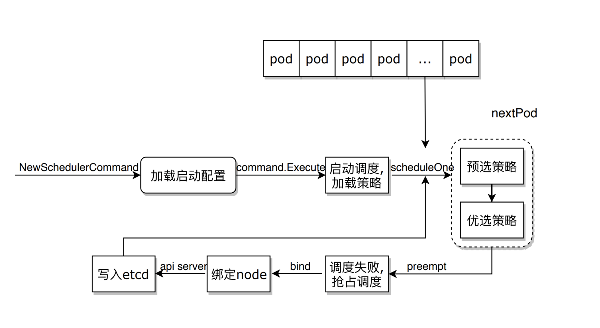

# Scheduling 流程深度剖析

## Scheduler

### 作用

1. 监听 API Server，获取还没有 bind 到 node 上的 pod
2. 根据预选，优先，抢占策略，将 pod 调度到合适的 node 上
3. 调用 API Server，将调度信息写入 ETCD

### 原则

1. 公平：确保每个 pod 都要被调度，即使因为资源不够而无法调用
2. 资源合理分配：根据多种策略选择合适的 node，并且使资源利用率尽量高
3. 可自定义：内部支持多种调度策略，用户可以选择亲和性、优先级、污点等控制调度结果，另外也支持自定义 schduler 的方式进行扩展

### procedure

