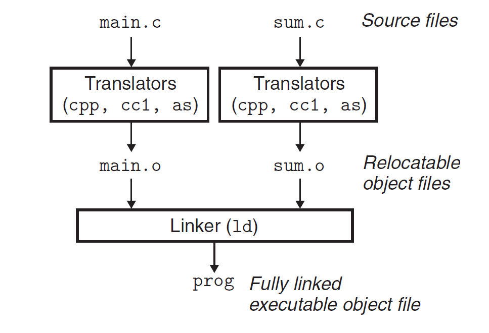
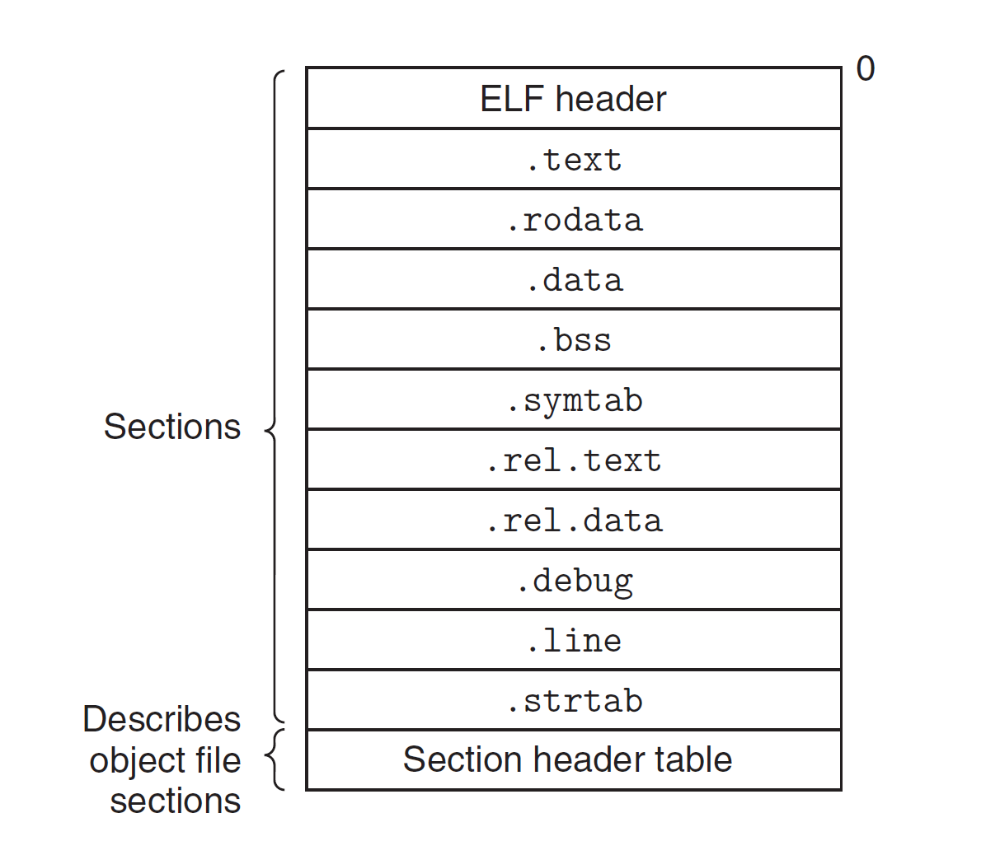
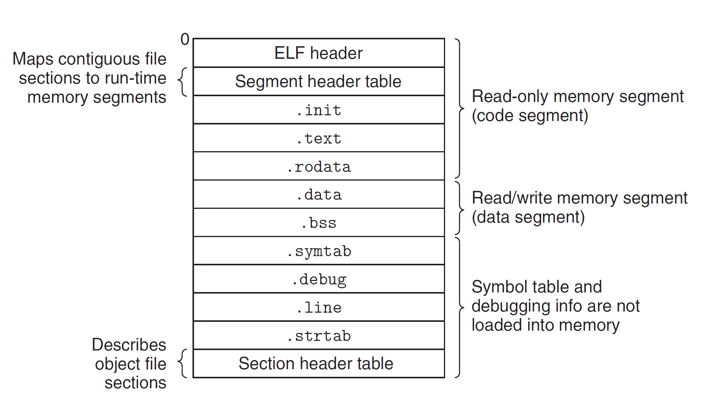
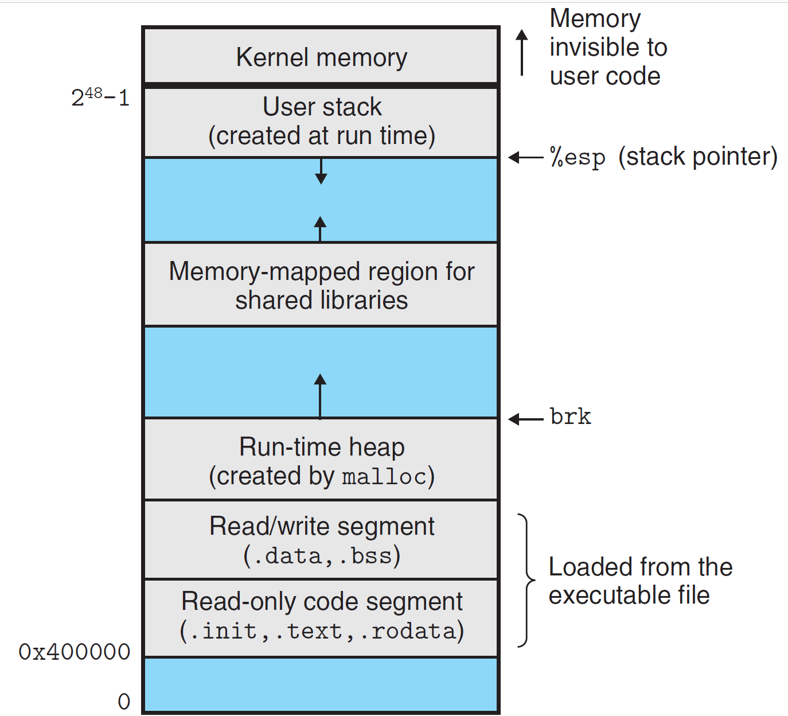

# Linking

Linking is the process of collecting and combining various pieces of code and data into a single file that can be loaded(copied) into memory and executed.

- Understanding linkers will help you build large programs
- Understanding linkers will help you avoid dangerous programming errors
- ... help you understand how language scoping rules are implemented
- ... help you understand other important systems concepts
- ... enable you to exploit shared libraries

**main.c**

```c
int sum(int *a, int n);

int array[2] = {1, 2};

int main() {
    int val = sum(array, 2);
    return val;
}
```

**sum.c**

```c
int sum(int *a, int n) {
    int i, s = 0;
    for (i = 0; i < n; i++) {
        s += a[i];
    }
    return s;
}
```

## 1. Compiler Drivers

Most compilation systems provides a `compiler driver` that invokes the language preprocessor, compiler, assembler and linker.

`linux> gcc -0g -o prog main.c sum.c`



### Steps

1. C preprocessor(cpp) tranlates the C source file `main.c` into an ASCII intermediate file `main.i`. `cpp [other arguments] main.c /tmp/main.i`
2. C compiler(cc1) translates `main.i` into an ASCII assembly-language file `main.s`. `cc1 /tmp/main.i -0g [other arguments] -o /tmp/main.s`
3. Assembler(as) translates `main.s` into a binary `relocatable object file` `main.o`. `as [other arguments] -o /tmp/main.o /tmp/main.s`
4. Linker program(ld) combines `main.o` and `sum.o` along with necessary library object files to create the binary `executable object file` `prog`. `ld -o prog [system object files and args] /tmp/main.o /tmp/sum.o`

## 2. Static Linking

`Static linkers` such as Linux LD program take as input a collection of relocatable object files and command-line arguments and generate as output a fully linked executable object file that can be loaded and run.

### Two main tasks

**Symbol resolution**: Object files define and reference symbols, where each symbol corresponds to a function, a global variable, or a `static` variable. The purpose of symbol resolution is to associate each symbol reference with exactly one symbol definition.

**Relocation**: Compilers and assemblers generate code and data sections that start at address 0. The linker relocates thses sections by associating a memory loaction with each symbol definition, and then modifying all of the references to those symbols so that relocations using detailed instructions, generated by the assembler, called relocation entries.

## 3. Object Files

Typical ELF relocatable object file.



### Three forms

- Relocatable object file: Contains binary code and data in a form that can be combined with other relocatable object files at compile time to create an executable object file.
- Executable object file: Contains binary code and data in a form that can be copied directly into memory and executed.
- Shared object file: A special type of relocatable object file that can be loaded into memory and linked dynamically, at either load time or run time.

## 4. Relocatable Object Files

The `_ELF_ header` begins with a 16-byte sequence that describes the word size and byte ordering of the system that generated the file. The rest of the `_ELF_ header` contains information that allows a linker to parse and interpret the object file. (the size of the `ELF` header, the object file type, the machine type, the file offset of the section header table, and the size and number of entries)

The locations and sizes of the various sections are described by the `section header table`, which contains a fixed-size entry for each section in the object file.

- `.text` The machine code of the compiled program
- `.rodata` Read-only data such as the format strings in `printf` statements, and jump tables for switch statements
- `.data` Initialized global and static C variables. Local C variables are maintained at run time on the stack and do not appear in either the `.data` or `.bss` sections
- `.bss` Uninitialized global and static C variables, along with any global or static variables that are initialized to zero. This section occupies no actual space in the object file; it is merely a placeholder. Object file formats distinguish between initialized and uninitialized variables for space efficiency: uninitialized variables do not have to occupy any actual disk space in the object file. At run time, these variables are allocated in memory with an initial value of zero.
- `.symtab` A symbol table with information about functions and global variables that are defined and referenced in the program. Some programmers mistakenly believe that a program must be compiled with the -g option to get symbol table information. In fact, every relocatable object file has a symbol table in `.symtab` (unless the programmer has specifically removed it with the _strip_ command). However, unlike the symbol table inside a compiler, the `.symtab` symbol table does not contain entries for local variables.
- `.rel.text` A list of locations in the `.text` section that will need to be modified when the linker combines this object file with others. In general, any instruction that calls an external function or references a global variable will need to be modified. On the other hand, instructions that call local functions do not need to be modified. Note that relocation information is not needed in executable object files, and is usually omitted unless the user explicitly instructs the linker to include it.
- `.rel.data` Relocation information for any global variables that are referenced or defined by the module. In general, any initialized global variable whose initial value is the address of a global variable or externally defined function will need to be modified.
- `.debug` A debugging symbol table with entries for local variables and typedefs defined in the program, global variables defined and referenced in the program, and the original C source file. It is only present if the compiler driver is invoked with the -g option.
- `.line` A mapping between line numbers in the original C source program and machine code instructions in the .text section. It is only present if the compiler driver is invoked with the -g option.
- `.strtab` A string table for the symbol tables in the `.symtab` and `.debug` sections and for the section names in the section headers. A string table is a sequence of null-terminated character strings.

## 5. Symbols and Symbol Tables

- Global symbols that are defined by module m and that can be referenced by other modules. Global linker symbols correspond to _nonstatic_ C functions and global variables
- Global symbols that are referenced by module m but defined by some other module. Such symbols are called externals and correspond to nonstatic C functions and global variables that are defined in other modules.
- Local symbols that are defined and referenced exclusively by module m. These correspond to static C functions and global variables that are defined with the _static_ attribute.

```c
typedef struct {
    int name; // String table offset
    char type:4, // Function or data (4 bits)
         binding:4; // Local or global (4 bits)
    char reserved;
    short section; // Section header index
    long value; // Section offset or absolute address
    long size; // Object size in bytes
} Elf64_Symbol;

```

## 6. Symbol Resolution

The linker resolves symbol references by associating each reference with exactly one symbol definition from the symbol tables of its input relocatable object files. [The compiler allows only one definition of each local symbol per module, ensures that static local variables, which get local linker symbols, have unique names]

When the compiler encounters a symbol (either a variable or function name) that is not defined in the current module, it assumes that it is defined in some other module, generates a linker symbol table entry, and leaves it for the linker to handle. If the linker is unable to find a definition for the referenced symbol in any of its input modules, it prints an (often cryptic) error message and terminates.

To deal duplicate symbol names:

1. Multiple strong symbols with the same name are not allowed
2. Given a strong symbol and multiple weak symbols with the same name, choose the strong one
3. Given multiple weak symbols with the same name, choose any of the weak symbols

```c
// foo.c
int y = 222;
int x = 111;

// bar.c
double x = -0.0;

// the assignment x in bar.c will overwrite the memory locations x&y
```

## 07. Relocation

Relocation merges the input modules and assigns run-time addresses to each symbol.

Two Steps:

- Relocating sections and symbol definitions. The linker merges all sections of the same type into a new aggregate section of the same type, then assigns run-time memory addresses to the new aggregate section, to each section defined by the input modules, and to each symbol defined by the input modules. After this, each instruction and global variable in the program has a unique run-time memory address.
- Relocating symbol references within sections. The linker modifies every symbol reference in the bodies of the code and data sections so that they point to the correct run-time addresses.

## 08. Executable Object Files



The `.init` section defines a small function, called `_init`, that will be called by the program's initialization code. Since the executable is fully linked (relocated), it needs no `.rel` sections.

## 09. Loading Executable Object Files

Linux x86-64 run-time memory structure



> Each program in a Linux system runs in the context of a process with its own virtual address space.When the shell runs a program, the parent shell process forks a child process that is a duplicate of the parent. The child process invokes the loader via the `execve` system call. The loader deletes the child’s existing virtual memory segments and creates a new set of code, data, heap, and stack segments. The new stack and heap segments are initialized to zero. The new code and data segments are initialized to the contents of the executable file by mapping pages in the virtual address space to page-size chunks of the executable file. Finally, the loader jumps to the `_start` address, which eventually calls the application’s `main` routine. Aside from some header information, there is no copying of data from disk to memory during loading. The copying is deferred until theCPUreferences a mapped virtual page, at which point the operating system automatically transfers the page from disk to memory using its paging mechanism.

## 10. Dynamic Linking with Shared Libraries

Shared libraries are modern innovations that adress the disadvantages of static libraries. A shared library is an object module that, at either run time or load time, can be loaded at an arbitrary memory address and linked with a program in memory. This process is known as dynamic linking and is performed by a program called a dynamic linker.

1. in any given file system, there is exactly one `*.so` file for particular library.
2. a single copy of the `.text` section of a shared library in memory can be shared by different running processes.

## 11. Loading and Linking Shared Libraries from Applications

Linux systems provide a simple interface to the dynamic linker that allows application programs to load and link shared libraries at run time.

```c
#include <dlfcn.h>

void *dlopen(const char* filename, int flag); // return: Pointer to handle if OK, NULL on error
```

Sample Code

```c
#include <stdio.h>
#include <stdlib.h>
#include <dlfcn.h>

int x[2] = {1, 2};
int y[2] = {3, 4};
int z[2];

int main()
{

    void *handle;
    void (*addVec)(int *, int *, int *, int);
    char *error;

    // dynamically load the shared library containing addVec()
    handle = dlopen("./libvector.so", RTLD_LAZY);
    if (!handle)
    {
        fprintf(stderr, "%s\n", dlerror());
        exit(EXIT_FAILURE);
    }

    // get a pointer to the addVec() function
    addVec = dlsym(handle, "addVec");
    if ((error = dlerror()) != NULL)
    {
        fprintf(stderr, "%s\n", error);
        exit(EXIT_FAILURE);
    }

    // call the func
    addVec(x, y, z, 2);
    printf("z = [%d %d]\n", z[0], z[1]);

    // unload the shared library
    if (dlclose(handle) < 0)
    {
        fprintf(stderr, "%s\n", dlerror());
        exit(EXIT_FAILURE);
    }
    return 0;
}
```

## 12. Position-Independent Code (PIC)

Modern systems compile the code segments of shared modules so that they can be loaded anywhere in memory without having to be modified by the linker. With this approach, a single copy of a shared module's code segment can be shared by an unlimited number of processes.

Code that can be loaded without needing any relocations is known as Position Independent Code (PIC). Users direct GNU compilation systems to generate PIC code with the `-fpic` option to gcc. [Shared libraries must always be compiled with this option]

## 13. Library Interpositioning

Library interpositioning allows you to intercept calls to shared library functions and execute your own code instead. [Using interpositioning, you could trace the number of times a particular library function is called, validate and trace its input and output values, or even replace it with a completely different implementation]

```c
// malloc wrapper function
void *malloc(size_t size) {
    void *(*mallocp)(size_t size);
    char *error;

    mallocp
}
```

## 14. Tools for Manipulating Object Files

- `AR` creates static libraries, and inserts, deletes, lists, and extracts members
- `STRINGS` lists all of the printable strings contained in an object file
- `STRIP` deletes symbol table information from an object file
- `NM` lists the symbols defined in the symbol table of an object file
- `SIZE` lists the names and sizes of sections in an object file
- `READELF` displays the complete structure of an object file, including all of the information encoded in the ELF header.
- `OBJDUMP` display all of the information in an object file. Its most useful function is disassembling the binary instructions in the `.text` section

## 15. Summary

Linking can be performed at compile time by static linkers and at load time and run time by dynamic linkers. Linkers manipulate binary files called object files, which come in three different forms: relocatable, executable and shared. Relocatable object files are combined by static linkers into an executable object file that can be loaded into memory and executed. Shared object files (shared libraries) are linked and loaded by dynamic linkers at run time, either implicitly when the calling program is loaded and begins executing, or on demand, when the program calls functions from the `dlopen` library.

Thetwo main tasks of linkers are symbol resolution, where each global symbol in an object file is bound to a unique definition, and relocation, where the ultimate memory address for each symbol is determined and where references to those objects are modified.

Static linkers are invoked by compiler drivers such as gcc. They combine multiple relocatable object files into a single executable object file. Multiple object files can define the same symbol, and the ruls that linkers use for silently resolving these multiple definitions can introduce subtle bugs in user program.

Multiple object files can be concatenated in a single static library. Linkers use libraries to resolve symbol references in other object modules. The left-to-right sequential scan that many linkers use to resolve symbol references is another source of confusing link-time errors.

Loaders map the contents of executable files into memory and run the program. Linkers can also produce partially linked executable object files with unresolved references to the routines and data defined in a shared library. At load time, the loader maps the partially linked executable into memory and then calls a dynamic linker, which completes the linking task by loading the shared library and relocating the references in the program.

Shared libraries that are compiled as position-independent code can be loaded anywhere and shared at run time by multiple processes. Applications can also use the dynamic linker at run time in order to load, link and access the functions and data in shared libraries.
