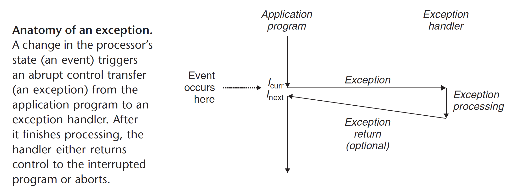
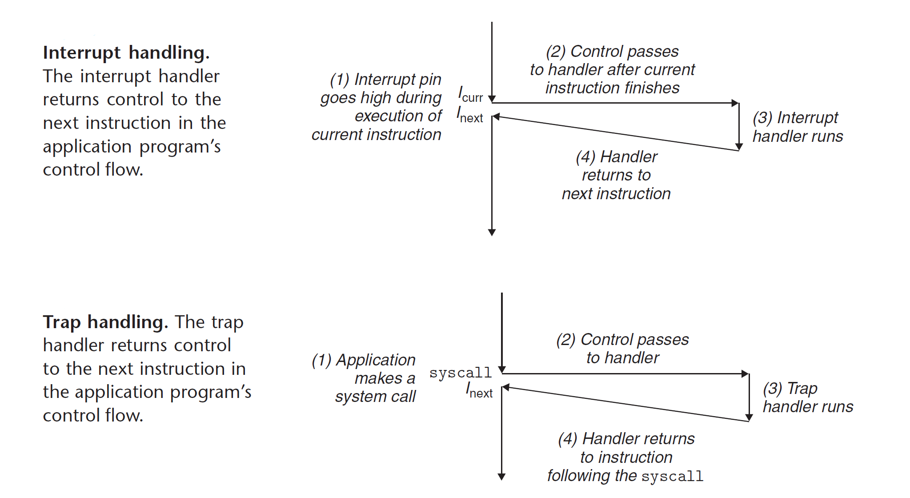
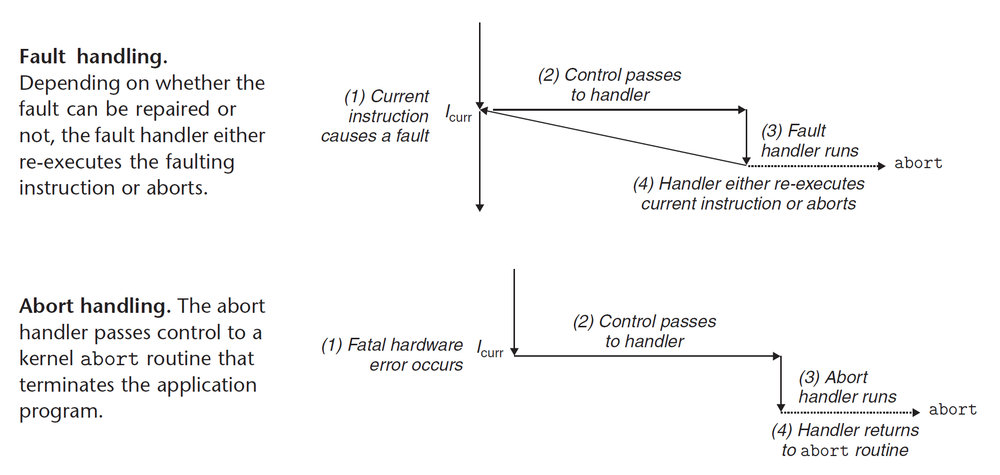
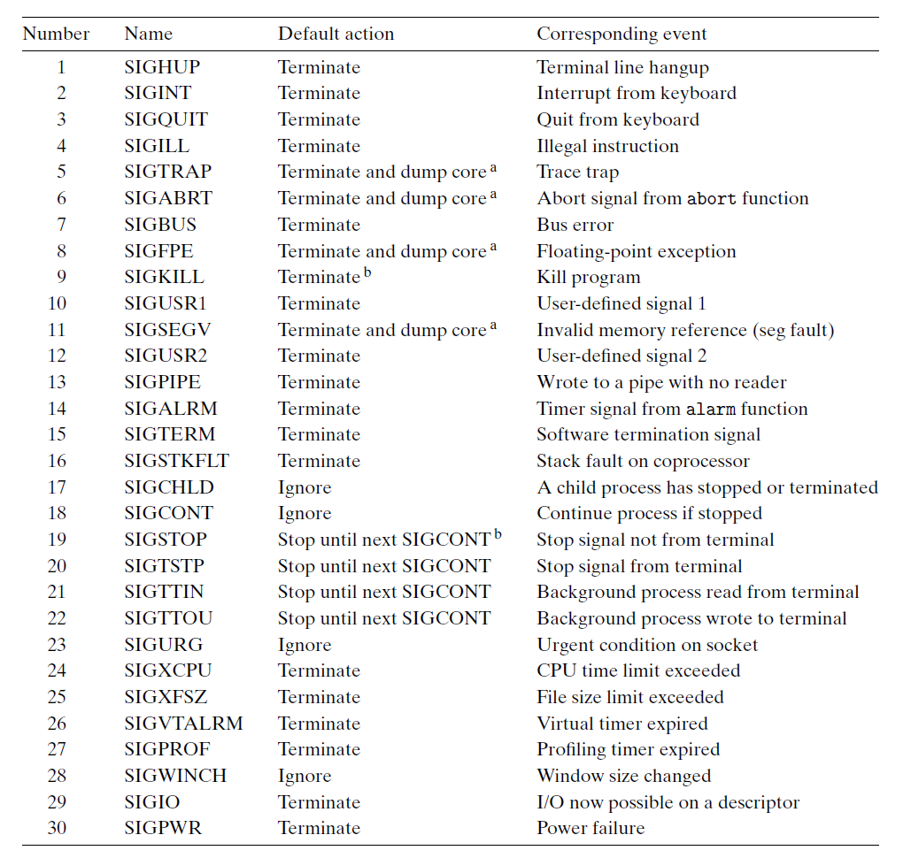

# Exceptional Control Flow

Abrupt changes in the control flow.

**Understand ECF**:

1. help you understand important systems concepts [I/O, processes, virtual memory]
2. help you understand how applications interact with the operating system
3. help you write interesting new application programs
4. help you understand concurrency
5. help you understand how software exceptions work

## Exceptions

Exceptions are a form of exceptional control flow that are implemented partly by the hardware and partly by the operating system.



> The event might be directly related to the execution of the current instruction. [A virtual memory page fault, an arithmetic overflow or an instruction attempts a divide by zero] On the other hand, the event might be unrelated to the execution of the current instruction. [a system timer goes off or an I/O request completes]

In any case, when the processor detects that the event has occurred, it makes an indirect procedure call (the exception), throught a jump table called `exception table`, to an operating system subroutine (the exception handler) that is specifically designed to process this particular kind of event. When the exception handler finishes processing, one of three things happenes, depending on the type of event that caused the exception:

1. The handler returns control to the current instruction $I_{curr}$, the instruction that was executing when the event occurred.
2. The handler returns control to $I_{next}$, the instruction that would have executed next had the exception not occurred.
3. The handler aborts the interrupted program.

### Exception handling

Each type of possible exception in a system is assigned a unique nonnegative integer `exception number`.

- Assigned by the designers of the processor [divide by zero, page faults, memory access violations, break points and arithmetic overflows]
- Assigned by the designers of the operating system kernel (the memory-resident part of the operating system) [system calls and signals from external I/O devices]

At system boot time (when the computer is reset or powered on), the operating system allocates and initializes a jump table called an exception table, so that entry _k_ contains the address of the handler for exception _k_.

At system run time (when the system is executing some program), the processor detects that an event has occurred and determines the corresponding exception number _k_. The processor then triggers the exception by making an indirect procedure call, through entry _k_ of the exception table, to the corresponding handler.

**Differences between an exception with a procedure call**:

- As with a procedure call, the processor pushes a return address on the stack before branching to the handler. However, depending on the class of exception, the return address is either the current instruction or the next instruction.
- The processor also pushes some additional processor state onto the stack that will be necessary to restart the interrupted program when the handler returns.
- When control is being tranferred from a user program to the kernel, all of these items are pushed onto the kernel's stack rather onto the user's stack.
- Exception handlers run in _kernel mode_, which means they have complete access to all system resources.

### Classes of exceptions

| Class     | Cause                         | Async/Sync | Return behavior                     |
| --------- | ----------------------------- | ---------- | ----------------------------------- |
| Interrupt | Signal from I/O device        | Async      | always returns to next instruction  |
| Trap      | Intentional exception         | Sync       | always returns to next instruction  |
| Fault     | Potentially recoverable error | Sync       | might return to current instruction |
| Abort     | Nonrecoverable error          | Sync       | never returns                       |





**Interrupts**

Interrupts occur asynchronously as a result of signals from I/O devices that are external to the processor. Hardware interrupts are asynchronous in the sense that they are not caused by the execution of any particular instruction.

**Traps and System Calls**

Traps are intentional exceptions that occur as a result of executing an instruction. [The most important use of traps is to provide a procedure-like interface between user programs and the kernel, known as a _system call_]

**Faults**

Faults result from error conditions that a handler might be able to correct. When a fault occurs, the processor transfers control to the fault handler. If the handler is able to correct the error condition, it returns control to the faulting instruction, thereby re-executing it. Otherwise, the handler returns to an abort routine in the kernel that terminates the application program that caused the fault.

**Aborts**

Aborts result from unrecoverable fatal errors, typically hardware errors such as parity errors that occur when **DRAM** or **SRAM** bits are corrupted.

### Exceptions in Linux/x86-64 Systems

| Exception Number | Description              | Exception Class   |
| ---------------- | ------------------------ | ----------------- |
| 0                | Divide error             | Fault             |
| 13               | General protection fault | Fault             |
| 14               | Page fault               | Fault             |
| 18               | Machine check            | Abort             |
| 32-255           | OS-defined exceptions    | Interrupt or trap |

## Processes

An instance of a program in execution.

Each program in the system runs in the `context` of some process. The context consists of the state that the program needs to run correctly. This state includes the programs's code and data stored in memory, its stack, the contents of its general-purpose registers, its program counter, environment variables and the set of open file descriptors.

## System Call Error Handling

When unix system-level functions encounter an error, they typically return -1 and set the global integer variable _errno_ to indicate what went wrong.

```c
if ((pid = fork()) < 0) {
    fprintf(stderr, "fork error: %s\n", strerror(errno));
    exit(-1);
}
```

## Process Control

### Obtaining process IDs

Each process has a unique positive process ID (PID).

```c
#include <sys/types.h>
#include <unistd.h>

pid_t getpid(void);
pid_t getppid(void);
```

### Creating and Terminating Processes

A parent process creates a new running child process by calling the fork function.

```c
#include <sys/types.h>
#include <unistd.h>
#include <stdlib.h>

pid_t fork(void);
void exit(int status);
```

**Sample**

```c
int main() {
    pid_t pid;
    int x = 1;
    pid = fork();
    // child process
    if (pid == 0) {
        printf("child: x=%d\n", ++x);
        exit(0);
    }
    // parent process
    printf("parent: x=%d\n", --x);
    exit(0);
}
```

### Reaping child processes

```c
#include <sys/types.h>
#include <sys/wait.h>

pid_t waitpid(pid_t pid, int *statusp, int options);
```

> 基本上都是 Linux API 的讲解, 就不做太多说明了

## Signals



详见 TLPI 信号章节

### Safe Signal Handling

1. Keep handlers as simple as possible
2. Call only async-signal-safe functions in your handlers
3. Save and restore _errno_
4. Protect accesses to shared global data structure by blocking all signals
5. Declare global variables with _volatile_
6. Declare flags with `sig_atomic_t`

## Nonlocal Jumps

C provides a form of user-level exceptional control flow, called a nonlocal jump, that transfers control directly from one function to another currently executing function without having to go through the normal call-and-return sequence.

## Tools for Manipulating Processes

1. strace -> Prints a trace of each system call invoked by a running program and its children
2. ps -> Lists processes currently in the system
3. top -> Prints information about the resource usage of current processes
4. pmap -> Displays the memory map of a process
5. `/proc`

## Summary

Exceptional control flow (ECF) occurs at all levels of a computer system and is a basic mechanism for providing concurrency in a computer system.

There are four different types of exceptions: interrupts, faults, aborts and traps. Interrupts occur asynchronously (with respect to any instructions) when an external I/O device such as a timer chip or a disk controller sets the interrupt pin on the processor chip. Control returns to the instruction following the faulting instruction. Fault handlers restart the faulting instruction, while abort handlers never return control to the interrupted flow. Finally, traps are like function calls that are used to implement the system calls that provide applications with controlled entry points into the operating system code.

At the operating system level, the kernel uses ECF to provide the fundamental notion of a process. A process provides applications with two important abstractions: logical control flows that give each program with illusion that it has exclusive use of the processor; private address spaces that provide the illusion that each program has exclusive use of the main memory.
