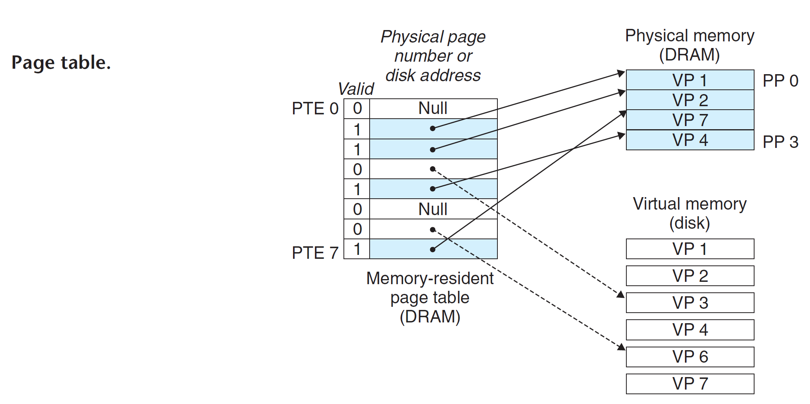

# Virtual Memory

1. Uses main memory efficiently by treating it as a cache for an address space stored on disk, keeping only the active areas in main memory and transferring data back and forth between disk and memory as needed
2. Simplifies memory management by providing each process with a uniform address space
3. Protects the address space of each process from corruption by other processes

## Physical and virtual Addressing

- Physical Addressing -> CPU accesses Main Memory Directly
- Virtual Addressing -> CPU accesses Main Memory by generating a _virtual address_, which is converted to the approriate physical address before sent to the main memory [MMU]

## Address Spaces

An _address space_ is an ordered set of non-negative integer addresses `{0, 1, 2, ...}`

## VM as a Tool for Caching

VM partitions the virtual memory into fixed-size blocks called _virtual pages_.

At any point in time, the set of virtual pages is partitioned into three disjoint subsets:

- Unallocated. Pages that have not yet been allocated by VM system
- Cached. Allocated pages that are currently cached in physical memory
- Uncached. Allocated pages that are not cached in physical memory

### Page Table

## VM as a Tool for Memory Management

## VM as a Tool for Memory Protection

## Address Translation

## Memory Mapping

## Dynamic Memory Allocation

## Garbage Collection

## Summary
