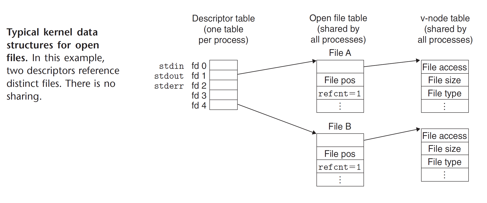

# System-Level I/O

Input/Output is the process of copying data between main memory and external devices.

## Unix I/O

Four General Operations

- Opening files
- Changing the current file position
- Reading and writting files
- Closing files

## Files

### Linux File Types

- A regular file - contains arbitrary data
- A directory - consists an array of links, where each link maps a filename to a file(another directory)
- A socket - uses to communicate with another process across a network

named pipes, symbolic links, character and block devices

## Opening and Closing Files

`open` & `close` API in libc.

```c
#include <stdio.h>
#include <sys/types.h>
#include <sys/stat.h>
#include <unistd.h>

int main() {
    int fd1, fd2;

    fd1 = open("foo.txt", O_RDONLY, 0);
    close(fd1);
    fd2 = open("baz.txt", O_RDONLY, 0);
    printf("fd2 = %d\n", fd2);
    close(fd2);

    return 0;
}
```

## Reading and Writing Files

```c
#include <unistd.h>

ssize_t read(int fd, void* buf, size_t n); // returns: numbers of bytes read if OK, 0 on EOF, -1 on error
ssize_t write(int fd, const void* buf, size_t n); // returns: number of bytes written if OK, -1 on error
```

## Reading File Metadata

```c
#include <unistd.h>
#include <sys/stat.h>

int stat(const char* filename, struct stat* buf);
int fstat(int fd, struct stat* buf);
```

## Reading Directory Contents

```c
#include <sys/types.h>
#include <dirent.h>

DIR *opendir(const char* name);
struct dirent *readdir(DIR *dirp);
int closedir(DIR *dirp);
```

## Sharing Files

The kernel represents open files using three related data structures:



- Descriptor table - Each process have its own separate descriptor table whose entries are indexed by the process's open file descriptor. Each open descriptor entry points to an entry in the file table.
- File table - The set of open files is represented by a file table that is shared by all processes. Each file table entry consists of the current file position, a reference count of the number of descriptor entries that currently point to it, and a pointer to an entry in the v-node table. Closing a descriptor decrements the reference count in the associated file table entry. Kernel will not delete the file table entry until its reference count is zero.
- v-node table - shared by all processes. Each entry contains most of the information in the _stat_ structure, including the `st_mode` and `st_size` members.

## I/O Redirection

`ls > foo.txt` (standard output redirected to disk file _foo.txt_)

```c
#include <unistd.h>

int dup2(int oldfd, int newfd);
```

## Standard I/O

libc `stdio.h`

## Summary

Linux provides a small number of system-level functions, based on the unix I/O model, that allow applications to open, close, read, and write files, to fetch file metadata, and to perform I/O redirection. Linux read and write operations are subject to short counts that applications must anticipate and handle correctly.

The linux kernel uses three related data structures to represent open files. Entries in a descriptor table point to entries in the open file table, which point to entries in the v-node table. Each process has its own distinct descriptor table, while all processes share the same open file and v-node tables.
