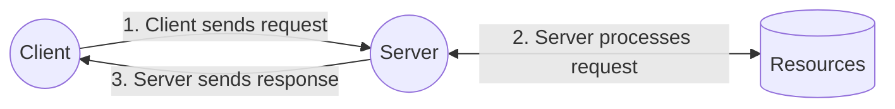
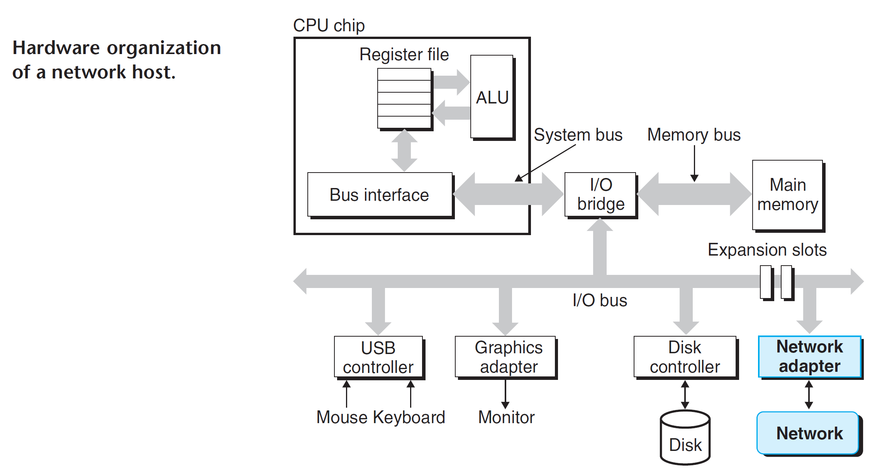
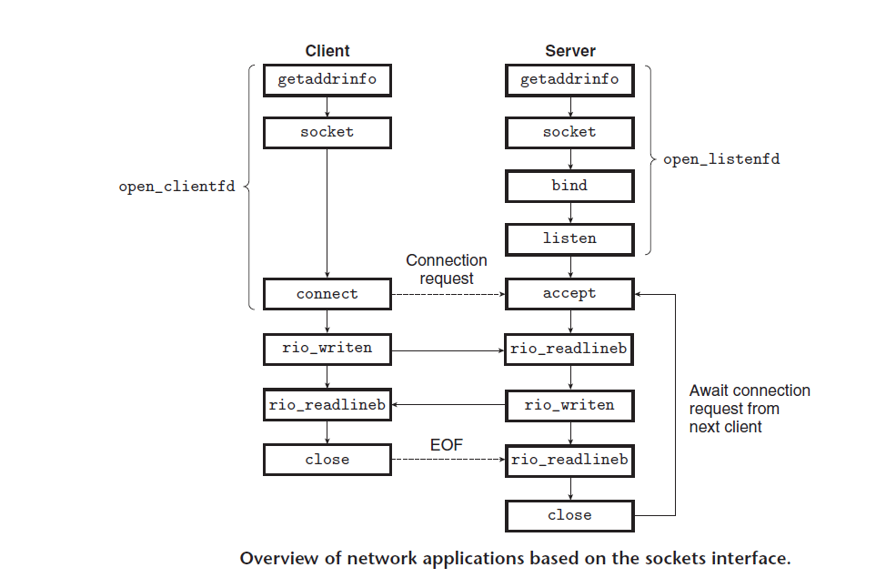

# Network Programming

## CS Programming Model

## Networks

Clients and servers often run on separate hosts and communicate using hardware and software resources of a computer network.

## The Global IP Internet

Each Internet host runs software that implements the TCP/IP protocol (Transmission Control Protocol/Internet Protocol), which is supported by almost every modern computer system. Internet clients and servers communicate using a mix of sockets interface functions and Unix I/O functions.

## The Sockets Interface

