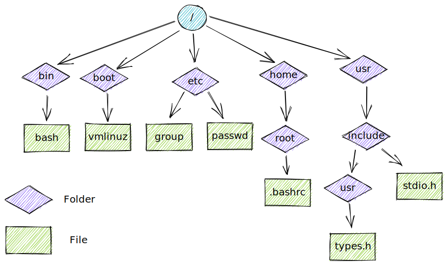

# 基本概念

## 内核：操作系统的核心

**两种不同含义**

1. 指完整的软件包，包括用来管理计算机资源的核心层软件，以及附带的所有标准软件工具
2. 指管理和分配计算机资源的核心层软件

### 内核的职责

1. 进程调度：Linux 属于抢占式多任务操作系统
2. 内存管理：虚拟内存管理机制
3. 提供文件系统：包含对文件创建、获取、更新以及删除等操作
4. 创建和终止进程
5. 设备访问
6. 网络连接
7. 提供系统调用应用编程接口(syscall API)

**用户态和内核态**

- 在用户态下运行时，CPU 只能访问被标记为用户空间的内存，试图访问属于内核空间的内存会引发硬件异常
- 在内核态运行时，CPU 既能访问用户空间内存，也能访问内核空间内存

仅在内核态可以执行的操作：执行宕机命令关闭系统，访问内存管理硬件，设备 I/O 操作的初始化

## Shell

Shell 是一种具有特殊用途的程序，主要用于读取用户输入的命令，并执行相应的程序以响应命令。

## 用户和组

系统会对每个用户的身份做唯一标识，用户可隶属于多个组。

**用户**

系统的每个用户都拥有唯一的登录名和与之相对应的整数型用户 ID。系统密码文件 `/etc/passwd` 为每个用户都定义了一行记录，其中还包括以下信息：

1. 组 ID：用户所属的第一个组的整数型组 ID
2. 主目录：用户登录后所在的初始目录
3. 登录 shell：执行并解释用户命令的程序名称

**组**

用户组便于赋予多个用户相同的权限。每个用户组都对应着系统组文件 `/etc/group` 中的一行记录，其中包含以下信息：

1. 组名：唯一的组名称
2. 组 ID：与组相关的整数型 ID
3. 用户列表：隶属于该组的用户登录名列表

**超级用户**

超级用户在系统中享有特权。超级用户账号的用户 ID 为 0，登录名通常为 root。

## 文件系统

内核维护着一套单根 `/` 目录结构，以放置系统的所有文件。

## 文件 I/O 模型

同一套系统调用(`open`, `read`, `write`, `close`)所执行的 I/O 操作，可适用于所有文件类型，包括设备文件。

**文件描述符**

I/O 系统调用使用文件描述符【（往往是数值很小的）非负整数】来指代打开的文件。获得文件描述符的常见手法是调用 `open()`，在参数中指定 I/O 操作目标文件的路径名。

通常，由 shell 启动的进程会继承三个已打开的文件描述符：描述符 0 为标准输入，指代为进程提供输入的问题件；描述符 1 为标准输出，指代供进程写入输出的文件；描述符 2 为标准错误，指代供进程写入错误消息或异常通告的文件。在交互式 shell 或程序中，上述三者一般都指向终端。

**stdio 函数库**

- `fopen()`
- `fclose()`
- `scanf()`
- `printf()`
- `fgets()`
- `fputs()`

## 进程

进程是正在执行的程序实例。执行程序时，内核会将程序代码载入虚拟内存，为程序变量分配空间，建立内核记账数据结构，以记录与进程有关的各种信息(进程 ID，用户 ID，组 ID 以及终止状态)。

**进程的内存布局**

- 文本：程序的指令
- 数据：程序使用的静态变量
- 堆：程序可从该区域动态分配额外内存
- 栈：随函数调用、返回而增减的一块内存，用于为局部变量和函数调用链接信息分配存储空间。

**创建进程和执行程序**

进程可使用系统调用 `fork` 来创建一个新进程。

每个进程都有一个唯一的整数型进程标识符（PID），一个父进程标识符（PPID）。

**进程退出和终止状态**

1. 进程可使用 `_exit()` 系统调用请求退出
2. 向进程传递信号，将其杀死(kill -9), SIGTERM

无论以何种方式退出，进程都会生成“终止状态”，一个非负小整数，可供父进程的 `wait()` 系统调用检测。

**特权进程**

特权进程是指有效用户 ID 为 0 的进程。通常由内核所施加的权限控制对此类进程无效。

**能力(Capabilities)**

内核 2.2 开始，Linux 把传统上赋予 root 用户的权限划分为一组相互独立的单元。每次特权操作都与特定的能力相关，仅当进程具有特定能力时，才能执行相应操作。

**init 进程**

系统引导时，内核会创建一个名为 init 的特殊进程，即“所有进程之父”，该进程的相应的程序文件是 `/sbin/init`。系统的所有进程不是由 init“亲自”创建，就是由其后代进程创建。init 进程的进程号总为 1，且总是以超级用户权限运行。只有关闭系统才能终止该进程。init 的主要任务是创建并监控系统运行所需的一系列进程。

**环境变量**

每个进程都有一份环境列表，即在进程用户空间内存中维护的一组环境变量。 `export MY_VAR=hello world`

**资源限制**

使用系统调用 `setrlimit()`，进程可为自己消耗的各类资源设置一个上限。(ControlGroup)

## 内存映射

调用系统调用 `mmap()` 的进程，会在其虚拟地址空间中创建一个新的内存映射。

文件映射：将文件的部分区域映射入调用进程的虚拟内存。映射一旦完成，对文件映射内容的访问则转化为对相应内存区域的字节操作。映射页面会按需自动从文件中加载。

## 静态库和共享库

目标库：将一组函数代码加以编译，并置于一个文件中，供其他应用程序调用

**静态库**

静态库是对已编译目标模块的一种结构化整合。最后会复制到最终的可执行文件中。

**动态库**

链接器不会把库中的目标模块复制到可执行文件中，而是在可执行文件中写入一条记录，以表明可执行文件可运行时需要使用该共享库。

## 进程间通信及同步

- 信号：表示事件的发生
- 管道（“|”）和 FIFO：用于在进程间传递数据
- 套接字：供同一台主机或联网的不同主机上所运行的进程之间传递数据
- 文件锁定：为防止其他进程读取或更新文件内存，允许某进程对文件的部分区域加以锁定
- 消息队列：用于在进程间交换消息（数据包）
- 信号量：用于同步进程动作
- 共享内存：允许两个及两个以上的进程共享一块内存。

## 信号

信号一般被称为“软件中断”。

内核、其他进程（具有相应的权限）或自身进程均可向进程发送信号。

## 线程

可以把线程看作共享同一个虚拟内存及一干其他属性的进程

## 进程组和 shell 任务控制

shell 执行的每个程序都会在一个新进程内发起。

## 伪终端

ssh

## 日期和时间

- 真实时间：指在进程的生命周期内，以某个标准时间点或固定时间点为起点测量得出的时间。
- 进程时间：指进程自启动起来，所占用的 CPU 时间总量。

## /proc 文件系统

`/proc` 文件系统是一种虚拟文件系统，以文件系统目录和文件形式，提供一个指向内核数据结构的接口。
