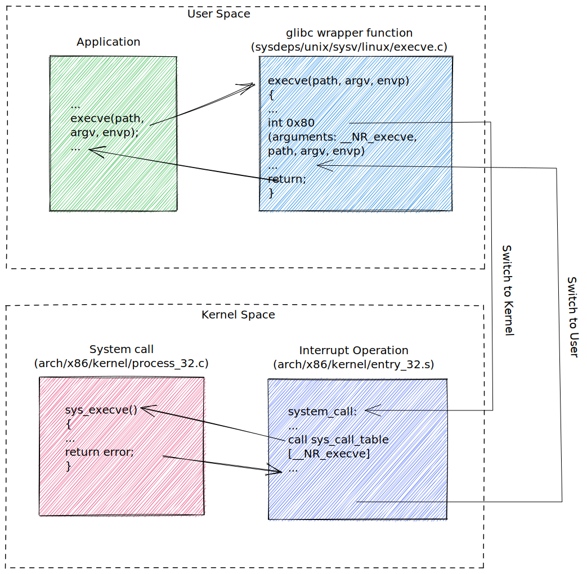

# 系统编程概念

**只要执行了系统调用或者库函数，一定要检查调用的返回状态以确定调用是否成功**

## 系统调用

系统调用是受控的内核入口，通过这一机制，进程可以请求内核以自己的名义去执行某些动作。

- 系统调用将处理器从用户态切换到内核态，以便 CPU 访问受到保护的内核内存
- 系统调用的组成是固定的，每个系统调用都由一个唯一的数字来标识
- 每个系统调用可辅之以一套参数，对用户空间与内核空间之间的传递的信息加以规范

### 系统调用的步骤顺序

1. 应用程序通过调用 C 语言库函数中的外壳【Wrapper】函数，来发起系统调用
2. 外壳函数必须保证所有的系统调用参数可用；参数通过堆栈传入外壳函数，再由外壳函数复制到寄存器
3. 外壳函数会将系统调用编号复制到一个特殊的 CPU 寄存器中【%eax】
4. 外壳函数执行一条中断机器指令【int 0x80】，引发处理器从用户态切换到内核态，并执行系统中断 0x80 的中断矢量所指向的代码
5. 为响应中断 0x80，内核会调用 `system_call()` 例程来处理此次中断【arch/i386/entry.S】
   1. 在内核栈中保存寄存器值
   2. 审核系统调用编号的有效性
   3. 以系统调用编号对存放所有调用服务例程的列表进行索引，发现并调用相应的系统调用服务例程
      - 若系统调用有参数，首先会检查参数的有效性
      - 随后，该服务例程会执行必要的任务【对特定参数中指定地址处的值进行修改，在用户内存和内核内存间传递数据】
      - 最后，该服务例程会将结果状态返回给 `system_call` 例程
   4. 从内核栈中恢复各寄存器值，并将系统调用返回值置于栈中
   5. 返回至外壳函数，同时将处理器切换回用户态
6. 若系统调用服务例程的返回值表明调用有误，外壳函数会使用该值来设置全局变量 errno。然后，外壳函数会返回到调用程序，并同时返回一个整型值，以表明系统调用是否成功



## 库函数

一个库函数是构成标准 C 语言函数库的众多库函数之一。

许多库函数不会使用任何系统调用；有些库函数构建于系统调用层之上。

## 标准 C 语言函数库 (glibc)

GNU C 语言函数库【[glibc](https://www.gnu.org/software/libc/)】是 Linux 上最常用的实现。

```sh
# 确定系统的 glibc 版本
/lib/libc.so.6
# output below
GNU C Library (GNU libc) stable release version 2.28.
Copyright (C) 2018 Free Software Foundation, Inc.
This is free software; see the source for copying conditions.
There is NO warranty; not even for MERCHANTABILITY or FITNESS FOR A
PARTICULAR PURPOSE.
Compiled by GNU CC version 8.5.0 20210514 (Red Hat 8.5.0-3).
libc ABIs: UNIQUE IFUNC ABSOLUTE
For bug reporting instructions, please see:
<http://www.gnu.org/software/libc/bugs.html>.
```

## 处理错误

**坚持对状态值进行检查**

每个系统调用的手册页记录有调用可能的返回值，并指出了哪些值表示错误。

```c
int main()
{
    fd = open(pathname, flags, mode);
    // 通常使用-1表示出错
    if (fd == -1) {
        errExit("open");
    }
    if (close(fd) == -1) {
        errExit("close");
    }
    exit(EXIT_SUCCESS);
}
```

系统调用失败时，会将全局整型变量 errno 设置为一个正值，以标识具体的错误。程序硬包含 `<errno.h>` 头文件，该文件提供了对 errno 的声明，以及一组针对各种错误编号而定义的常量。

```c
int main()
{
    cnt = read(fd, buf, numBytes);
    if (cnt == -1)
    {
        if (errno == ENITR)
        {
            fprintf(stderr, "read was interrupted by a signal\n");
        }
        else
        {
            errExit("read");
        }
    }
}
```

如果调用系统调用和库函数成功，errno 绝不会被重置为 0。若该变量值不为 0，可能是之前调用失败造成的。

- 函数 `perror()` 会打印出 msg 参数所指向的字符串，紧跟一条与当前 errno 值相对应的消息
- 函数 `strerror()` 会针对起 errnum 参数中所指定的错误号，返回相应的错误字符串

```c
void perror(const char* msg);

char *strerror(int errnum);
```
