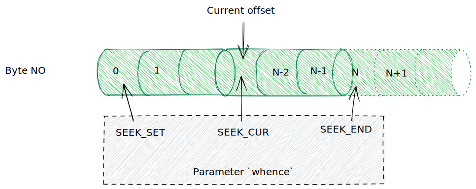

# 文件 I/O：通用的 I/O 模型

- 打开文件
- 关闭文件
- 从文件中读取数据
- 向文件中写数据

## I/O 概述

所有执行 I/O 操作的系统调用都以文件描述符，一个非负整数，来指代打开的文件。文件描述符用以表示所有类型的已打开文件，包括管道、FIFO、socket、终端设备和普通文件。

| 文件描述符 | 用途     | POSIX 名称    | stdio 流 |
| ---------- | -------- | ------------- | -------- |
| 0          | 标准输入 | STDIN_FILENO  | stdin    |
| 1          | 标准输出 | STDOUT_FILENO | stdout   |
| 2          | 标准错误 | STDERR_FILENO | stderr   |

在程序开始运行之前，shell 代表程序打开上述三种文件描述符。【更准确地说，程序继承了 shell 文件描述符副本；在 shell 的正常操作中，这三个文件描述符始终是打开的】

### 4 个主要系统调用

- `fd = open(pathname, flags, mode)` 函数打开 pathname 所标识的文件，并返回文件描述符，用于在后续函数调用中指代打开的文件。
- `num_read = read(fd, buffer, count)` 调用从 fd 指代的打开文件中读取至多 count 字节的数据，并存储到 buffer 中。`read()` 调用的返回值为实际读取到的字节数。如果再无字节可读【EOF】，返回值为 0。
- `num_written = write(fd, buffer, count)` 调用从 buffer 中读取多大 count 字节的数据写入由 fd 所指代的已打开文件中。 `write()` 调用的返回值为实际写入文件中的字节数，，可能小于 count。
- `status = close(fd)` 在所有输入/输出操作完成后，调用 `close()`，释放文件描述符 fd 以及与之相关的内核资源。

使用 I/O 系统调用实现 copy 操作：

```c
#include <sys/stat.h>
#include <fcntl.h>
#include "tlpi_hdr.h"

#ifndef BUFFER_SIZE
#define BUFFER_SIZE 1024
#endif

/* copy.c

   Copy the file named argv[1] to a new file named in argv[2].
*/
int main(int argc, char *argv[])
{
    int inputFd, outputFd, openFlags;

    mode_t filePerms;
    ssize_t numRead;
    char buf[BUFFER_SIZE];

    if (argc != 3 || strcpm(argv[1], "--help") == 0)
    {
        usageErr("%s old-file new-file\n", argv[0]);
    }

    inputFd = open(argv[1], O_RDONLY);
    if (inputFd == -1)
    {
        errExit("opening file %s", argv[1]);
    }
    /* create, readonly, truncate */
    openFlags = O_CREAT | O_WRONLY | O_TRUNC;
    /* rw-rw-rw */
    filePerms = S_IRUSR | S_IWUSR | S_IRGRP | S_IWGRP | S_IROTH | S_IWOTH;
    outputFd = open(argv[2], openFlags, filePerms);
    if (outputFd == -1)
    {
        errExit("opening file %s", argv[2]);
    }

    /* Transfer data until we encounter end of input or an error */
    while ((numRead = read(inputFd, buf, BUFFER_SIZE)) > 0)
    {
        if (write(outputFd, buf, numRead) != numRead)
        {
            fatal("write() returned error or partial write occurred");
        }
    }
    if (numRead == -1)
    {
        errExit("read failed");
    }

    if (close(inputFd) == -1)
    {
        errExit("close input fd");
    }
    if (close(outputFd) == -1)
    {
        errExit("close output fd");
    }

    exit(EXIT_SUCCESS);
}
```

## 通用 I/O

UNIX I/O 模型的显著特点之一是其输入/输出的通用性概念。仅使用这些系统调用编写的程序，将对任何类型的文件有效。

```sh
./copy test test.old # copy a regular file
./copy a.txt /dev/tty # copy a regular file to this terminal
./copy /dev/tty b.txt # copy input from this terminal to a regular file
./copy /dev/pts/16 /dev/tty # copy input from another terminal
```

## open

`open()` 调用既能打开一个已存在的文件，也能创建并打开一个新文件。

```c
#include <sys/stat.h>
#include <fcntl.h>

int open(const char* pathname, int flags, ... /* mode_t mode */);
```

### 使用案例

```c
int main() {
    fd = open("start", O_RDONLY);
    if (fd == -1) {
        errExit("open");
    }
    // open new or existing file for reading and writing, truncating to zero bytes
    // file permissions r+w for owner, none for all others
    fd = open("my_file", O_RDWR | O_CREAT | O_TRUNC, S_IRUSR | S_IWUSR);
    if (fd == -1) {
        errExit("open");
    }
    // open new or existing file for writing, truncating to zero bytes
    // writes should always append to the end of file
    fd = open("w.log", O_WRONLY | O_CREAT | O_TRUNC | O_APPEND, S_IRUSR | S_IWUSR);
}
```

### 文件访问模式

| 访问模式    | 描述                                                  |
| ----------- | ----------------------------------------------------- |
| O_RDONLY    | 只读                                                  |
| O_WRONLY    | 只写                                                  |
| O_RDWR      | 可读可写                                              |
| O_CLOSEXEC  | 设置 close-on-exec 标志                               |
| O_CREAT     | 若文件不存在则创建                                    |
| O_DIRECT    | 无缓冲的输入/输出                                     |
| O_DIRECTORY | 如果 pathname 不是目录，则失败                        |
| O_EXCL      | 结合 O_CREAT 参数使用，专门用于创建文件               |
| O_LARGEFILE | 在 32 位系统中使用此标志打开大文件                    |
| O_NOATIME   | 调用 read() 时，不修改文件最近访问时间【Linux 2.6.8】 |
| O_NOCTTY    | 不要让 pathname【所指向的终端设备】成为控制终端       |
| O_NOFOLLOW  | 对符号链接不予解引用                                  |
| O_TRUNC     | 截断已有文件，使其长度为零                            |
| O_APPEND    | 总在文件尾部追加数据                                  |
| O_ASYNC     | 当 I/O 操作可行时，产生信号通知进程                   |
| O_DSYNC     | 提供同步的 I/O 数据完整性【Linux 2.6.33】             |
| O_NONBLOCK  | 以非阻塞方式打开                                      |
| O_SYNC      | 以同步方式写入文件                                    |

### open() 函数的错误

- EACESS：文件权限不允许调用进程以 flags 参数指定的方式打开文件
- EISDIR：所指定文件属于目录，而调用者企图打开该文件进行读写操作
- EMFILE：进程已打开的文件描述符数量达到了进程资源限制所设定的上限
- ENFILE：文件打开数量已经达到系统运行的上限
- ENOENT：1. 文件不存在且未指定 O_CREAT 标志；2. 指定了 O_CREAT 标志，但 pathname 参数所指定的目录之一不存在，或 pathname 参数为符号链接，而链接指向的文件不存在。
- EROFS：所指定的文件隶属于只读文件系统，而调用者企图以写方式打开文件
- ETXTBSY：所指定的文件为可执行文件，且正在运行。系统不允许修改正在运行的程序。

## read

`read()` 系统调用从文件描述符 fd 所指代的打开文件中读取数据

```c
#include <unistd.h>

ssize_t read(int fd, void* buffer, size_t count);
```

count 参数指定最多能读取的字节数。【ssize_t 数据类型属于无符号整数类型】buffer 参数提供用来存放输入数据的内存缓冲区地址。缓冲区至少应该有 count 个字节。

## write

`write()` 系统调用将数据写入一个已打开的文件中

```c
#include <unistd.h>

ssize_t write(int fd, void* buffer, size_t count);
```

## close

`close()` 系统调用关闭一个打开的文件描述符，并将其释放回调用进程，供该进程继续使用。

```c
#include <unistd.h>

int close(fd);
```

## lseek

对于每个打开的文件，系统内核会记录其文件偏移量，有时也将文件偏移量成为读写偏移量或指针。文件偏移量是指执行下一个 read()或 write()操作的文件起始位置，会以相对于文件头部起始点的文件当前位置来表示。文件第一个字节的偏移量为 0。

针对文件描述符 fd 参数所指代的一打开文件，`lseek()` 系统调用依照 offset 和 whence 参数值调整该文件的偏移量。

```c
#include <unistd.h>

off_t lseek(int fd, off_t offset, int whence);
```

offset 参数指定了一个以字节为单位的数值。whence 参数则表明应该参照哪个基点来解释 offset 参数。

- SEEK_SET：将文件偏移量设置为从文件头部起始点开始的 offset 个字节
- SEEK_CUR：相对于当前文件偏移量，将文件偏移量调整 offset 个字节
- SEEK_END：将文件偏移量设置为起始于文件尾部的 offset 个字节



### 文件空洞

`write()` 函数可以在文件结尾后的任意位置写入数据；从文件结尾后到新写入数据间的这段空间被称为文件空洞。

文件空洞不会占用任何磁盘空间。知道后续某个时间点，在文件空洞中写入了数据，文件系统才会为之分配磁盘块。

### read write lseek 使用示范

```c
#include <sys/stat.h>
#include <fcntl.h>
#include <ctype.h>

#include "tlpi_hdr.h"

/* seek_io.c

   Demonstrate the use of lseek() and file I/O system calls.

   Usage: seek_io file {r<length>|R<length>|w<string>|s<offset>}...

   This program opens the file named on its command line, and then performs
   the file I/O operations specified by its remaining command-line arguments:

           r<length>    Read 'length' bytes from the file at current
                        file offset, displaying them as text.

           R<length>    Read 'length' bytes from the file at current
                        file offset, displaying them in hex.

           w<string>    Write 'string' at current file offset.

           s<offset>    Set the file offset to 'offset'.

   Example:

        seek_io myfile wxyz s1 r2
*/
int main(int argc, char *argv[])
{
    size_t len;
    off_t offset;
    int fd, ap, j;
    unsigned char *buf;
    ssize_t numRead, numWritten;

    if (argc < 3 || strcmp(argv[1], "--help") == 0)
    {
        usageErr("%s file {r<length>|R<length>|w<string>|s<offset>}...\n", argv[0]);
    }

    fd = open(argv[1], O_RDWR | O_CREAT,
              S_IRUSR | S_IWUSR | S_IRGRP | S_IWGRP | S_IROTH | S_IWOTH);
    if (fd == -1)
    {
        errExit("open failed");
    }
    for (ap = 2; ap < argc; ap++)
    {
        switch (argv[ap][0])
        {
        case 'r':
        case 'R':
            len = getLong(&argv[ap][1], GN_ANY_BASE, argv[ap]);
            buf = malloc(len);
            if (buf == NULL)
            {
                errExit("malloc failed");
            }
            numRead = read(fd, buf, len);
            if (numRead == -1)
            {
                errExit("read failed");
            }
            if (numRead == 0)
            {
                printf("%s: end of file\n", argv[ap]);
            }
            else
            {
                printf("%s: ", argv[ap]);
                for (j = 0; j < numRead; j++)
                {
                    if (argv[ap][0] == 'r')
                    {
                        printf("%c", isprint(buf[j]) ? buf[j] : '?');
                    }
                    else
                    {
                        printf("%02x ", buf[j]);
                    }
                }
                printf("\n");
            }
            free(buf);
            break;
        case 'w':
            numWritten = write(fd, &argv[ap][1], strlen(&argv[ap][1]));
            if (numWritten == -1)
            {
                errExit("write failed");
            }
            printf("%s, wrote %ld bytes\n", argv[ap], (long)numWritten);
            break;
        case 's':
            offset = getLong(&argv[ap][1], GN_ANY_BASE, argv[ap]);
            if (lseek(fd, offset, SEEK_SET) == -1)
            {
                errExit("lseek failed");
            }
            printf("%s: seek succeeded\n", argv[ap]);
            break;
        default:
            cmdLineErr("Argument must start with [rRws]: %s\n", argv[ap]);
        }
    }
    if (close(fd) == -1)
    {
        errExit("close failed");
    }
    exit(EXIT_SUCCESS);
}
```
