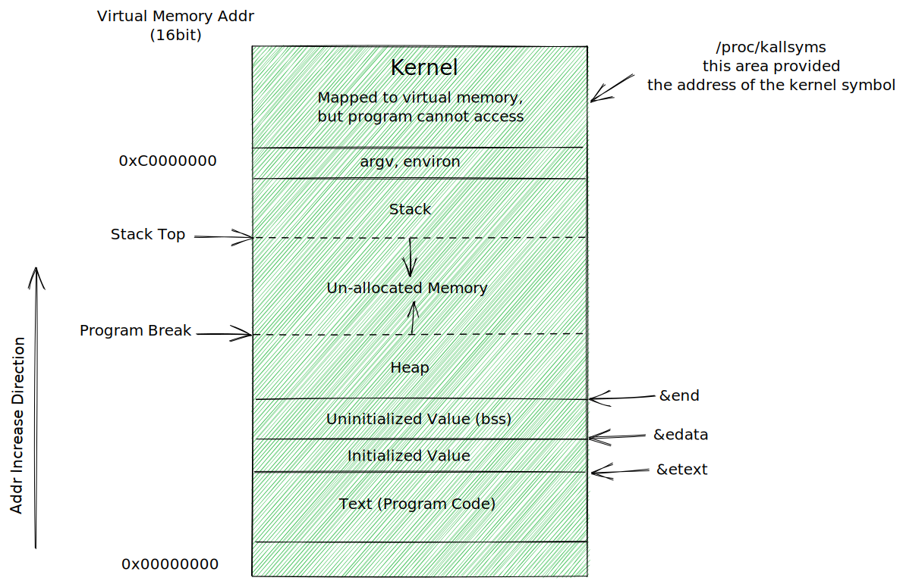
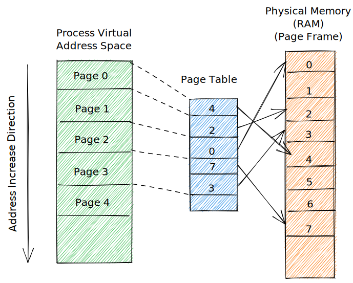

# 进程

## 进程和程序

进程(process)是一个可执行程序(program)的实例。

程序是包含了一系列信息的文件，这些信息描述了如何在运行时创建一个程序，具体内容如下：

- 二进制格式标志【每个程序文件都包含用于描述可执行文件格式的元信息(meta-information)。内核利用此信息来解释文件中的其他信息】
- 机器语言指令【对程序算法进行编码】
- 程序入口地址【标志程序开始执行时的起始指令位置】
- 数据【程序文件包含的变量初始值和程序使用的字面常量值】
- 符号表及重定位表【描述程序中函数和变量的位置及名称】
- 共享库和动态链接信息【程序文件所包含的一些字段，列出了程序运行时需要使用的共享库以及加载共享库的动态链接器的路径名】
- 其他信息【程序文件还包含许多其他信息，用以描述如何创建进程】

从内核角度看，进程由用户内存空间和一系列内核数据结构组成，其中用户内存空间包含了程序代码及代码所使用的变量；而内核数据结构则用于维护进程状态信息。记录在内核数据结构中的信息包含许多与进程相关的标志号、虚拟内存表、打开文件的描述符表、信号传递及处理的有关信息、进程资源使用及限制、当前工作目录和大量的其他信息。

## 进程号和父进程号

每个进程都有一个进程号(PID)，进程号是一个正数，用以唯一标识系统中的某个进程。

```c
#include <unistd.h>

pid_t getpid(void);

pid_t getppid(void);
```

在 Linux2.4 版本及更早版本中，进程号的上限是 32767，由内核常量 `PID_MAX` 所定义。Linux2.6 版本以后，默认上限仍是 32767，但可以通过 `/proc/sys/kernel/pid_max` 进行调整，在 32 位系统下，pid_max 文件的最大值为 32768，在 64 位系统下，最高可以达到 2^22。

每一个进程都有一个创建自己的父进程，使用系统调用 getppid() 可以检索到父进程的进程号。【init 进程，所有进程的始祖】

> 如果子进程的父进程终止，则子进程就会变成“孤儿”，init 进程随即会收养该进程。

## 进程内存布局

每个进程所分配的内存由很多部分组成，通常称之为"段(Segment)"。

- **文本段**包含了进程运行的程序机器语言指令【文本段具有只读属性，防止进程通过错误指针意外修改自身指令】
- **初始化数据段**包含显式初始化的全局变量和静态变量【当程序加载到内存时，从可执行文件中读取这些变量的值】
- **未初始化数据段**包含了未进行显式初始化的全局变量和静态变量【程序启动之前，系统将本段内所有内存初始化 0】
- **栈**是一个动态增长和收缩的段，由栈帧组成【系统会为当前调用的函数分配一个栈帧，战阵中存储了函数的局部变量，实参和返回值】
- **堆**是可在运行时动态进行内存分配的一块区域

```c
#define _BSD_SOURCE
#include <stdio.h>
#include <stdlib.h>

char globBuf[65536];         // Uninitialized data segment
int primes[] = {2, 3, 5, 7}; // initialized data segment

static int square(int x) // allocated in frame for square
{
    int result;
    result = x * x;
    return result; // return value passed via register
}

static void doCalc(int val) // allocated in frame for doCalc
{
    printf("The square of %d is %d\n", val, square(val));
    if (val < 1000)
    {
        int t;

        t = val * val * val;
        printf("the cube of %d is %d\n", val, t);
    }
}

int main(int argc, char *argv[]) // allocated in frame for main()
{
    static int key = 9973;       // initialized data segment
    static char m_buf[10240000]; // 未初始化数据区间
    char *p;                     // main 栈帧

    p = malloc(1024); // points to memory in heap segment

    doCalc(key);

    exit(EXIT_SUCCESS);
}
```



> 大多数 Unix 实现中 C 语言编程环境提供了 3 个全局符号【etext, edata, end】，可以在程序内使用这些符号以获取相应程序文本段、初始化数据段和非初始化数据段结尾处下一个字节的地址。

## 虚拟内存管理

Linux 像多数现代内核一样，采用了虚拟内存管理技术。【该技术利用了大多数程序的一个典型特征，即局部访问性(locality of reference)，以求高效使用 CPU 和 RAM 资源】

- 空间局限性：程序倾向于访问在最近访问过的内存地址附近的内存【由于指令是顺序执行的，且有时会按顺序处理数据结构】
- 时间局限性：程序倾向于在不久的将来再次访问最近刚访问过的内存地址【循环】

虚拟内存的规划之一是将每个程序使用的内存切割成小型的、固定大小的“页”单元。相应将 RAM 划分成一系列与虚存页尺寸相同的页帧。任一时刻，每个程序仅有部分页需要驻留在物理内存页帧中。这些页构成了所谓驻留集(resident set)。程序未使用的页拷贝保存在交换区内---这是磁盘空间中的保留区域，作为计算机 RAM 的补充---仅在需要时才会载入物理内存。若进程欲访问的页面目前并未驻留在物理内存中，将会发生页面错误，内核即刻挂起进程的执行，同时从磁盘中将页面载入内存。

内核会为每个进程维护一张页表(Page Table)。该页表描述了每页在进程虚拟空间中的位置。



虚拟内存管理使进程的虚拟地址空间与 RAM 物理地址空间隔离开来，有以下优点：

- 进程与进程、进程与内核相互隔离，因此一个进程不能读取或修改另一个进程或内核的内存
- 适当情况下，两个或者多个进程可以共享内存
  - 执行同一程序的多个进程，可共享一份(只读的)程序代码副本
  - 进程可以使用 shmget()和 mmap()系统调用显式请求与其他进程共享内存区
- 便于实现内存保护机制【可以对页表条目进行标记，以显示相关页面内容是可读、可写、可执行的】
- 程序员和编译器、链接器之类的工具无需关注程序在 RAM 中的物理布局
- 因为需要驻留在内存中的仅是程序的一部分，所以程序的加载和运行都很快。而且一个进程所占用的内存能够超出 RAM 容量

## 栈和栈帧

函数的调用和返回使栈的增长和收缩呈线性。大多数 Unix 实现中，栈驻留在内存的高端并向下增长。专用寄存器---栈指针(Stack Pointer)，用于跟踪当前栈顶。每次调用函数时，会在栈上新分配一帧，每当函数返回时，再从栈上将此帧移去。

每个栈帧包括如下信息：

- 函数实参和局部变量
- (函数)调用的链接信息

## 命令行参数(argc, argv)

```c
/**
 * @param argc 命令行参数的个数
 * @param argv 指向命令行参数的指针数组，每一个参数都是以空字符(null)结尾的字符串
 * @see argv[0] 指向的通常是该程序的名称
 */
int main(int argc, char* argv[]) {
    exit(EXIT_SUCCESS);
}
```

```c
/**
 * print all args
 */
int main(int argc, char *argv[])
{
    int j = 0;
    for (j = 0; j < argc; j++)
    {
        printf("argv[%d] = %s\n", j, argv[j]);
    }

    exit(EXIT_SUCCESS);
}
```

若要从程序内任一位置访问这些信息的部分或者全部内容，还有方法，但会破坏程序的可移植性

- 通过 Linux 系统专有的 `/proc/PID/cmdline` 文件可以读取任一进程的命令行参数，每个参数都以空(null)结尾
- GNU C 语言库提供了两个全局变量，可以在程序内任一位置使用以获取调用该程序时的程序名称【program_invocation_name，提供了用于调用该程序的完整路径名；program_invocation_short_name，提供了不含目录的程序名称】

## 环境列表

每一个进程都有与其相关的称之为环境列表的字符串数组。【其中每个字符串都以 name=value 形式定义】新进程在创建时，会继承其父进程的环境副本。【原始的进程间通信方式】

`NAME=VALUE program`

printenv 命令显示当前的环境列表

### 从程序中访问环境

在 C 语言程序中，可以使用全局变量 `char **__environ` 访问环境列表；还可以通过声明 main 函数中的第三个参数来访问环境列表 `int main(int argc, char* argv[], char* envp[])`

```c
#include "tlpi_hdr.h"

extern char **__environ; // or define _GNU_SOURCE to get it from <unistd.h>

int main(int argc, char *argv[])
{
    char **ep;

    for (ep = __environ; *ep != NULL; ep++)
        puts(*ep);

    exit(EXIT_SUCCESS);
}
```

- getenv 函数能够从进程环境中检索单个值
- putenv 函数向调用进程的环境中添加一个新变量，或者修改一个已经存在的变量值
- setenv 函数将`name=value`形式的字符串分配一块内存缓冲区，并将 name 和 value 所指向的字符串复制到此缓冲区，以此创建一个新的环境变量
- unsetenv 函数从环境中移除由 name 参数标识的变量
- clearenv 函数清除环境 【将 environ 变量设置为 NULL】

```c
#include <stdlib.h>

char* getenv(const char* name);
int putenv(char *string);
int setenv(const char* name, const char* value, int overwrite);
int unsetenv(const char* name);
int clearenv(void);
```

```c
int setenv(const char *name, const char *value, int overwrite)
{
    if (name == NULL || name[0] == '\0' || strchr(name, '=') != NULL ||
        value == NULL)
    {
        errno = EINVAL;
        return -1;
    }

    if (getenv(name) != NULL && overwrite == 0)
        return 0;

    unsetenv(name); /* Remove all occurrences */

    char *es = malloc(strlen(name) + strlen(value) + 2);
    /* +2 for '=' and null terminator */
    if (es == NULL)
        return -1;

    strcpy(es, name);
    strcat(es, "=");
    strcat(es, value);

    return (putenv(es) != 0) ? -1 : 0;
}
```

## 非局部跳转

这块内容比较迷，反正也不推荐使用了，那就不仔细记笔记了吧。
