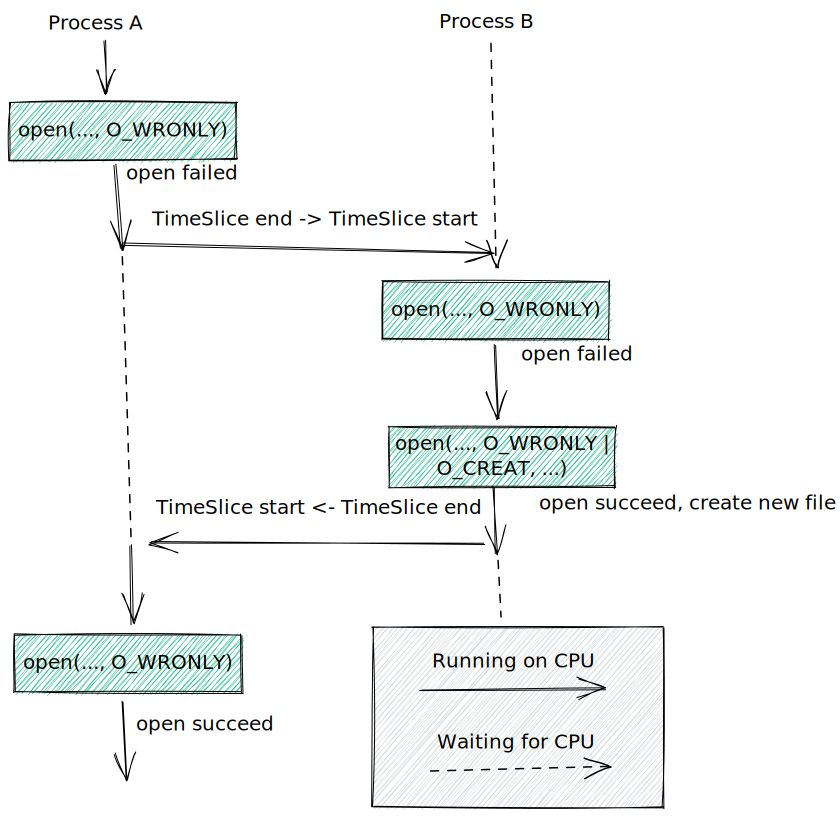
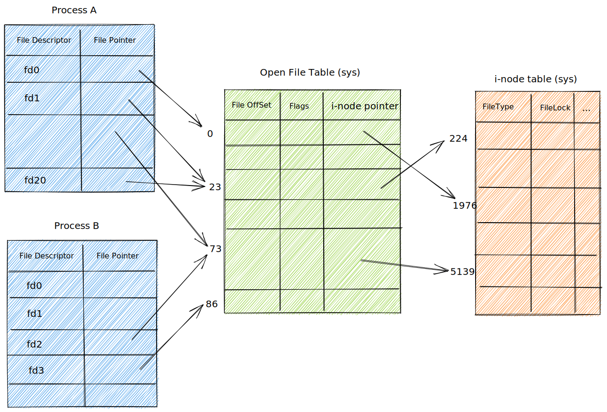

# 深入探究文件 I/O

## 原子操作和竞争条件

**原子操作**：将某次系统调用所要完成的各个动作作为不可中断的操作，一次性加以执行。

所有系统调用都是以原子操作的方式执行【内核保证了某系统调用中的所有步骤会作为独立操作而一次性执行，其间不会未其他进程或线程中断】

### 以独占方式创建一个文件

当同时指定 O_EXCL 与 O_CREAT 作为 open() 的标志位时，如果要打开的文件已存在，则 open() 将返回错误。【保证进程是文件的创建者】

**试图以独占方式打开文件的错误代码**

```c
fd = open(argv[1], O_WRONLY);
if (fd != -1)
{
    printf("[PID %ld] File \"%s\" already exists\n",
           (long)getpid(), argv[1]);
    close(fd);
}
else
{
    if (errno != ENOENT)
    {
        errExit("open");
    }
    else
    {
        printf("[PID %ld] File \"%s\" doesn't exist yet\n",
               (long)getpid(), argv[1]);
        if (argc > 2)
        {             /* Delay between check and create */
            sleep(5); /* Suspend execution for 5 seconds */
            printf("[PID %ld] Done sleeping\n", (long)getpid());
        }
        fd = open(argv[1], O_WRONLY | O_CREAT, S_IRUSR | S_IWUSR);
        if (fd == -1)
            errExit("open");

        printf("[PID %ld] Created file \"%s\" exclusively\n",
               (long)getpid(), argv[1]);
    }
}
```

当第一次调用 open 时，希望打开的文件还不存在，而第二次调用 open 时，其他进程已经创建了该文件。此时，进程 A 将得出错误的结论，_目标文件是由自己创建的_。



结合 O_CREAT 和 O_EXCL 标识来一次性调用 open 可以防止这种情况。

### 向文件尾部追加数据

多个进程同时向一个文件尾部添加数据。

```c
if (lseek(fd, 0, SEEK_END) != -1) {
    errExit("lseek");
}
if (write(fd, buf, len) != len) {
    fatal("Partial/failed write");
}
```

如果第一个进程执行到 lseek 和 write 之间，被执行相同代码的第二个进程所中断，那么这两个进程会在写入数据前，将文件偏移量设置为同一位置，而当第一个进程再次获得调度时，会覆盖第二个进程已写入的数据。

在打开文件时加入 O_APPEND 标识可以保证将文件偏移量的移动与数据写操作纳入同一原子操作。

## 文件控制操作：fcntl

fcntl() 系统调用对一个打开的文件描述符执行一系列控制操作。

```c
#include <fcntl.h>

int fcntl(int fd, int cmd, ...); // return on success depend on cmd, or -1 on error
```

## 打开文件的状态标识

fnctl 可以针对一个打开的文件，获取或修改其访问模式和状态标志。

```c
int main(int argc, char *argv[])
{
    int flags, accessMode;
    char *filename = "hello.txt";
    int fd;

    fd = open(filename, O_RDONLY | O_SYNC);
    flags = fcntl(fd, F_GETFL);
    if (flags == -1)
    {
        exit(EXIT_FAILURE);
    }
    printf("%d\n", flags);
    if (flags & O_SYNC)
    {
        printf("writes are sync\n");
    }
    accessMode = flags & O_ACCMODE;
    if (accessMode == O_WRONLY || accessMode == O_RDWR)
    {
        printf("file is writable");
    }
    exit(EXIT_SUCCESS);
}
```

判断文件的访问模式需要使用掩码 O_ACCMODE 与 flags 相与，再将结果与三个常量进行对比，因为 O_RDONLY(0)，O_WRONLY(1)和 O_RDWR(2)这三个常量不予打开文件状态标志的单个比特位对应。

可以使用 fcntl 的 F_SETFL 命令来修改打开文件的某些状态标志【允许更改的标识：O_APPEND, O_NONBLOCK, O_NOATIME, O_ASYNC 和 O_DIRECT】

```c
int flags;

flags = fcntl(fd, F_GETFL);
if (flags == -1){
    errExit("fcntl");
}
flags |= O_APPEND;
if (fcntl(fd, F_SETFL, flags) == -1) {
    errExit("fcntl");
}
```

## 文件描述符和打开文件之间的关系

内核维护的三个数据结构

- 进程级的文件描述符
- 系统级的打开文件表
- 文件系统的 i-node 表

针对每个进程，内核为其维护打开的文件描述符表[open file descriptor]，相关信息如下：

- 控制文件描述符的一组标志【close-on-exec】
- 打开文件句柄的引用

内核对所有打开的文件维护有一个系统级的描述表格[open file description table]【亦称为打开文件表，表中各条目称为打开文件句柄[open file handler]】。一个文件句柄存储了其打开文件相关的全部信息：

- 当前文件偏移量
- 打开文件时所用的状态标志
- 文件访问模式
- 与信号驱动 I/O 相关的设置
- 与该文件 i-node 对象的引用

每个文件系统都会为驻留其上的所有文件建立一个 i-node 表。每个文件的 i-node 信息如下：

- 文件类型和访问权限【常规文件、套接字、FIFO】
- 一个指针【指向该文件所持有的锁的列表】
- 文件的各种属性【文件大小、不同类型操作相关的时间戳】



1. 两个不同的文件描述符，若指向同一打开文件句柄，将共享同一文件偏移量
2. 文件描述符标识为进程和文件描述符所私有

## 复制文件描述符

dup() 调用复制一个打开的文件描述符 oldfd，并返回一个新的描述符，二者都指向同一打开的文件句柄。【系统会保证新描述符一定是编号值最低的未使用文件描述符】

dup2() 调用会为 oldfd 参数所指定的文件描述符创建副本，其编号由 newfd 参数指定。若 newfd 的文件描述符已经打开，dup2 首先会将其关闭。【dup2 调用会忽略 newfd 关闭期间出现的任何错误】

dup3()和 dup2 基本一致，额外新增了附加参数 flags，可以修改系统调用行为的位掩码【O_CLOEXEC】

```c
#include <fcntl.h>
#include <unistd.h>

int dup(int oldfd);
int dup2(int oldfd, int newfd);
#define _GNU_SOURCE
int dup3(int oldfd, int newfd, int flags);

newfd = fcntl(oldfd, F_DUPFD, startfd);
```

## 指定文件偏移量的 I/O

系统调用 pread()和 pwrite()和 read，write 类似，只是会在 offset 参数所指定的位置进行文件 I/O 操作，而且不会改变文件的当前偏移量。

```c
#include <unistd.h>

ssize_t pread(int fd, void *buf, size_t count, off_t offset);
ssize_t pwrite(int fd, const void *buf, size_t count, off_set offset);
```

```c
// 模拟 pread
off_t orig;

orig = lseek(fd, 0, SEEK_CUR);
lseek(fd, offset, SEEK_SET);
s = read(fd, buf, len);
lseek(fd, orig, SEEK_SET);
```

## 分散输入和集中输出

readv() 和 writev() 系统调用分别实现了分散输入和集中输出的功能。【一次即可传输多个缓冲区的数据】

```c
#include <sys/uio.h>

struct iovec {
    void* iov_base;
    size_t iov_len;
}

ssize_t readv(int fd, const struct iovec *iov, int iovcnt);

ssize_t writev(int fd, const struct iovec *iov, int iovcnt);
```

readv()系统调用实现了分散输入的功能：从文件描述符 fd 所指代的文件中读取一片连续的字节，然后将其散置于 iov 指定的缓冲区中。【round_robin】调用 readv() 成功将返回读取的字节数，若文件结束将返回 0。

writev() 系统调用实现了集中输出：将 iov 指定的所有缓冲区中的数据拼接起来，然后以连续的字节序列写入文件描述符 fd 指代的文件中。

当然也有指定偏移量的 preadv, pwritev。

```c
int main(int argc, char *argv[])
{
    int fd;
    struct iovec iov[3];
    struct stat myStruct; /* First buffer */
    int x;                /* Second buffer */

#define STR_SIZE 100

    char str[STR_SIZE]; /* Third buffer */
    ssize_t numRead, totRequired;

    if (argc != 2 || strcmp(argv[1], "--help") == 0)
        usageErr("%s file\n", argv[0]);

    fd = open(argv[1], O_RDONLY);
    if (fd == -1)
        errExit("open");

    totRequired = 0;

    iov[0].iov_base = &myStruct;
    iov[0].iov_len = sizeof(struct stat);
    totRequired += iov[0].iov_len;

    iov[1].iov_base = &x;
    iov[1].iov_len = sizeof(x);
    totRequired += iov[1].iov_len;

    iov[2].iov_base = str;
    iov[2].iov_len = STR_SIZE;
    totRequired += iov[2].iov_len;

    numRead = readv(fd, iov, 3);
    if (numRead == -1)
        errExit("readv");

    if (numRead < totRequired)
        printf("Read fewer bytes than requested\n");

    /*FIXME: should use %zd here, and remove (long) cast */
    printf("total bytes requested: %ld; bytes read: %ld\n",
           (long)totRequired, (long)numRead);
    exit(EXIT_SUCCESS);
}
```

## 截断文件

truncate() 和 ftruncate() 系统调用将文件大小设置为 length 参数所指定的值。

```c
#include <unistd.h>

int truncate(const char* pathname, off_t length);
int ftruncate(int fd, off_t length);
```

若文件当前长度大于参数 length，调用将丢弃超出部分，若小于参数，调用将在文件尾部添加一系列空字节或是一个文件空洞。

## 非阻塞 I/O

在打开文件时指定 O_NONBLOCK 标识：

1. 若 open 调用未能立即打开文件，则返回错误，而非陷入阻塞。【调用 open()操作 FIFO 可能会陷入阻塞】
2. 调用 open 成功后，后续的 I/O 操作也是非阻塞的。【若 I/O 系统调用未能立即完成，则可能会只传输部分数据，或者系统调用失败，并返回 EAGAIN 或 EWOULDBLOCK 错误】

## 大文件 I/O

通常将存放文件偏移量的数据类型 `off_t` 实现为一个有符号的长整型。【-1 表示错误情况】

### 过渡型 LFS API

要使用过渡型 LFS API，必须在编译程序时定义 \_LARGEFILE64_SOURCE 功能测试宏，该定义可以通过命令行指定，也可以定义源文件中包含所有头文件之前的位置。【该 API 具有处理 64 位文件大小和文件偏移量的能力：fopen64, open64, lseek64, truncate64, stat64, mmap64, setrlimit64】

> 调用 open64()，相当于在调用 open() 时指定 O_LARGEFILE 标识。若未指定该标识，且文件大于 2G，则会返回错误。

```c
#define _LARGEFILE64_SOURCE
#include <sys/stat.h>
#include <fcntl.h>
#include "tlpi_hdr.h"

int main(int argc, char *argv[])
{
    int fd;
    off64_t off;

    if (argc != 3 || strcmp(argv[1], "--help") == 0)
        usageErr("%s pathname offset\n", argv[0]);

    fd = open64(argv[1], O_RDWR | O_CREAT, S_IRUSR | S_IWUSR);
    if (fd == -1)
        errExit("open64");

    off = atoll(argv[2]);
    if (lseek64(fd, off, SEEK_SET) == -1)
        errExit("lseek64");

    if (write(fd, "test", 4) == -1)
        errExit("write");
    exit(EXIT_SUCCESS);
}
```

## `/dev/fd`

对于每个进程，内核都提供有一个特殊的虚拟目录 `/dev/fd`。该目录包含 `/dev/fd/n` 形式的文件名，其中 n 时与进程中打开文件描述符相对应的编号。

```c
// 打开 /dev/fd 目录中的一个文件等同于复制相应的文件描述符
fd = open("/dev/fd/1", O_WRONLY);
fd = dup(1);
```

## 创建临时文件

- 基于调用者提供的模板，mkstemp() 函数生成一个唯一的文件名并打开该文件，返回一个可用于 I/O 调用的文件描述符。
- tmpfile() 函数会创建一个名称唯一的临时文件，并以读写方式将其打开。【指定了 O_EXCL 标识，防止冲突】

```c
int fd;
// 模板参数采用路径名形式，其中最后6个字符必须为XXXXXX [这六个字符会被替换，以保证文件的唯一性，且修改后的]
chat template[] = "/tmp/somestringXXXXXX";

fd = mkstemp(template);
if (fd == -1) {
    errExit("mkstemp");
}
printf("Generate filename was: %s\n", template);
unlink(template); // Name disappears immediately, but the file is removed only after close();

if (close(fd) == -1) {
    errExit("close");
}

// tmpfile 函数签名
FILE *tmpfile(void);
```

## 总结

指定 O_EXCL 标识调用 open()，这确保了调用者就是文件的创建者；指定 O_APPEND 标识来调用 open()，可以确保多个进程在对同一文件追加数据时，不会覆盖彼此的输出。
