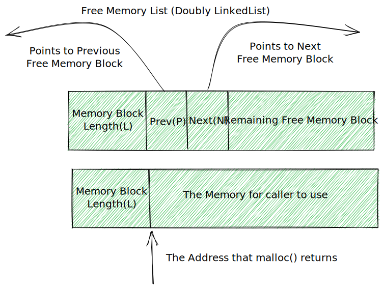

# 内存分配

## 在堆上分配内存

进程可以通过增加堆的大小来分配内存【一段长度可变的连续虚拟内存，始于进程的未初始化数据段末尾，随着内存的分配和释放而增减】。通常将堆的当前内存边界成为 `program break`。

### 调整 program break: brk(), sbrk()

在 program break 的位置抬升后，程序可以访问新分配区域内的任何内存地址，此时物理内存页尚未分配。内核会在进程首次试图访问这些虚拟内存时自动分配新的物理内存页。

```c
#include <unistd.h>

int brk(void* end_data_segment); // returns 0 on success, -1 on error
void* sbrk(intptr_t increment); // returns previous program break on success, or (void*) -1 on error
```

系统调用 brk()会将 program break 设置为参数 end_data_segment 所指定的位置。【由于内存以页为单位进行分配，end_data_segment 实际会四舍五入到下一个内存页的边界】当试图将 program break 设置为一个低于其初始值(&end)的位置时，有可能导致无法预知的行为【SegmentFault】。

系统调用 sbrk()将 program break 在原有地址上增加从参数 increment 传入的大小。若调用成功，sbrk()返回前一个 program break 的地址。【调用 sbrk(0)将返回 program break 的当前位置】

### 在堆上分配内存: malloc(), free()

malloc 函数族相较于 brk 和 sbrk 具有以下优点：

- 属于 C 语言标准的一部分
- 更易于在多线程程序中使用
- 接口简单，允许分配小块内存
- 允许随意释放内存块【维护在空闲内存列表】

```c
#include <stdlib.h>

void* malloc(size_t size);
void free(void* ptr);
```

malloc() 函数在堆上分配参数 size 字节大小的内存，并返回指向新分配内存起始位置处的指针，其所分配的内存未经初始化。【由于 malloc 的返回类型为 `void*`，因此可以将其赋给任意类型的 C 指针；malloc 返回的内存块所采用的字节对齐方式，适用于高校访问任何类型的 C 语言数据结构】若无法分配内存【已经抵达 program break 的地址上限】，则 malloc 返回 NULL，并设置 errno 以返回错误信息。

free() 函数释放 ptr 参数所指向的内存块。free 并不降低 program break 的位置，而是将这块内存添加到空闲内存列表中，空后续的 malloc 函数循环调用，有以下几点原因：

- 被释放的内存通常位于堆的中间位置，而非堆的顶部，因此不可能降低 program break
- 最大限度减少了程序必须执行 sbrk 的调用次数
- 在大多数情况下，降低 program break 的位置不会对那些分配大量内存的程序有太大帮助

```c
#define _BSD_SOURCE
#include "tlpi_hdr.h"

#define MAX_ALLOCS 1000000

int main(int argc, char *argv[])
{
    char *ptr[MAX_ALLOCS];
    int free_step, free_min, free_max, block_size, num_allocs, j;
    printf("\n");

    if (argc < 3 || strcmp(argv[1], "--help") == 0)
    {
        usageErr("%s num-allocs block-size [step [min [max]]]\n", argv[0]);
    }
    num_allocs = getInt(argv[1], GN_GT_0, "num-allocs");
    if (num_allocs > MAX_ALLOCS)
    {
        cmdLineErr("num-allocs > %d\n", MAX_ALLOCS);
    }

    block_size = getInt(argv[2], GN_GT_0 | GN_ANY_BASE, "block-size");
    free_step = (argc > 3) ? getInt(argv[3], GN_GT_0, "step") : 1;
    free_min = (argc > 4) ? getInt(argv[4], GN_GT_0, "min") : 1;
    free_max = (argc > 5) ? getInt(argv[5], GN_GT_0, "max") : num_allocs;

    if (free_max > num_allocs)
        cmdLineErr("free-max > num-allocs\n");

    printf("Initial program break:          %10p\n", sbrk(0));

    printf("Allocating %d*%d bytes\n", num_allocs, block_size);
    for (j = 0; j < num_allocs; j++)
    {
        ptr[j] = malloc(block_size);
        if (ptr[j] == NULL)
            errExit("malloc");
    }

    printf("Program break is now:           %10p\n", sbrk(0));

    printf("Freeing blocks from %d to %d in steps of %d\n",
           free_min, free_max, free_step);
    for (j = free_min - 1; j < free_max; j += free_step)
        free(ptr[j]);

    printf("After free(), program break is: %10p\n", sbrk(0));

    exit(EXIT_SUCCESS);
}
```

free 函数的 glibc 实现会在释放内存时将相邻的空闲内存块合并为一整块更大的内存。

### malloc() 和 free() 的实现

malloc 首先会扫描之前由 free()所释放的空闲内存块列表，以找到尺寸大于或等于要求的一块空闲内存。【first-fit, best-fit】如果尺寸合适，就直接返回；如果尺寸较大，会进行拆分，返回大小相当的内存，把剩余的内存块保留在空闲列表中。如果在空闲内存表中找不到足够大的空闲内存块，malloc 会调用 sbrk 以分配更多的内存。

> 在 malloc 分配内存块时，会额外分配几个字节以存放记录这块内存大小的整数值。【该整数位于内存块的起始处，实际返回给调用者的内存地址位于长度记录字节之后】



谨慎对待 malloc 和 free：

- 分配一块内存后，不要改变这块内存范围外的任何内容
- 释放同一块已分配内存超过一次是错误的
- 非经由 malloc 函数包中函数所返回的指针，绝不能在调用 free 函数时使用
- 确保释放所有已使用完毕的内存

**malloc 调试的工具和库**：

- mtrace() 和 muntrace() 分别在程序中打开和关闭对内存分配调用进行跟踪的功能
- mcheck() 和 mprobe() 函数允许程序对已分配内存块进行一致性检查
- MALLOC_CHECK 环境变量提供了类似 mcheck() 和 mprobe() 函数的功能

**控制和检测 malloc 函数包**：

- 函数 mallopt() 能修改各项参数，以控制 malloc() 所采用的算法
- mallinfo() 函数返回一个结构，包含由 malloc 分配内存的各种统计数据

### 在堆上分配内存的其他方式

```c
#include <stdlib.h>

void* calloc(size_t numitems, size_t size); // returns pointer to allocated memory on success, or NULL on error
void* realloc(void* ptr, size_t size);

/**************/
struct {
    name: int
} my_struct;
struct my_struct *p;

p = calloc(1000, sizeof(struct my_struct));
if (p == NULL) {
    errExit("calloc");
}

/*            */
nptr = realloc(ptr, newsize);
if (nptr == NULL) {

} else {
    ptr = nptr;
}
```

函数 calloc 用于给一组相同对象分配内存。【calloc 会将已分配的内存初始化为 0】

realloc 函数用于调整一块内存的大小【此块内存应是之前由 malloc 所分配的】【realloc 可能会分配一块新内存，并将原有数据复制到新内存块中】

```c
#include <malloc.h>

void* memalign(size_t boundary, size_t size); // returns pointer to allocated memory on success, or NULL on error

#include <stdlib.h>

int posix_memalign(void** memptr, size_t alignment, size_t size); //returns 0 on success, or a positive error number on error
```

函数 memalign 和 posix_memalign 的目的在于分配内存时，起始地址要与 2 的整数次幂边界对齐。

## 在堆栈上分配内存

```c
#include <alloca.h>

void* alloca(size_t size);

/**         */
// 下列会使alloca分配的堆栈空间出现在当前函数参数的空间内
func(x, alloca(size), z); // wrong

//
void *y;
y = alloca(size);
func(x, y, z);
```

alloca() 通过增加栈帧的大小从堆栈上分配内存。【只需修改堆栈指针】【若 alloca 造成堆栈溢出，则程序的行为无法阈值，特别是在没有收到一个 NULL 返回值通知错误的情况下】

## 总结

使用 `malloc` 函数族，进程可以动态分配和释放堆内存。

函数 `alloca()` 能够在堆栈上分配内存，该类内存会在调用 `alloca()` 的函数返回时自动释放。
