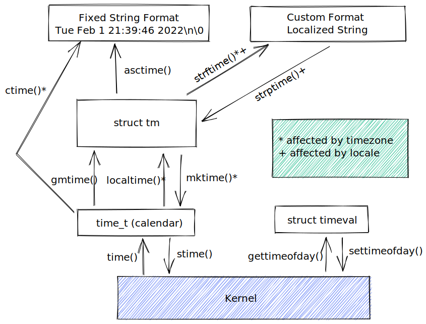

# 时间

## 日历时间

Unix 系统内部对时间的表示方式是以 Epoch 以来的秒来度量的。【UTC 1970 年 1 月 1 日凌晨 0 时，`time_t`】

```c
#include <sys/time.h>

int gettimeofday(struct timeval *tv, struct timezone *tz); // return 0 on success, -1 on error

struct timeval {
    time_t tv_sec;
    suseconds_t tv_usec;
}
```

gettimeofday 可于 tv 指向的缓冲区中返回日历时间。

> tz 参数是历史遗留，现已废弃，应始终设置为 NULL。

```c
#include <time.h>

time_t time(time_t *timep);
```

time 返回自 Epoch 以来的秒数。

> 如果 timep 部位 NULL，还会将自 Epoch 以来的秒数置于 timep 所指向的位置

## 时间转换函数



```c
#include <time.h>

char* ctime(const time_t *timep);
```

ctime 将返回一个长达 26 字节的字符串，内含标准格式的日期和时间。`Sun Mar 13 20:31:58 2022`

> 返回的字符串由静态分配，下一次 ctime 调用会将其覆盖

```c
#include <time.h>

struct tm
{
  int tm_sec;            /* Seconds.    [0-60] (1 leap second) */
  int tm_min;            /* Minutes.    [0-59] */
  int tm_hour;            /* Hours.    [0-23] */
  int tm_mday;            /* Day.        [1-31] */
  int tm_mon;            /* Month.    [0-11] */
  int tm_year;            /* Year    - 1900.  */
  int tm_wday;            /* Day of week.    [0-6] */
  int tm_yday;            /* Days in year.[0-365]    */
  int tm_isdst;            /* DST.        [-1/0/1]*/

# ifdef    __USE_MISC
  long int tm_gmtoff;        /* Seconds east of UTC.  */
  const char *tm_zone;        /* Timezone abbreviation.  */
# else
  long int __tm_gmtoff;        /* Seconds east of UTC.  */
  const char *__tm_zone;    /* Timezone abbreviation.  */
# endif
};

struct tm *gmtime(const time_t *timep);
struct tm *localtime(const time_t *timep);
time_t mktime(struct tm *timeptr);
```

gmtime 和 localtime 可以将 time_t 转换为一个分解时间。mktime 将一个本地时区的分解时间转译为 time_t 值。

- gmtime: UTC
- localtime: TZ + LOCALE

```c
#include <time.h>

char* asctime(const struct tm *timeptr);
size_t strftime(char* outstr, size_t maxsize, const char* format, const struct tm *timeptr);
#define _XOPEN_SOURCE
char* strptime(const char *str, const char* format, struct tm *timeptr);
```

- asctime 将 tm 转换为字符串，不受本地时区影响
- strftime 令 timeptr 指向分解时间，将以 null 结尾、由日期和时间组成的相应字符串置于 outstr 所指向的缓冲区中。
- strptime 将包含日期和时间的字符串转换为分解时间

```c
#if !defined(__sun)
#ifndef _XOPEN_SOURCE
#define _XOPEN_SOURCE
#endif
#endif
#include <time.h>
#include <locale.h>
#include "tlpi_hdr.h"

#define SBUF_SIZE 1000

int main(int argc, char *argv[])
{
    struct tm tm;
    char sbuf[SBUF_SIZE];
    char *ofmt;

    if (argc < 3 || strcmp(argv[1], "--help") == 0)
        usageErr("%s input-date-time in-format [out-format]\n", argv[0]);

    if (setlocale(LC_ALL, "") == NULL)
        errExit("setlocale"); /* Use locale settings in conversions */

    memset(&tm, 0, sizeof(struct tm)); /* Initialize 'tm' */
    if (strptime(argv[1], argv[2], &tm) == NULL)
        fatal("strptime");

    tm.tm_isdst = -1; /* Not set by strptime(); tells mktime()
                         to determine if DST is in effect */
    printf("calendar time (seconds since Epoch): %ld\n", (long)mktime(&tm));

    ofmt = (argc > 3) ? argv[3] : "%H:%M:%S %A, %d %B %Y %Z";
    if (strftime(sbuf, SBUF_SIZE, ofmt, &tm) == 0)
        fatal("strftime returned 0");
    printf("strftime() yields: %s\n", sbuf);

    exit(EXIT_SUCCESS);
}
```

## 时区

时区文件位于目录 `/usr/share/zoneinfo` 中。该目录下的每个文件都包含了一个特定国家或地区内时区制度的相关信息。

为运行中的程序指定一个时区，需要将 TZ 环境变量设置为由一冒号和时区名称组成的字符串【设置时区会自动影响到函数 ctime, localtime, mktime, strftime】

```sh
TZ=":Pacific/Auckland" ./your_app
```

## 地区 (Locale)

地区信息维护于 `/usr/share/local` 之下的目录层次结构中。`language[_territory[.codeset]][@modifier]`

language 是双字母的 ISO 语言代码，territory 是双字母的 ISO 国家代码，codeset 表示编码集，modifier 以区分前三者一致的情况。

```c
#include <locale.h>

char* setlocale(int category, const char* locale);
```

setlocale 既可以设置也可以查询程序的当前地区。

## 更新系统时钟

```c
#define _BSD_SOURCE
#include <sys/time.h>

int settimeofday(const struct timeval *tv, const struct timezone *tz);
int adjtime(struct timeval *delta, struct timeval* olddelta);
```

- settimeofday 设置系统时间
- adjtime 将系统时钟逐步调整到正确的时间

> settimeofday 调用所造成的系统时间突然变化，可能会对依赖于系统时钟单调递增的应用造成有害的影响

## 进程时间

进程时间指处理过程中所消耗的总 CPU 时间。

```c
#include <sys/times.h>

struct tms
  {
    clock_t tms_utime;        /* User CPU time.  */
    clock_t tms_stime;        /* System CPU time.  */

    clock_t tms_cutime;        /* User CPU time of dead children.  */
    clock_t tms_cstime;        /* System CPU time of dead children.  */
  };

clock_t times(struct tms *buf);
```

times 检索进程时间信息，并把结果通过 buf 指向的结构体返回。tms 前两个字段返回调用进程到目前为止使用的用户和系统组件的 CPU 时间，后两个字段返回的信息是：父进程执行力系统调用 wait 的所有已经终止的子进程使用的 CPU 时间。

```c
#include <time.h>

clock_t clock(void);
```

clock 提供了一个简单的接口用于取得进程时间。【描述了调用进程使用的总 CPU 时间】

---

```c
#include <sys/times.h>
#include <time.h>
#include "tlpi_hdr.h"

/* Display 'msg' and process times */
static void displayProcessTimes(const char *msg)
{
    struct tms t;
    clock_t clockTime;
    static long clockTicks = 0;

    if (msg != NULL)
        printf("%s", msg);

    if (clockTicks == 0)
    { /* Fetch clock ticks on first call */
        clockTicks = sysconf(_SC_CLK_TCK);
        if (clockTicks == -1)
            errExit("sysconf");
    }

    clockTime = clock();
    if (clockTime == -1)
        errExit("clock");

    printf("        clock() returns: %ld clocks-per-sec (%.2f secs)\n",
           (long)clockTime, (double)clockTime / CLOCKS_PER_SEC);

    if (times(&t) == -1)
        errExit("times");
    printf("        times() yields: user CPU=%.2f; system CPU: %.2f\n",
           (double)t.tms_utime / clockTicks,
           (double)t.tms_stime / clockTicks);
}

int main(int argc, char *argv[])
{
    int numCalls, j;

    printf("CLOCKS_PER_SEC=%ld  sysconf(_SC_CLK_TCK)=%ld\n\n",
           (long)CLOCKS_PER_SEC, sysconf(_SC_CLK_TCK));

    displayProcessTimes("At program start:\n");

    /* Call getppid() a large number of times, so that
       some user and system CPU time are consumed */

    numCalls = (argc > 1) ? getInt(argv[1], GN_GT_0, "num-calls") : 100000000;
    for (j = 0; j < numCalls; j++)
        (void)getppid();

    displayProcessTimes("After getppid() loop:\n");

    exit(EXIT_SUCCESS);
}
```
