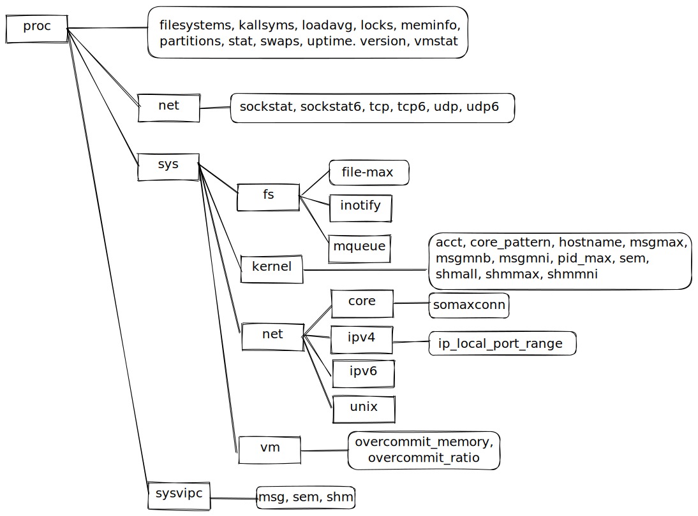

# 系统与进程信息

## `/proc` 文件系统

### `/proc/PID/`

| 文件    | 描述(进程属性)                                            |
| ------- | --------------------------------------------------------- |
| cmdline | 以`\0`分隔的命令行参数                                    |
| cwd     | 指向当前工作目录的符号链接                                |
| Environ | NAME=value 键值对环境列表，以`\0`分隔                     |
| exe     | 指向正在执行文件的符号链接                                |
| fd      | 文件目录，包含了指向由进程打开文件的符号链接              |
| maps    | 内存映射                                                  |
| mem     | 进程虚拟内存(在 I/O 操作前必须调用 lseek()移至有效偏移量) |
| mounts  | 进程的挂载点                                              |
| root    | 指向根目录的符号链接                                      |
| status  | 各种信息(进程 ID、凭证、内存使用量、信号)                 |
| task    | 为进程中的每个线程均包含一个子目录                        |

### `/proc` 下的系统信息

## 系统标识 `uname()`
