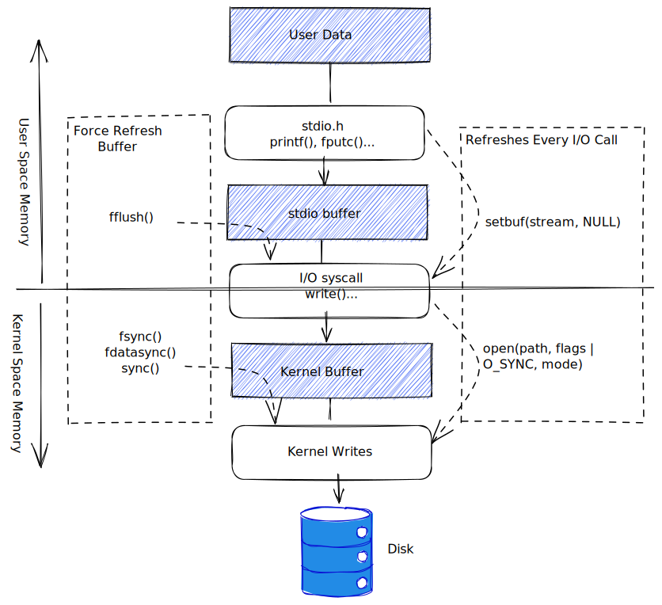

# 文件 I/O 缓存

## 文件 I/O 的内核缓存: 缓冲区高速缓存

read, write 系统调用在操作磁盘文件时不会直接发起磁盘访问，而是仅仅在用户空间缓冲区与内核缓冲区高速缓存【kernel buffer cache】之间复制数据。在后续的某个时刻，内核会将其缓冲区中的数据写入磁盘。若再次期间另一进程试图访问该文件的这几个字节，那么内核将自动从缓冲区高速缓存中提供这些数据。

Linux 内核对缓冲区高速缓存的大小没有固定上限。内核会尽可能多的分配缓冲区高速缓存，仅受限于以下两个因素：

1. 可用的物理内存总量
2. 出于其他目的对物理内存的需求【需要将正在运行的进程的文本和数据页保留在物理内存中】

如果与文件发生大量的数据传输，通过采用大块空间缓冲数据，以及执行更少的系统调用，可用提高 I/O 性能。

## stdio 库的缓存

```c
#include <stdio.h>

int setvbuf(FILE *stream, char *buf, int mode, size_t size); // return 0 on success, or non-zero on error
```

调用 setvbuf 函数，可以控制 stdio 库使用缓冲的形式。打开流后，必须在调用任何其他 stdio 库函数之前先调用 setvbuf，将影响后续在指定流上进行的所有 stdio 操作。

buf 和 size 针对参数 stream 要使用的缓冲区：

- buf 不为 NULL，那么其指向 size 大小的内存块作为 stream 的缓冲区
- 若 buf 为 NULL，那么 stdio 库会为 stream 自动分配一个缓冲区

参数 mode 制定了缓冲类型：

- `_IONBF` 不对 I/O 进行缓冲
- `_IOLBF` 采用行缓冲 I/O
- `_IOFBF` 采用全缓冲 I/O

```c
#define _BSD_SOURCE
#include <stdio.h>

void setbuffer(FILE *stream, char* buf, size_t size);
int fflush(FILE* stream);
```

- setbuffer 函数类似于 setbuf 函数，但允许调用者指定 buf 缓冲区的大小【`setbuffer(fp,buf,size) = setvbuf(fp, buf, (buf != NULL) ? _IOFBF : _IONBF, size)`】
- fflush 函数强制将 stdio 输出流中的数据刷新到内核缓冲区中【若参数 stream 为 NULL，将刷新所有的 stdio 缓冲区】

## 控制文件 I/O 的内核缓存

可以强制刷新内核缓冲区到输出文件。

- Synchronized I/O file integrity completion
- Synchronized I/O data integrity completion

```c
#include <unistd.h>

int fsync(int fd);
int fdatasync(int fd);
void sync(void);
```

- fsync 系统调用将使缓存数据和与打开文件描述符 fd 相关的所有元数据都刷新到磁盘上。
- fdatasync 系统调用类似于 fsync，只是强制文件处于 synchronized I/O data integrity completion 状态【fdatasync 可能会减少对磁盘操作的次数，由 fsync 调用请求的两次变为一次】
- sync 系统调用会是包含更新文件信息的所有内核缓冲区刷新到磁盘上

调用 open 函数时如指定`O_SYNC`标识，则会使所有后续输出同步。【`fd = open(pathname, O_RWONLY | O_SYNC)`】
【采用`O_SYNC`标识(或者频繁调用 fsync, fdatasync 和 sync)对性能的影响极大】

## I/O 缓冲小结



## 向内核提出建议 - I/O 模式

```c
#define _XOPEN_SOURCE 600
#include <fcntl.h>

int posix_fadvise(int fd, off_t offset, off_t len, int advice);
```

posix_fadvise 系统调用允许进程就自身访问文件数据时可能采取的模式通知内核。【内核并不一定采纳】

- POSIX_FADV_NORMAL 无特别建议
- POSIX_FADV_SEQUENTIAL 进程预计会从低偏移量到高偏移量顺序读取数据
- POSIX_FADV_RANDOM 进程预计以随机顺序访问数据
- POSIX_FADV_WILLNEED 进程预计在不久的将来访问指定文件区域
- POSIX_FADV_DONTNEED 进程预计在不久的将来将不会访问指定的文件区域
- POSIX_FADV_NOREUSE 进程预计会一次性地访问指定区域，不再复用

## 绕过缓冲区高速缓存: 直接 I/O

Linux 2.4 后允许应用程序在执行磁盘 I/O 时绕过缓冲区高速缓存，从用户空间直接将数据传递到文件和设备磁盘【direct I/O, raw I/O】

> 内核为提高 I/O 性能，针对缓冲区高速缓存做了很多优化：按顺序预读取，在成簇磁盘块上执行 I/O，允许访问同一文件的多个进程共享高速缓存的缓冲区。

### 直接 I/O 的对齐限制【EINVAL 错误】

- 用于传递数据的缓冲区，其内存边界必须对齐为块大小的整数倍
- 数据传输的开始点，即文件和设备的偏移量，必须是块大小的整数倍
- 待传递数据的长度必须是块大小的整数倍

```c
#define _GNU_SOURCE /* Obtain O_DIRECT definition from <fcntl.h> */
#include <fcntl.h>
#include <malloc.h>
#include "tlpi_hdr.h"

int main(int argc, char *argv[])
{
    int fd;
    ssize_t numRead;
    size_t length, alignment;
    off_t offset;
    char *buf;

    if (argc < 3 || strcmp(argv[1], "--help") == 0)
        usageErr("%s file length [offset [alignment]]\n", argv[0]);

    length = getLong(argv[2], GN_ANY_BASE, "length");
    offset = (argc > 3) ? getLong(argv[3], GN_ANY_BASE, "offset") : 0;
    alignment = (argc > 4) ? getLong(argv[4], GN_ANY_BASE, "alignment") : 4096;

    fd = open(argv[1], O_RDONLY | O_DIRECT);
    if (fd == -1)
        errExit("open");

    /* memalign() allocates a block of memory aligned on an address that
       is a multiple of its first argument. By specifying this argument as
       2 * 'alignment' and then adding 'alignment' to the returned pointer,
       we ensure that 'buf' is aligned on a non-power-of-two multiple of
       'alignment'. We do this to ensure that if, for example, we ask
       for a 256-byte aligned buffer, we don't accidentally get
       a buffer that is also aligned on a 512-byte boundary. */

    buf = memalign(alignment * 2, length + alignment);
    if (buf == NULL)
        errExit("memalign");

    buf += alignment;

    if (lseek(fd, offset, SEEK_SET) == -1)
        errExit("lseek");

    numRead = read(fd, buf, length);
    if (numRead == -1)
        errExit("read");

    printf("Read %zd bytes\n", numRead);

    exit(EXIT_SUCCESS);
}
```

## 混合使用库函数和系统调用进行文件 I/O

在同一文件上执行 I/O 操作时，可以将系统调用和标准 C 语言库函数混合使用。

```c
#include <stdio.h>

int fileno(FILE *stream);

FILE *fdopen(int fd, const char* mode);
```

- 给定一个(文件)流，fileno 函数将返回相应的文件描述符
- 给定一个文件描述符，fdopen 函数将创建一个使用该描述符进行文件 I/O 的相应流

> 通常情况下，printf 函数的输出往往在 write 函数的输出后出现
