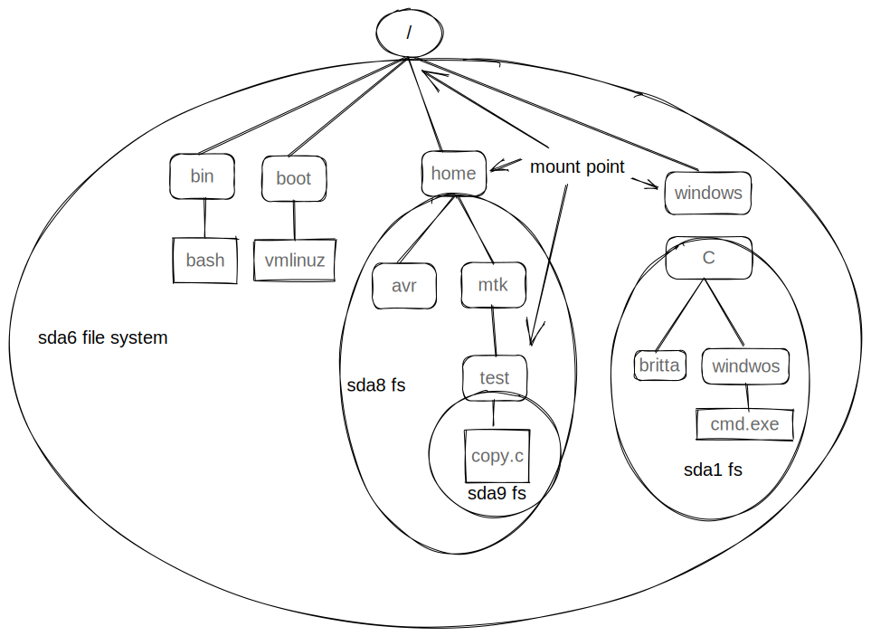

# 系统编程概念

## 设备专用文件

设备专用文件与系统的每个设备相对应。在内核中，每种设备类型都有与之相对应的设备驱动程序，用来处理设备的所有 I/O 请求。设备驱动程序树内核代码单元，可执行一系列操作，通常与相关硬件的输入/输出相对应。

- 字符型设备基于每个字符来处理数据【终端、键盘】
- 块设备每次处理一块数据，通常为 512 字节的倍数【磁盘】

每个设备文件都有主辅 ID 号。主 ID 号标识一般的设备等级，内核会使用主 ID 号查找与该类设备相应的驱动程序。辅 ID 号能够在一般等级中唯一标识特定设备。【ls -l】

## 磁盘与分区

常规文件和目录通常存放在硬盘设备里。

### 磁盘驱动器

磁盘驱动器是一种机械装置，由一个或多个高速旋转的盘片组成。通过在磁盘上快速移动的读/写磁头，便可获取/修改磁盘信息。磁盘表面信息物理上存储于称为磁道的一组同心圆上。磁道自身又被划分为若干扇区，每个扇区则包含一系列物理块。物理块的容量一般为 512 字节，代表了驱动器可读/写的最小信息单元。

> 磁头首先要移动到相应磁道(寻道时间)；然后，在相应扇区旋转到磁头下之前，驱动器必须一直等待(旋转延迟)；最后，还要从所请求的块上传输数据(传输时间)。

### 磁盘分区

Linux 专有文件 `/proc/partitions` 记录了系统中每个磁盘分区的主辅设备编号、大小和名称。

## 文件系统

文件系统是对常规文件和目录的组织集合【使用命令 mkfs 创建文件系统】

### ext2 文件系统

ext2 文件系统是 Linux 上使用最为广泛的文件系统。

### 文件系统结构

在文件系统中，用来分配空间的基本单位是逻辑块，即文件系统所在磁盘设备上若干连续的物理块。

分区 -> 引导块+超级块+i 节点表+数据块

- 引导块：总是作为文件系统的首块
- 超级快：包含与文件系统有关的参数信息
  - i 节点表容量
  - 文件系统中逻辑块的大小
  - 以逻辑块计，文件系统的大小
- i 节点表：文件系统中的每个文件或目录在 i 节点表中都对应着唯一一条记录
- 数据块：文件系统的大部分空间都用于存放数据，以构成驻留于文件系统之上的文件和目录

## i 节点

针对驻留于文件系统上的每个文件，文件系统的 i 节点表会包含一个 i 节点。【对 i 节点的标识，采用的是 i 节点表中的顺序位置，以数字表示】

- 文件类型【常规文件，目录，符号链接，字符设备】
- 文件属主
- 文件属组
- 三类用户的访问权限：属主，属组，其他用户
- 三个时间戳：文件最后访问时间【ls -lu】，文件最后修改时间【ls -l】，文件状态的最后改变时间【ls -lc】
- 指向文件的硬链接数量
- 文件的大小，以字节为单位
- 实际分配给文件的块数量，以 512 字节为单位
- 指向文件数据块的指针

在 ext2 中，每个 i 节点包含 15 个指针。其中的前 12 个指针指向文件前 12 个块在文件系统中的位置。接下来是一个指向指针块的指针，提供了文件第 13 个以及后续数据块的位置。【指针快中指针的数量取决于文件系统中的块大小。每个指针需占用 4 字节，因此指针的数量可能在 256~1024 之间】第 14 个指针是一个双重间接指针。【用于应对巨型文件】

## 虚拟文件 VFS

VFS 是一种内核特性，通过为文件系统创建抽象层以解决不同文件系统之间的差异问题。

## 日志文件系统

类似于数据库系统中的日志，用于保证文件的一致性操作。

## 单根目录层级和挂载点

Linux 上所有文件系统中的文件都位于单根目录树下，树根就是根目录`/`。



## 文件系统的挂载和卸载

系统调用 mount 和 umount 运行特权级进程(CAP_SYS_ADMIN)以挂载或卸载文件系统。

- 通过`/proc/mounts`可以查看当前已挂载文件系统的列表
- mount(8)和 umount(8)命令会自动维护`etc/mtab`文件，该文件包含了比`/proc/mounts`更加详细的信息【相对不那么准确】
- `/etc/fstab`包含了对系统支持的所有文件系统的描述

`/dev/sda9 /boot ext3 rw 0 0`

- 已挂载设备名
- 设备的挂载点
- 文件系统类型
- 挂载标识
- 一个数字，dump(8)会使用其来控制对文件系统的备份操作
- 一个数字，在系统引导时，用于控制 fsck(8)对文件系统的检查顺序

```c
#include <sys/mount.h>

int mount(const char* source, const char* target, const char* fstype,
            unsigned long mountflags, const void *data);
```

mount 系统调用将由 source 指定设备所包含的文件系统，挂载到由 target 指定的目录下。

| 标记           | 用途                                                                     |
| -------------- | ------------------------------------------------------------------------ |
| MS_BIND        | 建立绑定挂载                                                             |
| MS_DIRSYNC     | 同步更新路径                                                             |
| MS_MANDLOCK    | 允许强制锁定文件                                                         |
| MS_MOVE        | 以原子操作将挂载点移到新位置                                             |
| MS_NOATIME     | 不更新文件的最后访问时间                                                 |
| MS_NODEV       | 不允许访问设备                                                           |
| MS_NODIRATIME  | 不更新目录的最后访问时间                                                 |
| MS_NOEXEC      | 不允许程序执行                                                           |
| MS_NOSUID      | 禁止 set-user-ID 和 set-group-ID 程序                                    |
| MS_RDONLY      | 以只读方式挂载：不能修改或创建文件                                       |
| MS_REC         | 递归挂载                                                                 |
| MS_RELATIME    | 只有当最后访问时间遭遇最后修改时间或最后状态变更时间时，才对前者进行更新 |
| MS_REMOUNT     | 使用新的 mountflags 和 data 重新挂载                                     |
| MS_STRICATIME  | 总是更新最后访问时间                                                     |
| MS_SYNCHRONOUS | 是的所有文件和目录同步更新                                               |

```c
#include <sys/mount.h>
#include "tlpi_hdr.h"

#ifndef MS_DIRSYNC /* May not be defined in older glibc headers */
#define MS_DIRSYNC 128
#endif

#ifndef MS_BIND /* May not be defined in older glibc headers */
#define MS_BIND 4096
#endif

#ifndef MS_MOVE /* May not be defined in older glibc headers */
#define MS_MOVE 8192
#endif

#ifndef MS_REC /* May not be defined in older glibc headers */
#define MS_REC 16384
#endif

#ifndef MS_UNBINDABLE           /* May not be defined in older glibc headers */
#define MS_UNBINDABLE (1 << 17) /* change to unbindable */
#endif

#ifndef MS_PRIVATE           /* May not be defined in older glibc headers */
#define MS_PRIVATE (1 << 18) /* change to private */
#endif

#ifndef MS_SLAVE           /* May not be defined in older glibc headers */
#define MS_SLAVE (1 << 19) /* change to slave */
#endif

#ifndef MS_SHARED           /* May not be defined in older glibc headers */
#define MS_SHARED (1 << 20) /* change to shared */
#endif

#ifndef MS_LAZYTIME
#define MS_LAZYTIME (1 << 25)
#endif

static void usageError(const char *progName, const char *msg)
{
    if (msg != NULL)
        fprintf(stderr, "%s", msg);

    fprintf(stderr, "Usage: %s [options] source target\n\n", progName);
    fprintf(stderr, "Available options:\n");
#define fpe(str) fprintf(stderr, "    " str) /* Shorter! */
    fpe("-t fstype        [e.g., 'ext2' or 'reiserfs']\n");
    fpe("-o data          [file system-dependent options,\n");
    fpe("                 e.g., 'bsdgroups' for ext2]\n");
    fpe("-f mountflags    can include any of:\n");
#define fpe2(str) fprintf(stderr, "            " str)
    fpe2("b - MS_BIND         create a bind mount\n");
    fpe2("d - MS_DIRSYNC      synchronous directory updates\n");
    fpe2("l - MS_MANDLOCK     permit mandatory locking\n");
    fpe2("L - MS_LAZYATIME    lazy atime updates\n");
    fpe2("m - MS_MOVE         atomically move subtree\n");
    fpe2("A - MS_NOATIME      don't update atime (last access time)\n");
    fpe2("V - MS_NODEV        don't permit device access\n");
    fpe2("D - MS_NODIRATIME   don't update atime on directories\n");
    fpe2("E - MS_NOEXEC       don't allow executables\n");
    fpe2("S - MS_NOSUID       disable set-user/group-ID programs\n");
    fpe2("p - MS_PRIVATE      mark as private\n");
    fpe2("r - MS_RDONLY       read-only mount\n");
    fpe2("c - MS_REC          recursive mount\n");
    fpe2("T - MS_RELATIME     relative atime updates\n");
    fpe2("R - MS_REMOUNT      remount\n");
    fpe2("h - MS_SHARED       mark as shared\n");
    fpe2("v - MS_SLAVE        mark as slave\n");
    fpe2("s - MS_SYNCHRONOUS  make writes synchronous\n");
    fpe2("u - MS_UNBINDABLE   mark as unbindable\n");
    exit(EXIT_FAILURE);
}

int main(int argc, char *argv[])
{
    unsigned long flags;
    char *data, *fstype;
    int j, opt;

    flags = 0;
    data = NULL;
    fstype = NULL;

    while ((opt = getopt(argc, argv, "o:t:f:")) != -1)
    {
        switch (opt)
        {
        case 'o':
            data = optarg;
            break;

        case 't':
            fstype = optarg;
            break;

        case 'f':
            for (j = 0; j < strlen(optarg); j++)
            {

                /* In this version of the program we support more flags than
                   in the version of the program shown in the book */

                switch (optarg[j])
                {
                case 'b':
                    flags |= MS_BIND;
                    break;
                case 'd':
                    flags |= MS_DIRSYNC;
                    break;
                case 'l':
                    flags |= MS_MANDLOCK;
                    break;
                case 'm':
                    flags |= MS_MOVE;
                    break;
                case 'A':
                    flags |= MS_NOATIME;
                    break;
                case 'V':
                    flags |= MS_NODEV;
                    break;
                case 'D':
                    flags |= MS_NODIRATIME;
                    break;
                case 'E':
                    flags |= MS_NOEXEC;
                    break;
                case 'S':
                    flags |= MS_NOSUID;
                    break;
                case 'p':
                    flags |= MS_PRIVATE;
                    break;
                case 'r':
                    flags |= MS_RDONLY;
                    break;
                case 'c':
                    flags |= MS_REC;
                    break;
                case 'T':
                    flags |= MS_RELATIME;
                    break;
                case 'R':
                    flags |= MS_REMOUNT;
                    break;
                case 'h':
                    flags |= MS_SHARED;
                    break;
                case 'v':
                    flags |= MS_SLAVE;
                    break;
                case 's':
                    flags |= MS_SYNCHRONOUS;
                    break;
                case 'u':
                    flags |= MS_UNBINDABLE;
                    break;
                default:
                    usageError(argv[0], NULL);
                }
            }
            break;

        default:
            usageError(argv[0], NULL);
        }
    }

    if (argc != optind + 2)
        usageError(argv[0], "Wrong number of arguments\n");

    if (mount(argv[optind], argv[optind + 1], fstype, flags, data) == -1)
        errExit("mount");

    exit(EXIT_SUCCESS);
}
```

```c
#include <sys/mount.h>

int umount(const char* target);
int umount2(const char* target, int flags);
```

umount 系统调用用于卸载已挂载的文件系统；umont2 可以通过 flags 参数对卸载操作施加更加精密的控制。

- MNT_DETACH: 执行 lazy 卸载
- MNT_EXPIRE: 将挂载点标记为到期
- MNT_FORCE: 强行卸载，即使文件系统处于在用状态
- UMOUNT_NOFOLLOW: 若 target 为符号链接，则不对其进行解引用

## 高级挂载特性

- 在多个挂载点挂载文件系统【在挂载点一下对目录子树所做的改变，在挂载点而下完全可用】
- 多次挂载同一挂载点【每次新挂载都会隐藏之前可见于挂载点下的目录子树。卸载最后一次挂载时，挂载点下上次挂载的内容会再次显示】
- 基于每次挂载的挂载标识
- 绑定挂载【指在文件系统目录层级的另一处挂载目录或文件】
- 递归绑定挂载

## 虚拟内存文件系统: tmpfs

不仅使用 RAM，且在 RAM 耗尽的情况下，还会利用交换空间。

## 获得与文件系统有关的信息: statvfs

```c
#include <sys/statvfs.h>

struct statvfs
  {
    unsigned long int f_bsize;
    unsigned long int f_frsize;
#ifndef __USE_FILE_OFFSET64
    __fsblkcnt_t f_blocks;
    __fsblkcnt_t f_bfree;
    __fsblkcnt_t f_bavail;
    __fsfilcnt_t f_files;
    __fsfilcnt_t f_ffree;
    __fsfilcnt_t f_favail;
#else
    __fsblkcnt64_t f_blocks;
    __fsblkcnt64_t f_bfree;
    __fsblkcnt64_t f_bavail;
    __fsfilcnt64_t f_files;
    __fsfilcnt64_t f_ffree;
    __fsfilcnt64_t f_favail;
#endif
    unsigned long int f_fsid;
#ifdef _STATVFSBUF_F_UNUSED
    int __f_unused;
#endif
    unsigned long int f_flag;
    unsigned long int f_namemax;
    int __f_spare[6];
  };

int statvfs(const char* pathname, struct statvfs *statvfsbuf);
int fstatvfs(int fd, struct statvfs *statvfsbuf);
```

statvfs 和 fstatvfs 库函数能够获得与已挂载文件系统有关的信息。

## The structure of `/`

- **/ :** The slash / character alone denotes the root of the filesystem tree.
- **/bin :** Stands for “binaries” and contains certain fundamental utilities, such as ls or cp, which are generally needed by all users.
- **/boot :** Contains all the files that are required for successful booting process.
- **/dev :** Stands for “devices”. Contains file representations of peripheral devices and pseudo-devices.
- **/etc :** Contains system-wide configuration files and system databases. Originally also contained “dangerous maintenance utilities” such as init,but these have typically been moved to /sbin or elsewhere.
- **/home :** Contains the home directories for the users.
- **/lib :** Contains system libraries, and some critical files such as kernel modules or device drivers.
- **/media :** Default mount point for removable devices, such as USB sticks, media players, etc.
- **/mnt :** Stands for “mount”. Contains filesystem mount points. These are used, for example, if the system uses multiple hard disks or hard disk partitions. It is also often used for remote (network) filesystems, CD-ROM/DVD drives, and so on.
- **/proc :** procfs virtual filesystem showing information about processes as files.
- **/root :** The home directory for the superuser “root” – that is, the system administrator. This account’s home directory is usually on the initial filesystem, and hence not in /home (which may be a mount point for another filesystem) in case specific maintenance needs to be performed, during which other filesystems are not available. Such a case could occur, for example, if a hard disk drive suffers physical failures and cannot be properly mounted.
- **/tmp :** A place for temporary files. Many systems clear this directory upon startup; it might have tmpfs mounted atop it, in which case its contents do not survive a reboot, or it might be explicitly cleared by a startup script at boot time.
- **/usr :** Originally the directory holding user home directories,its use has changed. It now holds executables, libraries, and shared resources that are not system critical, like the X Window System, KDE, Perl, etc. However, on some Unix systems, some user accounts may still have a home directory that is a direct subdirectory of /usr, such as the default as in Minix. (on modern systems, these user accounts are often related to server or system use, and not directly used by a person).
- **/usr/bin :** This directory stores all binary programs distributed with the operating system not residing in /bin, /sbin or (rarely) /etc.
- **/usr/include :** Stores the development headers used throughout the system. Header files are mostly used by the **#include** directive in C/C++ programming language.
- **/usr/lib :** Stores the required libraries and data files for programs stored within /usr or elsewhere.
- **/var :** A short for “variable.” A place for files that may change often – especially in size, for example e-mail sent to users on the system, or process-ID lock files.
- **/var/log :** Contains system log files.
- **/var/mail :** The place where all the incoming mails are stored. Users (other than root) can access their own mail only. Often, this directory is a symbolic link to /var/spool/mail.
- **/var/spool :** Spool directory. Contains print jobs, mail spools and other queued tasks.
- **/var/tmp :** A place for temporary files which should be preserved between system reboots.
