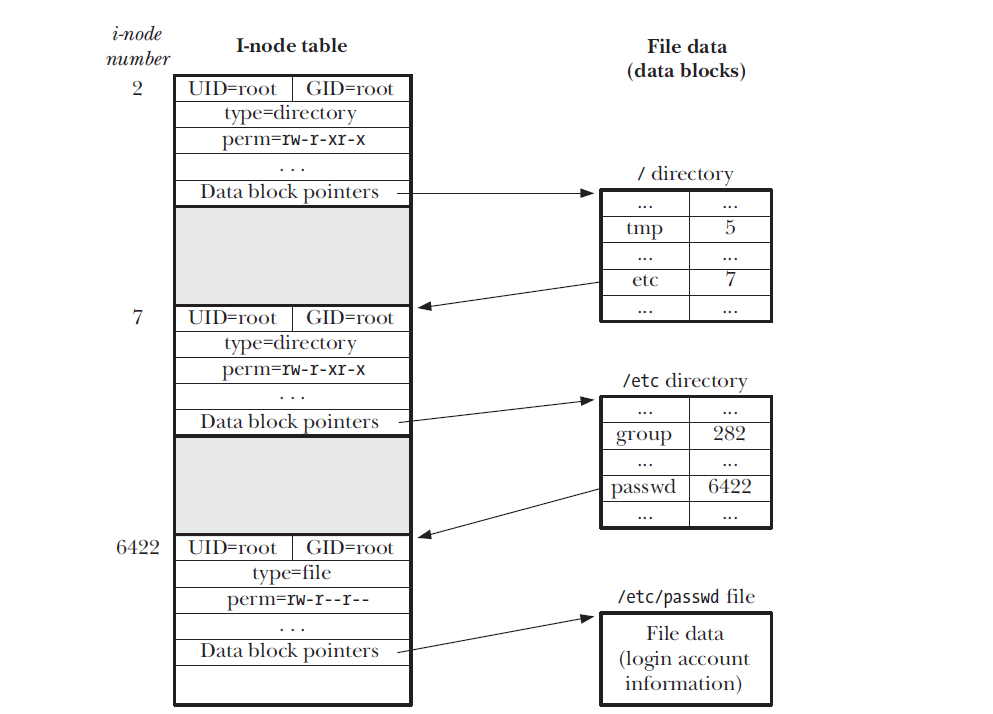
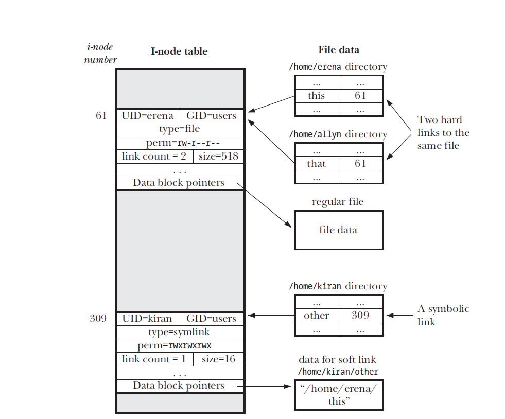

# 目录与链接

## 目录与(硬)链接

- 在 i-node 条目中，会将目录标记为一种不同的文件类型
- 目录是经过特殊组织而成的文件【本质上是一个表格，包含文件名和 i-node 编号】

> i-node 表的编号始于 1，而非 0 ，若目录条目的 i-node 字段值为 0，则表明该条目尚未使用。i-node 1 用来记录文件系统的坏块。文件系统根目录 `/` 总是存储在 i-node 条目 2 中



```sh
echo -n 'abc, ' > abc
ls -li abc
ln abc xyz
echo 'xyz' >> xyz
cat abc
ls -li abc xyz

rm abc
ls -li xyz
```

The i-node entry and data blocks for the file are removed (deallocated) only when the i-node's link count falls to 0.

> the `rm` command removes a filename from a directory list, decrements the link count of the corresponding i-node by 1, and, if the link count thereby falls to 0, deallocates the i-node and the data blocks to which it refers.

## 符号(软)链接

The pathname to which a symbolic link refers may be either absolute or relative. A relative symbolic link is interpreted relative to the location of the link itself.



Starting with kernel 2.6.18, Linux implements the SUSv3-specified minimum of 8 deferences.

> Symbolic links in the directory part of a pathname (i.e., all of the components preceding the final slash) are always dereferenced.

The ownership and permissions of a symbolic link are ignored for most operations (symbolic links are always created with all permissions enabled).

## 创建和移除(硬)链接 link, unlink

The `link()` and `unlink()` system call create and remove hard links.

```c
#include <unistd.h>

int link(const char* oldpath, const char *newpath);
int unlink(const char* pathname);
```

> `unlink` removes a link (deletes a filename) and, if that is the last link to the file, also removes the file itself. If the link specified in pathname doesn't exist, then `unlink` fails with the error `ENOENT`

**Remove a link with unlink**

```c
#include <sys/stat.h>
#include <fcntl.h>
#include "tlpi_hdr.h"

#define CMD_SIZE 200
#define BUF_SIZE 1024

int main(int argc, char *argv[])
{
    int fd, j, numBlocks;
    char shellCmd[CMD_SIZE]; /* Command to be passed to system() */
    char buf[BUF_SIZE];      /* Random bytes to write to file */

    if (argc < 2 || strcmp(argv[1], "--help") == 0)
        usageErr("%s temp-file [num-1kB-blocks] \n", argv[0]);

    numBlocks = (argc > 2) ? getInt(argv[2], GN_GT_0, "num-1kB-blocks")
                           : 100000;

    /* O_EXCL so that we ensure we create a new file */

    fd = open(argv[1], O_WRONLY | O_CREAT | O_EXCL, S_IRUSR | S_IWUSR);
    if (fd == -1)
        errExit("open");

    if (unlink(argv[1]) == -1) /* Remove filename */
        errExit("unlink");

    for (j = 0; j < numBlocks; j++) /* Write lots of junk to file */
        if (write(fd, buf, BUF_SIZE) != BUF_SIZE)
            fatal("partial/failed write");

    snprintf(shellCmd, CMD_SIZE, "df -k `dirname %s`", argv[1]);
    system(shellCmd); /* View space used in file system */

    if (close(fd) == -1) /* File is now destroyed */
        errExit("close");
    printf("********** Closed file descriptor\n");

    /* See the erratum for page 348 at http://man7.org/tlpi/errata/.
       Depending on factors such as random scheduler decisions and the
       size of the file created, the 'df' command executed by the second
       system() call below does may not show a change in the amount
       of disk space consumed, because the blocks of the closed file
       have not yet been freed by the kernel. If this is the case,
       then inserting a sleep(1) call here should be sufficient to
       ensure that the the file blocks have been freed by the time
       of the second 'df' command.
    */

    system(shellCmd); /* Review space used in file system */
    exit(EXIT_SUCCESS);
}
```

## 更改文件名 rename

The `rename` system call can be used both to rename a file and to move it into another directory on the same file system.

```c
#include <stdio.h>

int rename(const char *oldpath, const char* newpath);
```

The `rename` call just manipulates directory entries; it doesn't move file data.

1. If newpath already exists, it is overwritten
2. If newpath and oldpath refer to the same file, then no changes are made (and the call succeed).
3. The `rename` system call doesn't dereference symbolic links in either of its arguments
4. If oldpath refers to a file other than a directory, then newpath can't specify the pathname of a directory (the error is EISDIR)
5. Specifying the name of a directory in oldpath allows us to rename that directory
6. If oldpath is a directory, then newpath can't contain a directory prefix that is the same as oldpath
7. The files referred to by oldpath and newpath must be on the same file system.

## 使用符号链接 symlink, readlink

The `symlink` system call creates a new symbolic link, to the pathname specified in filepath. (Use `unlink` to remove a symbolic link)

```c
#include <unistd.h>

int symlink(const char* filepath, const char *linkpath);
```

The `readlink` system call places a copy of the symbolic link string in the character array pointed to by _buffer_.

```c
#include <unistd.h>

ssize_t readlink(const char* pathname, char* buffer, size_t bufsiz);
```

## 创建和删除文件夹 mkdir & rmdir

The `mkdir` system call creates a new directory. The `rmdir` removes the directory specified in pathname, which may be an absolute or a relative pathname.

```c
#include <unistd.h>

int mkdir(const char* pathname, mode_t mode);

int rmdir(const char* pathname); // the directory must be empty
```

## 移除一个文件或目录 remove

The `remove` removes a file or an empty directory

```c
#include <stdio.h>

int remove(const char* pathname);
```

It pathname is a file, `remove` calls `unlink`; if pathname is a directory, `remove` calls `rmdir`

## 读目录 opendir, readdir

The `opendir` opens a directory and returns a handle that can be used to refer to the directory in later calls.

```c
#include <dirent.h>

DIR* opendir(const char* dirpath);
DIR* fopendir(int fd);
```

The `readdir` read successive entries from a directory stream.

```c
#include <dirent.h>

struct dirent {
    ino_t d_ino; // file i-node number
    char d_name[]; // Null-terminated name of file
}

struct dirent *readdir(DIR* dirp);
```

On end-of-directory or error, `readdir` returns NULL, in the later case setting _errno_ to indicate the error.

```c
errno = 0;
direntp = readdir(dirp);
if (direntp == NULL) {
    if (errno != 0) {
        // handle error
    } else {
        // reach EOD
    }
}
```

The `rewinddir` moves the directory stream back to the beginning so that the next call to `readdir` will begin again with the first file in the directory.

```c
#include <dirent.h>

void rewinddir(DIR *dirp);
```

The `closedir` closes the open directory stream referred to by `dirp`, freeing the resources used by the stream.

```c
#include <dirent.h>

int closedir(DIR* dirp);
```

The `dirfd` returns the file descriptor associated with the directory stream referred to by _dirp_.

```c
#if defined(__APPLE__)
/* Darwin requires this header before including <dirent.h> */
#include <sys/types.h>
#endif
#include <dirent.h>
#include "tlpi_hdr.h"

static void /* List all files in directory 'dirpath' */ listFiles(const char *dirpath)
{
    DIR *dirp;
    struct dirent *dp;
    Boolean isCurrent; /* True if 'dirpath' is "." */

    isCurrent = strcmp(dirpath, ".") == 0;

    dirp = opendir(dirpath);
    if (dirp == NULL)
    {
        errMsg("opendir failed on '%s'", dirpath);
        return;
    }

    /* For each entry in this directory, print directory + filename */

    for (;;)
    {
        errno = 0; /* To distinguish error from end-of-directory */
        dp = readdir(dirp);
        if (dp == NULL)
            break;

        if (strcmp(dp->d_name, ".") == 0 || strcmp(dp->d_name, "..") == 0)
            continue; /* Skip . and .. */

        if (!isCurrent)
            printf("%s/", dirpath);
        printf("%s\n", dp->d_name);
    }

    if (errno != 0)
        errExit("readdir");

    if (closedir(dirp) == -1)
        errMsg("closedir");
}

int main(int argc, char *argv[])
{
    if (argc > 1 && strcmp(argv[1], "--help") == 0)
        usageErr("%s [dir-path...]\n", argv[0]);

    if (argc == 1) /* No arguments - use current directory */
        listFiles(".");
    else
        for (argv++; *argv; argv++)
            listFiles(*argv);

    exit(EXIT_SUCCESS);
}
```

## 文件树遍历 nftw

The `nftw` allows a program to recursively walk through an entire directory subtree performing some operation (calling some user-defined function) for each file in the subtree.

```c
#define _XOPEN_SOURCE 500
#include <ftw.h>

int nftw(const char* dirpath,
int (*func) (const char* pathname, const struct stat *statbuf, int typeflag, struct FTW *ftwbuf),
int nopenfd, int flags); // return 0 after successful walk of entir tree, or -1 on error, or the first non-zero value return by a call to _func_
```

## 进程的当前工作目录

A process's _current working directory_ defines the starting point for the resolution of relative pathnames referred to by the process. A new process inherits its current working directory from its parent.

A process can retrieve its current working directory by `getcwd`

```c
#include <unistd.h>

char* getcwd(char *cwdbuf, size_t size);
```

The `chdir` changes the calling process's current working directory to the relative or absolute pathname specified in _pathname_(which is dereferenced if it is a symbolic link)

```c
#include <unistd.h>

int chdir(const char* pathname);
#define _XOPEN_SOURCE 500
int fchdir(int fd);
```

## 改变进程的根目录 chroot

Every process has a _root directory_, which is the point from which absolute pathnames are interpreted.

The `chroot` changes the process's root directory to the directory specified by _pathname_.

```c
#define _BSD_SOURCE
#include <unistd.h>

int chroot(const char *pathname);
```

## 解析路径名 realpath

The `realpath` dereferences all symbolic links in _pathname_ (a null-terminated string) and resolves all references to /. and /.. to produce a null-terminated string containing the corresponding absolute pathname.

```c
#include <stdlib.h>

char* realpath(const char* pathname, char* resolved_path);
```

```c
#include <sys/stat.h>
#include <limits.h> /* For definition of PATH_MAX */
#include "tlpi_hdr.h"

#define BUF_SIZE PATH_MAX

int main(int argc, char *argv[])
{
    struct stat statbuf;
    char buf[BUF_SIZE];
    ssize_t numBytes;

    if (argc != 2 || strcmp(argv[1], "--help") == 0)
        usageErr("%s pathname\n", argv[0]);

    /* User lstat() to check whether the supplied pathname is
       a symbolic link. Alternatively, we could have checked to
       whether readlink() failed with EINVAL. */

    if (lstat(argv[1], &statbuf) == -1)
        errExit("lstat");

    if (!S_ISLNK(statbuf.st_mode))
        fatal("%s is not a symbolic link", argv[1]);

    numBytes = readlink(argv[1], buf, BUF_SIZE - 1);
    if (numBytes == -1)
        errExit("readlink");
    buf[numBytes] = '\0'; /* Add terminating null byte */
    printf("readlink: %s --> %s\n", argv[1], buf);

    if (realpath(argv[1], buf) == NULL)
        errExit("realpath");
    printf("realpath: %s --> %s\n", argv[1], buf);

    exit(EXIT_SUCCESS);
}
```

## 解析路径名字符串 dirname, basename

The `dirname` and `basename` break a pathname string into directory and filename parts.

```c
#include <libgen.h>

char* dirname(char* pathname);
char* basename(char* pathname);
```

- Trailing slash characters in _pathname_ are ignored
- If _pathname_ doesn't contain a slash, then `dirname` returns the string .(dot) and `basename` returns _pathname_
- If _pathname_ consists of just a slash, then both `dirname` and `basename` return the string /.
- If _pathname_ is a NULL pointer or an empty string, then both return the string .(dot).

| Pathname string | dirname     | basename |
| --------------- | ----------- | -------- |
| /               | /           | /        |
| /usr/bin/zip    | /usr/bin    | zip      |
| /etc/passwd//// | /etc        | passwd   |
| /etc////passwd  | /etc/passwd |
| etc/passwd      | etc         | passwd   |
| passwd          | .           | passwd   |
| passwd/         | .           | passwd   |
| ..              | .           | ..       |
| NULL            | .           | .        |

```c
#include <libgen.h>
#include "tlpi_hdr.h"

int main(int argc, char *argv[])
{
    char *t1, *t2;
    int j;

    for (j = 1; j < argc; j++)
    {
        t1 = strdup(argv[j]);
        if (t1 == NULL)
            errExit("strdup");
        t2 = strdup(argv[j]);
        if (t2 == NULL)
            errExit("strdup");

        printf("%s ==> %s + %s\n", argv[j], dirname(t1), basename(t2));

        free(t1);
        free(t2);
    }

    exit(EXIT_SUCCESS);
}
```
